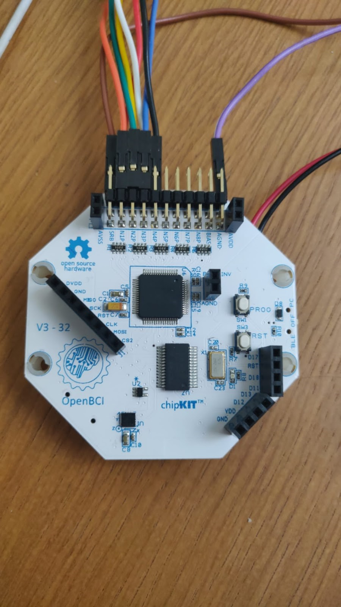
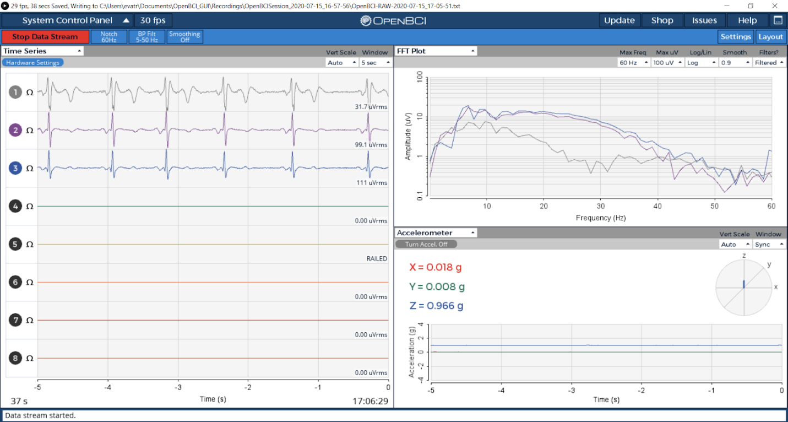
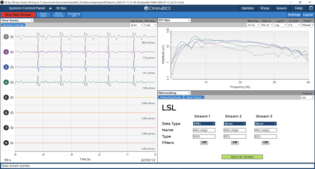

This document will show you how to read ECG data (electrical signals from  the heart) using OpenBCI hardware and GUI.

## Materials Needed
1. OpenBCI [Cyton Board](https://shop.openbci.com/collections/frontpage/products/cyton-biosensing-board-8-channel?variant=38958638542) or [Ganglion Board](https://shop.openbci.com/collections/frontpage/products/ganglion-board)
2. [Skintact sticky electrodes](https://shop.openbci.com/collections/frontpage/products/skintact-f301-pediatric-foam-solid-gel-electrodes-30-pack?variant=29467659395)
3. Three [EMG/ECG Snap Electrodes](https://shop.openbci.com/collections/frontpage/products/emg-ecg-snap-electrode-cables?variant=32372786958) — one ground and two sensors.
4. [OpenBCI GUI](../../06Software/01-OpenBCISoftware/01-OpenBCI_GUI.md)

## 3-Lead ECG with Cyton or Ganglion Boards
This step by step for 3-Lead ECG will show you how to get one channel of live ECG data.

### Connect Electrodes to the OpenBCI Board
1. Connect two snap electrode cables to the top and bottom N1P pins of the Cyton.
2. Connect a third snap electrode cable to the AGND pin of the Cyton.

If using the **Ganglion board**, please refer to the following steps A to C, noting that on the Ganglion board there are up to 4 channels available, but in this 3-Lead ECG tutorial we will show you how to use one channel (to start off with!).

A) The four switches on the Ganglion should be in the default UP position.

B) One snap electrode cable should be connected to the bottom D_G pin (Driven Ground) of the Ganglion board. The bottom row of pins is closer to the flat surface on which your Ganglion is placed.

C) To get one channel of data, connect one electrode cable to the top pin 1 of the Ganglion, and one electrode cable to the bottom pin 1 of the Ganglion. FYI, for future reference, you can use pins 1-4 for up to four channels of data. Nine cables, including the ground electrode in step B, are needed if you want to use all four channels of the Ganglion board.

After making these connections, snap the Skintact sticky electrodes into the snap electrode cable. Then, remove the backing tape and apply the electrode to the skin. **For safety reasons, make sure to snap the sticky electrode onto its cable before applying the sticky electrode to your skin.**

### Connect the electrodes to your body

1. Stick the ground electrode to a bony part of the chest, such as the sternum.
2. Connect top and bottom N1P pin on the Cyton (if using Ganglion, connect +1 and -1 pins) to opposite sides of your chest.

By doing this, we are instructing the data to measure the electric potential difference across your chest, which will in turn display your heart signals.

### Streaming ECG Data with the OpenBCI GUI

Once you have the GUI open, turn off all channels that are not connected to electrodes by toggling the numbered data streams in the Time Series widget. If using the Cyton board, additionally go to hardware settings and turn SRB2 **OFF** for all of the channels that you are streaming data from.

*Note: This is because ordinarily SRB2 is the reference point from which potentials are measured, however we are now having cardiac locations reference themselves, so we do not want it to look at this pin.*

Once all of your settings have been adjusted, press 'begin data stream.'

In the Cyton image above, note how the positive and negative terminals (yellow and green) are connected to the top and bottom N1P pins. When you are running the GUI, raw data from N1P pin will be displayed on Channel 1 within the Time Series Widget. If you are using the Ganglion, Channel 1 will show raw data from Pin 1 on the Ganglion.

## 5-Lead ECG with Cyton Board
This step by step 5-Lead ECG guide will show you how to get 4 channels of live ECG data.
It builds on the above guide to 3-Lead ECG and adds only a few additional steps, so be sure to review this page in its entirety before getting started on the 5-Lead ECG.

### Connect the Electrodes to the OpenBCI Board and to your Body
The standard placement of leads for a 5-lead ECG is shown below in

|---|---|
| LA | Left Arm |
| RA | Right Arm |
| LL | Left Leg |
| LA | Left Arm |
| RL | Right Leg |

For a 5-Lead ECG with the Cyton board, you will need seven Sticky Electrodes with one Snap Electrode Cable each. Follow the diagram below to connect the first six Sticky Electrodes. On the diagram below, the ‘P’ means the top row of Cyton pins, and the ‘N’ the bottom row of pins. Once the cables have been connected to the board, connect the electrodes to your body following the same diagram. For example, IN1P LA means you connect top N1P pin on the Cyton to the Left Arm location shown on chest diagram above. Do you see the line connecting **IN1P LA to IN3N LA**? That means you'll be measuring the potential difference between **IN1P LA to IN3N LA**
IN3N LA means you connect bottom N3P pin to Left Arm location.

The last electrode cable connects the bottom AGND pin on the Cyton to RL (not pictured above).

Connections for 5-lead ECG without V electrode.

Connections for 5-lead ECG with V electrode.

If you want to sample electrode V, it will require two additional electrodes, one plugged into the N4P bottom pin (corresponding to Channel 4) and the other one plugged into the bottom pin SRB2.

### Streaming and Visualizing ECG Data with the GUI

Once you have the GUI open, turn off all channels that are not connected to electrodes by toggling the numbered channels in the Time Series widget. Then, go to hardware settings (located above the Time Series widget) and turn SRB2 **OFF** for Channels 1, 2 and 3. Leave SRB2 ON for Channel 4.
Once your settings have been adjusted, press 'Start Data Stream’.' You should see graphs similar to the ones below. The first screenshot doesn’t include electrode V and the second one does.

Data streaming not including V electrode.

Data streaming including V electrode.

## Improving Signal Quality

For help minimizing noise and improving ECG signal quality, check out [this document](10Troubleshooting/01-MinimizingNoise.md) and head to the OpenBCI Technical [Forum](openbci.com/forum) if you have questions.
