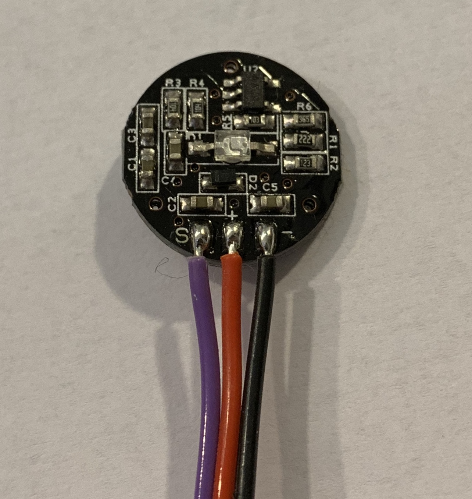

The Pulse Sensor can be connected to the [Ganglion](https://shop.openbci.com/collections/frontpage/products/pre-order-ganglion-board), [Cyton](https://shop.openbci.com/collections/frontpage/products/cyton-biosensing-board-8-channel), or any Arduino board to easily obtain your heart rate using [photoplethysmogram (PPG)](https://en.wikipedia.org/wiki/Photoplethysmogram).

Please scroll through the [general guide](https://www.generationrobots.com/media/DetecteurDePoulsAmplifie/PulseSensorAmpedGettingStartedGuide.pdf) for the Pulse Sensor before heading to the Ganglion or Cyton sections below.

The basic principles are the same no matter what board you're connecting the Pulse Sensor to.
The Pulse Sensor has three leads, seen below.

RED wire (+) = +3V to +5V

BLACK wire (-) = GND

PURPLE wire (S) = Signal in milli or microvolts

The pulse sensor takes power from the board via the red wire.

The OpenBCI GUI has a built-in pulse sensor widget. You can download the GUI [here](https://github.com/OpenBCI/OpenBCI_GUI/releases)

## Ganglion Pulse Sensor

Read the Ganglion [Getting Started Guide](../../01GettingStarted/01-Boards/02-Ganglion_Getting_Started_Guide.md)
You only need the GUI, pulse sensor kit, Ganglion, Ganglion dongle, and battery pack.

The connections are circled above.
Red goes to DVDD, black to GND (right next to DVDD), and purple to any single analog pin A3, A4, or A6.

## Cyton Pulse Sensor

Set up your Cyton according to its [Getting Started Guide](../../01GettingStarted/01-Boards/01-Cyton_Getting_Started_Guide.md).
You only need the GUI, pulse sensor kit, Cyton, Cyton dongle, and battery pack.

The connections are circled above.
Red goes to DVDD, black to GND (right next to DVDD), and purple to D11.
This D11 is read as analog pin A5, and sent in the first Aux data slot. The pulse sensor data will be pre-processed in the [pulse sensor widget](https://openbci.github.io/Documentation/docs/06Software/01-OpenBCISoftware/GUIWidgets#pulse-widget).

## Troubleshooting

Running into trouble? Consult these pulse sensor-ganglion Forum posts [here](https://openbci.com/forum/index.php?p=/discussion/1690/ganglion-use-with-pulse-sensor-which-analog-pin) and [here](http://openbci.com/forum/index.php?p=/discussion/919/ganglion-and-pulse-sensors).

For cyton, [here](https://openbci.com/forum/index.php?p=/discussion/1527/pulse-sensor-with-cyton-daisy).

You can find all relevant posts by using our site-specific [Google Search Function](https://www.google.com/advanced_search?q=site:openbci.com).
