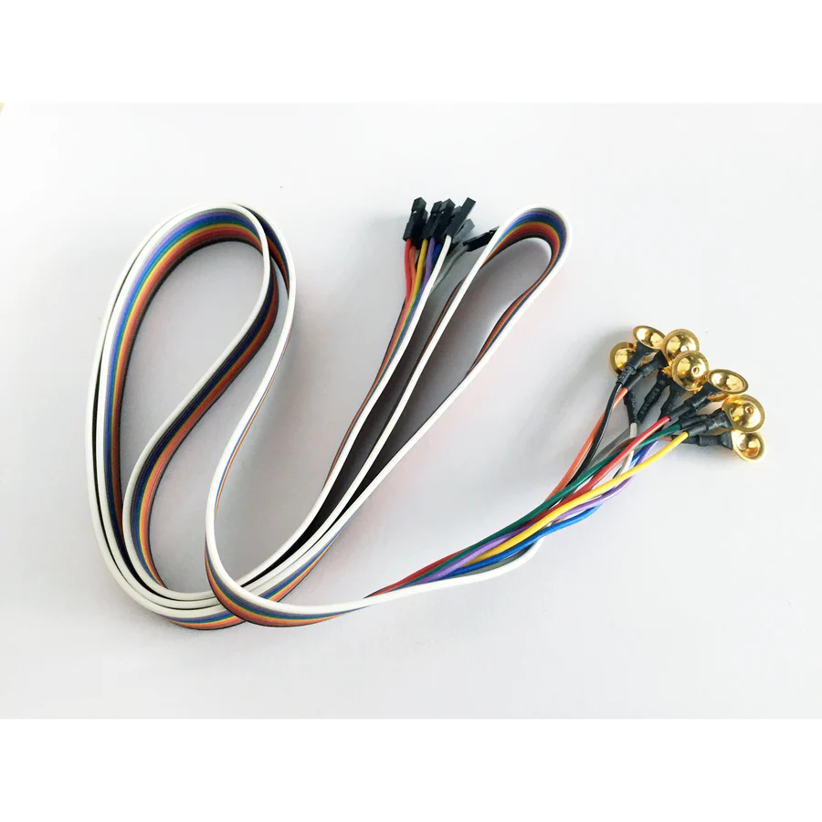
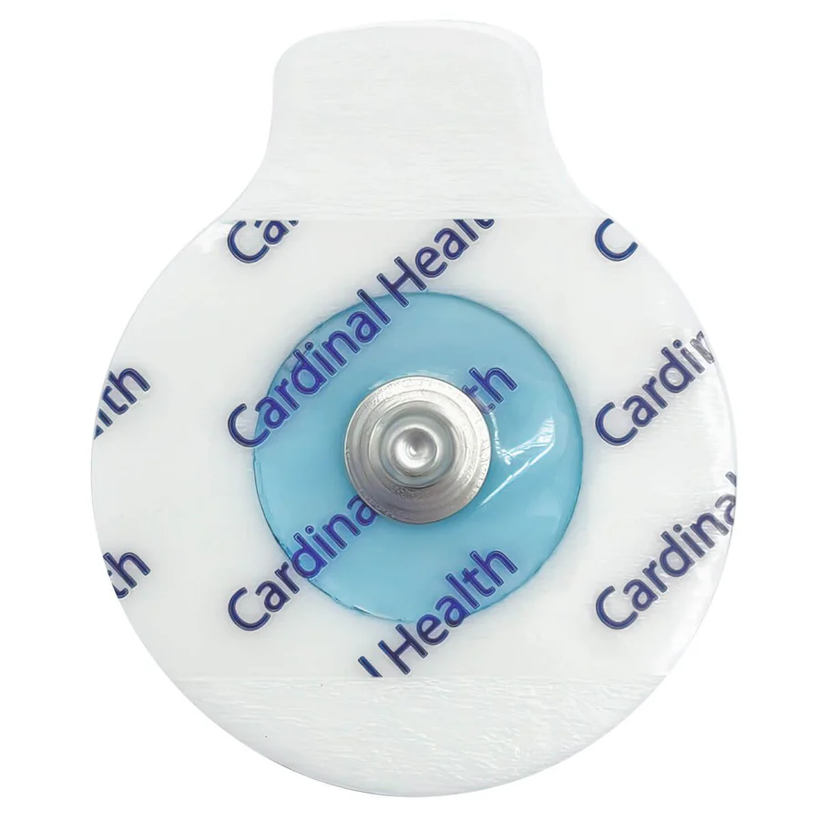
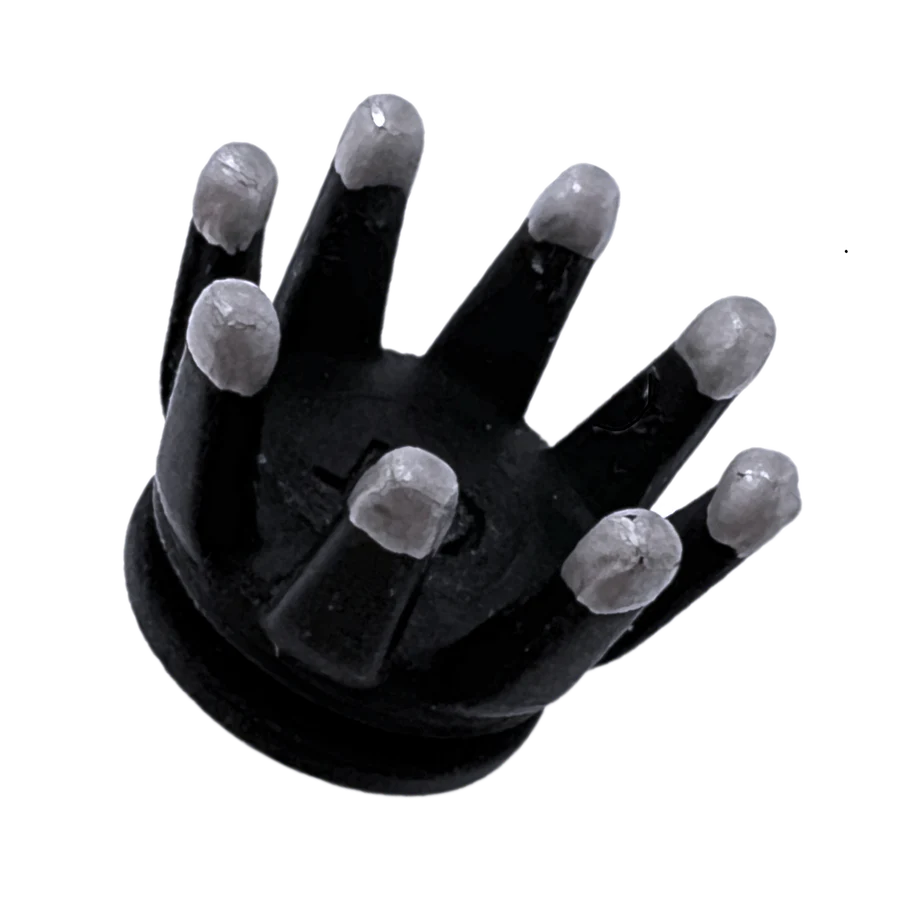
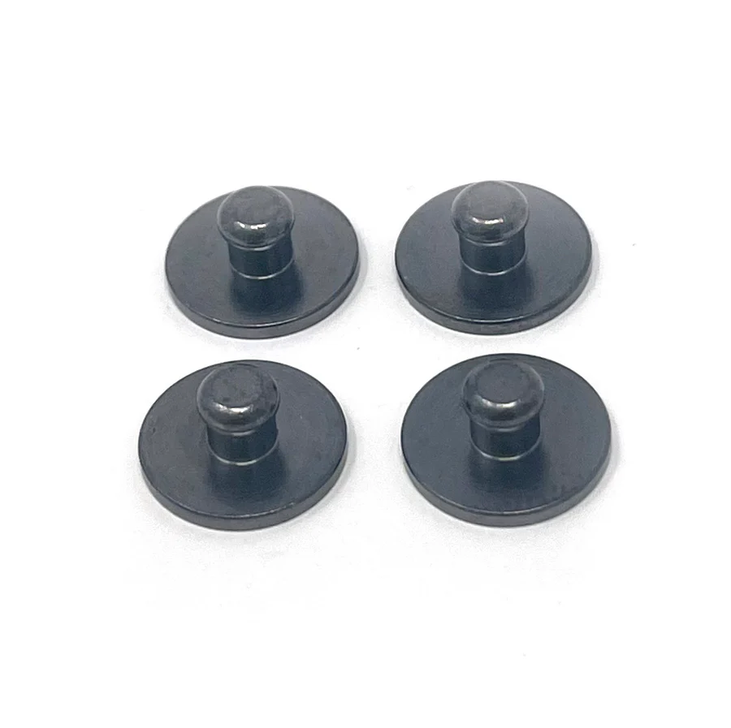
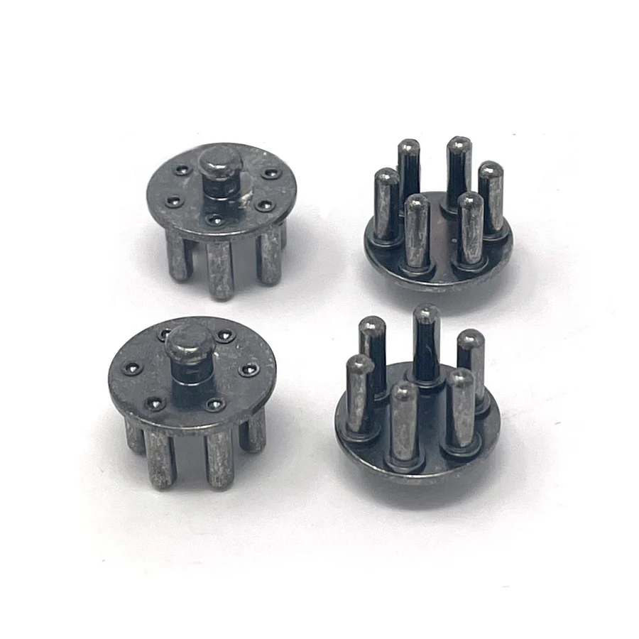
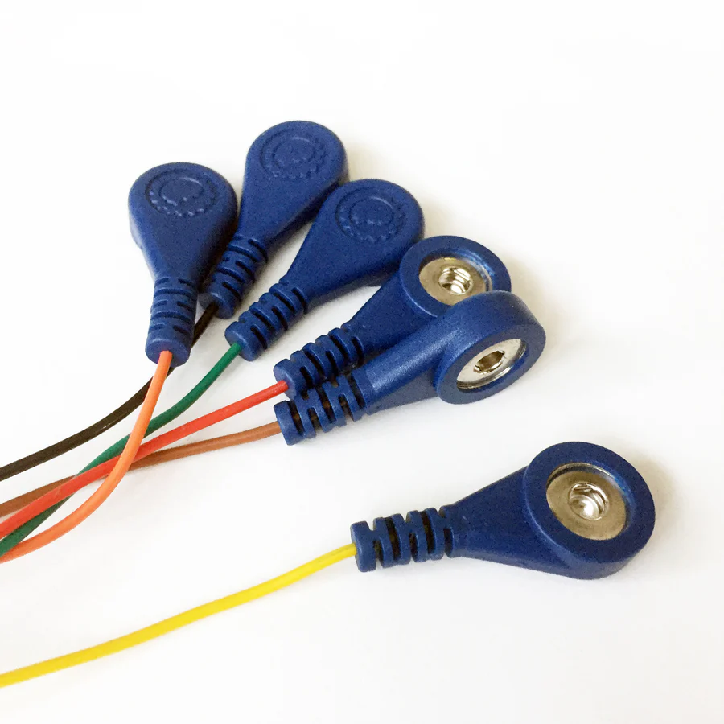
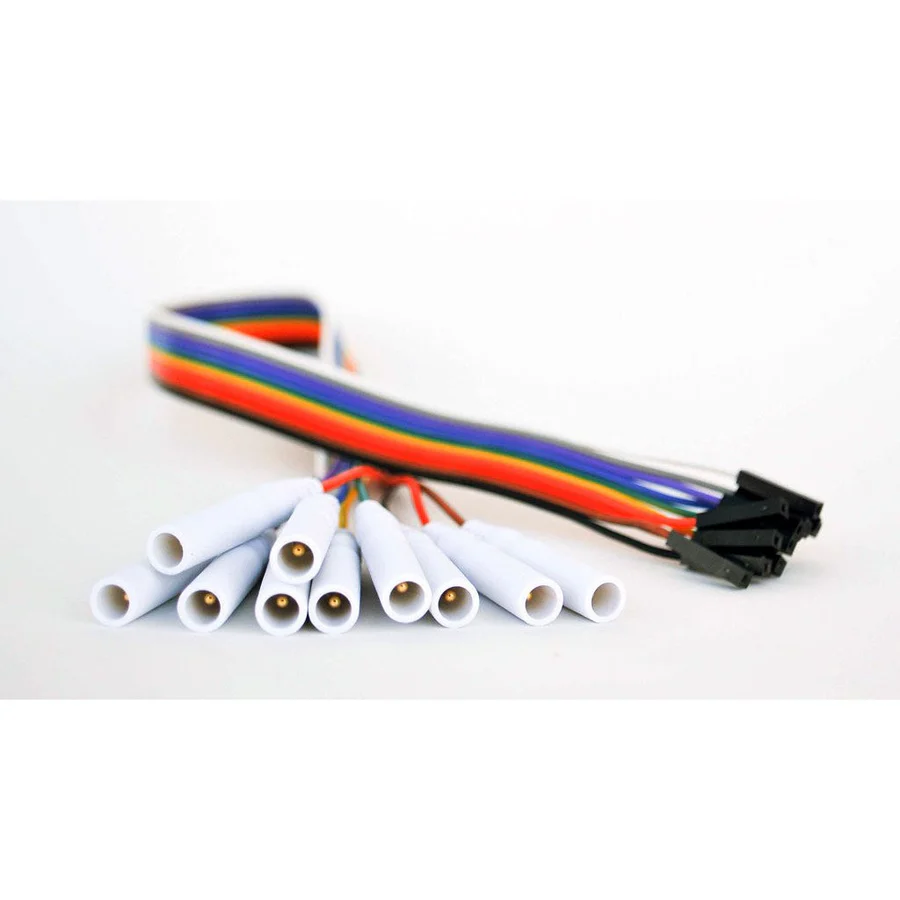

OpenBCI boards are compatible with a variety of different electrodes depending on your application, signal type (EEG, EMG, or ECG), and comfort requirements. In addition to our [Headwear solutions](https://docs.openbci.com/AddOns/AddOnLanding/#headwear), which provide integrated montages for high-quality EEG data, you can use standalone electrodes for tailored configurations. 

Use this guide to select the right electrode for your project.

---

## Electrodes

### Gold Cup Electrodes

[**Buy them here!**](https://shop.openbci.com/collections/frontpage/products/openbci-gold-cup-electrodes?variant=9056028163)

Gold cup electrodes are the standard for high-quality, clinical-grade biopotential recordings. The OpenBCI Gold Cup Electrodes come as a ribbon cable with 10 passive gold electrodes that can be directly connected to any OpenBCI board to sample brain activity (EEG), muscle activity (EMG), and heart activity (ECG/EKG). This makes them versatile for sleep studies, neurofeedback training, and long-term research sessions where signal stability is crucial. While they offer a good signal-to-noise ratio and are completely reusable, they require a fair amount of preparation time and the use of a conductive paste (like [Ten20](https://shop.openbci.com/collections/frontpage/products/ten20-conductive-paste-8oz-jar)) to adhere to the skin, which necessitates washing the area after use. 

For an optimal setup, fill the cup entirely with conductive paste, place it firmly on the scrubbed skin site, and secure it with medical tape or a specialized cap to prevent movement artifacts. You can refer to dedicated guide [EEG Setup using Gold Cup Electrodes and an OpenBCI Cyton board](https://docs.openbci.com/GettingStarted/Biosensing-Setups/EEGSetup/) for more information on how to use them.

### Dry EEG Comb Electrodes

[**Buy them here!**](https://shop.openbci.com/collections/frontpage/products/5-mm-spike-electrode-pack-of-30?variant=8120433606670)

Designed specifically to penetrate through thick hair without the need for conductive gels or pastes, these dry spike electrodes are ideal for fast-setup EEG applications. Their extended-length 5mm prongs accommodate longer hair while enabling good signal quality, and the prongs end in blunt tips engineered for long-term comfort and wearability. They are designed to snap seamlessly into the OpenBCI Ultracortex 3D-printed headsets. 

To install or replace them, use a small handheld screwdriver to loosen the screw inside the Ultracortex headset's blue electrode mount, remove the pre-installed electrode, and reuse the same screw to secure the 5mm comb electrode in place. Please note that each electrode has a lifetime of approximately 10 uses. After this, the conductive silver-silver chloride (Ag-AgCl) coating may become compromised if the hardware is not properly maintained. To ensure the integrity of the plating, recommended maintenance involves gently cleaning any visible residue with water after a session, drying them completely, and storing them in a dark, low-moisture container.

### EMG/ECG Foam Solid Gel Electrodes

[**Buy them here!**](https://shop.openbci.com/collections/frontpage/products/skintact-f301-pediatric-foam-solid-gel-electrodes-30-pack?variant=29467659395)

These pre-gelled, disposable foam electrodes are the standard for recording high-quality EMG (muscle activity) and ECG/EKG (heart activity). Featuring a high-quality, electro-plated silver-silver chloride (Ag/AgCl) layer and a protective foam backing that shields the sensor and gel from fluids, they deliver consistently high-quality recordings for long-term monitoring. Their solid adhesive gel is engineered to offer a quick signal pick-up, ensuring reliable data acquisition even in situations where inadequate skin preparation is carried out. While they are strictly single-use disposable items and cannot be applied over hair-covered areas like the scalp, they are optimized for secure placement on flat skin surfaces across the body—perfect for muscle-control interfaces and heart rate monitoring. 

To connect these electrodes to your OpenBCI board, they must be paired with [OpenBCI Snap Electrode Cables](https://shop.openbci.com/collections/frontpage/products/emg-ecg-snap-electrode-cables?variant=32372786958) or any other industry-standard button-snap cables.

### EEG Polymer Electrodes

[**Buy them here!**](https://shop.openbci.com/products/eeg-polymer-electrodes?_pos=2&_fid=2d41d083a&_ss=c)

These experimental, dry, conductive-polymer electrodes feature a standard button-snap connection interface, making them fully compatible with the [OpenBCI Snap Electrode Cables](https://shop.openbci.com/collections/frontpage/products/emg-ecg-snap-electrode-cables?variant=32372786958) and standard third-party snap cables. Because of the flexible nature of the polymer material, they are ideal for long wear-time setups and extended monitoring experiments where rigid dry spikes might cause physical discomfort. Each kit comes as a comprehensive package designed for quick deployment, which includes eight individual polymer electrodes, a custom velcro strap pre-marked with the International 10-20 EEG system placement layout to ensure precise positioning on the head, and a secure mounting clip.

###  EEG Snap Electrodes

[**Buy them here**](https://shop.openbci.com/products/eeg-snap-electrodes)

These silver-silver chloride (Ag-AgCl) plated electrodes feature a standard button-snap connection interface, making them fully compatible with the OpenBCI EEG Headband Kit, OpenBCI Snap Electrode Cables, and standard third-party snap cables. Designed to offer flexibility for different areas of the scalp, each order contains five individual electrodes and allows users to choose between a Metal Comb or a Metal Flat configuration. The Metal Comb variant is highly recommended for securely bypassing hair-covered areas to achieve proper skin contact, while the Metal Flat option is ideal for bare skin or forehead placements. Their high-quality plating ensures excellent signal transduction, making them a reliable choice for modular or headband-based EEG setups.

---

## Cables & Adapters

### Snap Electrode Cables

[**Buy them here!**](https://shop.openbci.com/collections/frontpage/products/emg-ecg-snap-electrode-cables?variant=32372786958)

These specialized ribbon cables serve as the bridge between standard button-snap electrodes and your OpenBCI hardware. On one end, they feature universal snap connectors that are fully compatible with both body-applied EMG/ECG gel electrodes and specialized EEG electrodes: [EEG Polymer Electrodes](https://shop.openbci.com/products/eeg-polymer-electrodes?_pos=2&_fid=2d41d083a&_ss=c) and [EEG Snap Electrodes](https://shop.openbci.com/products/eeg-snap-electrodes); on the other end, they terminate in standard female header pins. This universal pin configuration allows them to be connected directly to any OpenBCI board. 

### Header Pin to Touch Proof Electrode Adapter

[**Buy it here!**](https://shop.openbci.com/collections/frontpage/products/touch-proof-electrode-cable-adapter?variant=31007211715)

The OpenBCI Touch-proof Electrode Cable Adapter is a ribbon cable with 10 touch-proof adapters designed specifically  our [OpenBCI electrode cap](https://shop.openbci.com/products/openbci-eeg-electrocap) or a third-party electrode cap that has standard touchproof DIN 42802 termination, to any OpenBCI board.

