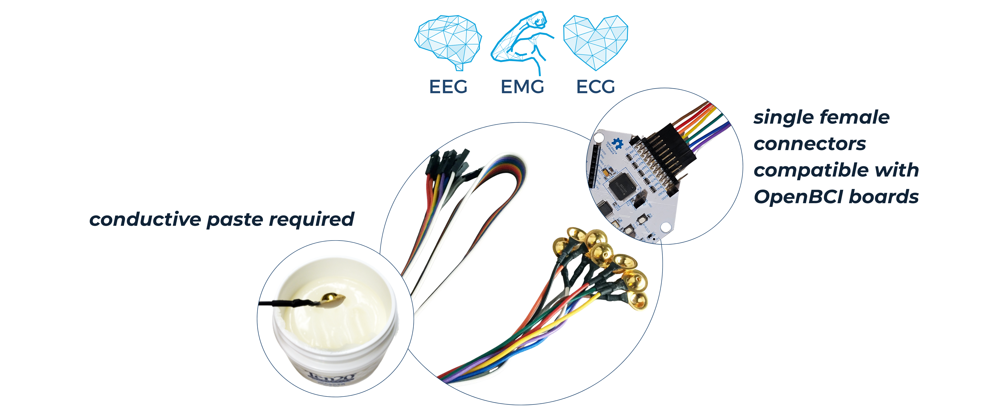
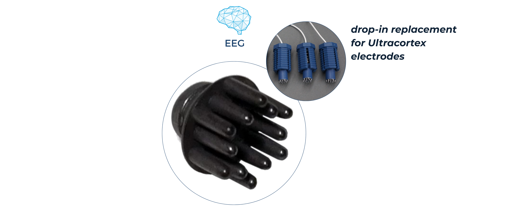
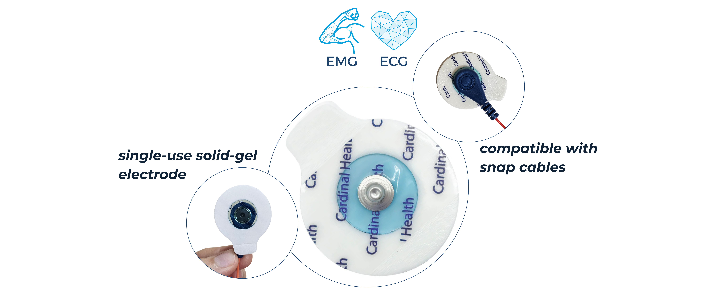
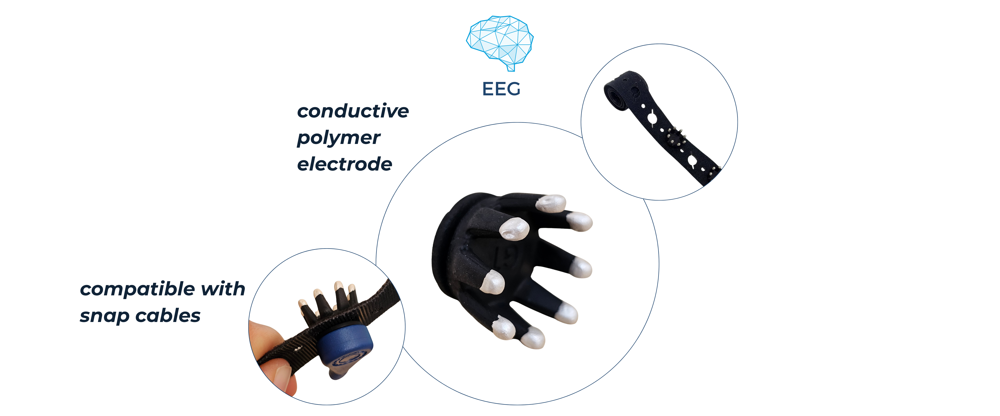
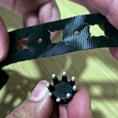
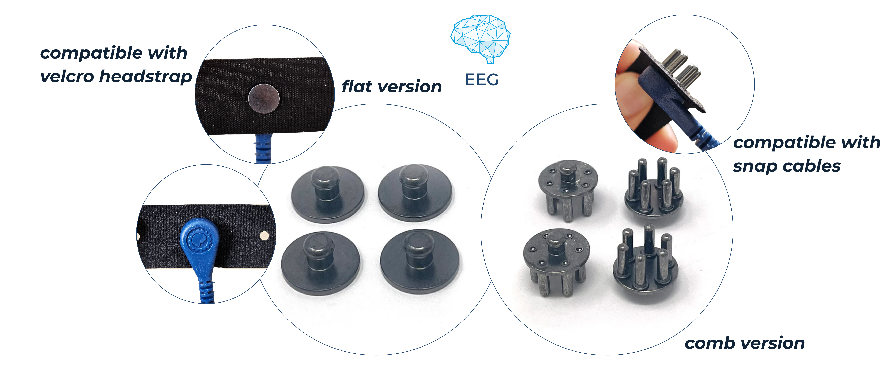
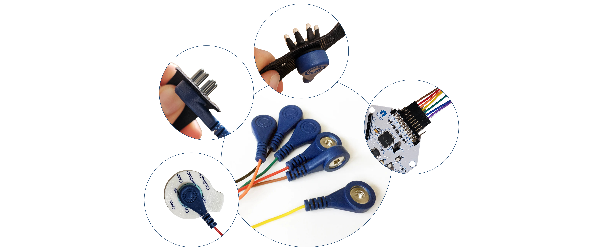
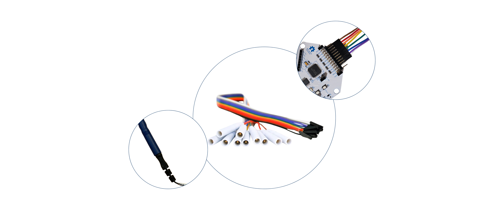

OpenBCI boards are compatible with a variety of different electrodes depending on your application, signal type (EEG, EMG, or ECG), and comfort requirements. In addition to our [Headwear solutions](https://docs.openbci.com/AddOns/AddOnLanding/#headwear), which provide integrated montages for high-quality EEG data, you can use standalone electrodes for tailored configurations for different biosignals. This guide covers the different electrode types available, as well as the cables and adapters used to connect them to your board. This guide covers the different electrode types available, as well as the cables and adapters used to connect them to your board

---

## Electrodes

### Gold Cup Electrodes

[**Buy them here!**](https://shop.openbci.com/collections/frontpage/products/openbci-gold-cup-electrodes?variant=9056028163)

Gold cup electrodes are the standard for high-quality, clinical-grade biopotential recordings. The OpenBCI Gold Cup Electrodes come as a ribbon cable with 10 passive gold electrodes that can be directly connected to any OpenBCI board to sample brain activity (EEG), muscle activity (EMG), and heart activity (ECG/EKG). While they offer a good signal-to-noise ratio and are completely reusable, they require a fair amount of preparation time, knowledge of proper electrode placement and the use of a conductive paste (like [Ten20](https://shop.openbci.com/collections/frontpage/products/ten20-conductive-paste-8oz-jar)) to adhere to the skin. 

**Usage:** Fill the cup entirely with conductive paste, place it firmly on the scrubbed skin site, and secure it with medical tape to prevent movement artifacts. You can refer to our dedicated [guide for EEG Setup](https://docs.openbci.com/GettingStarted/Biosensing-Setups/EEGSetup/) for more information on how to use them.

### Dry EEG Comb Electrodes

[**Buy them here!**](https://shop.openbci.com/collections/frontpage/products/5-mm-spike-electrode-pack-of-30?variant=8120433606670)

Designed specifically to penetrate through thick hair without the need for conductive gels or pastes, these dry comb electrodes are ideal for fast-setup EEG applications. Their 5mm prongs accommodate longer hair while maintaining good signal quality, and end in blunt tips engineered for long-term comfort and wearability. They are designed to easily replace the pre-installed spikey electrodes in [OpenBCI Ultracortex](https://shop.openbci.com/products/ultracortex-mark-iv) headsets. 

**Usage:** To install or replace them, use a small handheld screwdriver to loosen the screw inside the Ultracortex headset's blue electrode mount, remove the pre-installed electrode, and reuse the same screw to secure the comb electrode in place. Please note that each electrode has a lifetime of approximately 10 uses. After this, the conductive Ag-AgCl coating may become compromised if the electrodes aren't properly maintained. To ensure the integrity of the plating, recommended maintenance involves gently cleaning any visible residue with water after a session, drying them completely, and storing them in a dark, low-moisture container.

### EMG/ECG Foam Solid Gel Electrodes

[**Buy them here!**](https://shop.openbci.com/collections/frontpage/products/skintact-f301-pediatric-foam-solid-gel-electrodes-30-pack?variant=29467659395)

These pre-gelled, disposable foam electrodes are the standard for recording EMG (muscle activity) and ECG (heart activity). They use a silver-silver chloride (Ag/AgCl) coating, the same conductive material found in medical-grade sensors, plus a foam backing that keeps sweat and moisture away from the gel, so recordings stay stable during long sessions. The adhesive gel also picks up a strong signal quickly, even if the skin wasn't perfectly cleaned beforehand.

**Usage:** Snap the electrode into an [OpenBCI Snap Electrode Cable](https://shop.openbci.com/products/snap-electrode-cables-emg-ecg-eeg) or any other industry-standard button-snap cable to connect it to your OpenBCI board. Then, peel off the protective backing and press it firmly onto clean, dry skin over the muscle or chest site you want to monitor. Keep in mind they're single-use.

### EEG Polymer Electrodes

[**Buy them here!**](https://shop.openbci.com/products/eeg-polymer-electrodes?_pos=2&_fid=2d41d083a&_ss=c)

These experimental, dry, conductive-polymer electrodes are ideal for long, comfortable wear during EEG sessions, unlike rigid dry spikes, thanks to the flexible nature of the polymer material. Each kit comes as a comprehensive package designed for quick deployment, which includes eight individual polymer electrodes, a custom velcro strap pre-marked with the International 10-20 EEG system placement layout to ensure precise positioning on the head, and a mounting clip to secure your OpenBCI board in place.

**Usage:** Snap each electrode into the pre-marked positions on the included velcro strap, secure the strap snugly on the head, then connect it to your OpenBCI board using an [OpenBCI Snap Electrode Cable](https://shop.openbci.com/products/snap-electrode-cables-emg-ecg-eeg) or a standard third-party snap cable.

### EEG Snap Electrodes

[**Buy them here**](https://shop.openbci.com/products/eeg-snap-electrodes)

Designed to offer flexibility for different areas of the scalp, these silver-silver chloride (Ag-AgCl) plated electrodes are available either on their own, a [kit of 5](https://shop.openbci.com/products/eeg-snap-electrodes) letting you choose between a comb or a flat configuration, or as part of the OpenBCI [EEG Headband Kit](https://shop.openbci.com/products/openbci-eeg-headband-kit?_pos=7&_fid=851bedfe7&_ss=c), which includes 8 comb and 4 flat electrodes along with the snap cables, a velcro strap, and a board mounting clip. Their plating ensures good signal transduction, making them a reliable choice for modular or headband-based EEG setups. The comb variant is recommended for hair-covered areas, while the flat option is ideal for bare skin or forehead placements.

**Usage:** To connect them to your OpenBCI board, snap them into an [OpenBCI Snap Cables](https://shop.openbci.com/products/snap-electrode-cables-emg-ecg-eeg) or a standard third-party snap cable. These electrodes are usually held in place with a velcro strap, like the one included in the OpenBCI EEG Headband Kit.

---

## Cables & Adapters

### Snap Electrode Cables

[**Buy them here!**](https://shop.openbci.com/products/snap-electrode-cables-emg-ecg-eeg)

These specialized ribbon cables come in sets of 10 and serve as the bridge between standard button-snap electrodes and your OpenBCI hardware. On one end, they feature universal snap connectors that are fully compatible with both body-applied EMG/ECG gel electrodes and specialized EEG electrodes, like [EEG Polymer Electrodes](https://shop.openbci.com/products/eeg-polymer-electrodes?_pos=2&_fid=2d41d083a&_ss=c) and [EEG Snap Electrodes](https://shop.openbci.com/products/eeg-snap-electrodes). On the other end, they terminate in standard female header pins. This universal pin configuration allows them to be connected directly to any OpenBCI board. 

### Header Pin to Touch Proof Electrode Adapter

[**Buy it here!**](https://shop.openbci.com/collections/frontpage/products/touch-proof-electrode-cable-adapter?variant=31007211715)

The OpenBCI Touch-Proof Electrode Cable Adapter is a ribbon cable with 10 touch-proof sockets, designed to connect our [OpenBCI electrode cap](https://shop.openbci.com/products/openbci-eeg-electrocap), or any third-party electrode cap or electrode with standard touch-proof DIN 42802 termination, to any OpenBCI board.

