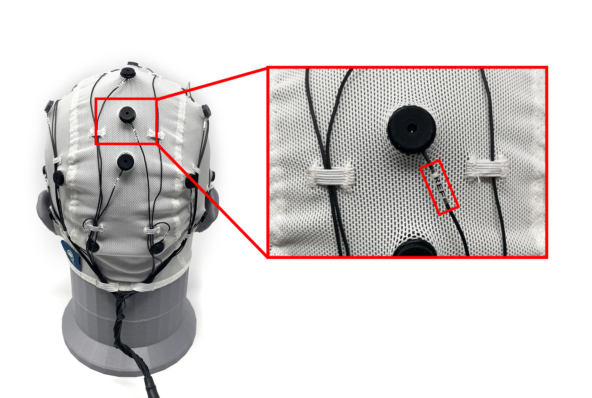
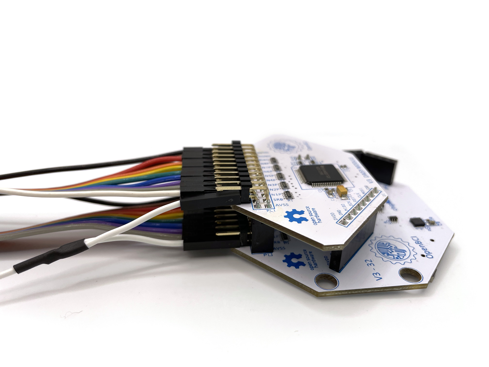

This is a guide to setting up and cleaning your OpenBCI Electrode Cap. Please consult the [Electrode Cap](https://shop.openbci.com/products/openbci-eeg-electrocap)
Product Page and review this guide in its entirety before starting.
The Electrode Cap allows up to 19 channels of EEG data to be obtained using wet electrodes.
You can pair the the Electrode Cap with the OpenBCI [CytonDaisy 16-channel Biosensing Board,](https://shop.openbci.com/collections/frontpage/products/cyton-daisy-biosensing-boards-16-channel)
or a bioamplifier of your choice. Electrode gel must be used with the electrode cap.

The placement of these electrodes is shown in the 10-20 diagram below:

The Electrode Cap comes in two variants:

-   19-channel electrode cap with Ag/AgCl **coated** electrodes
-   Premium 19-channel electrode cap with patented, **sintered** Ag/AgCl electrodes

The set up is the same between the two cap variants. You can follow this tutorial for both coated and sintered caps.

## Electrode Cap With CytonDaisy Tutorial

When combined with the OpenBCI [CytonDaisy 16-channel Biosensing Board](https://shop.openbci.com/collections/frontpage/products/cyton-daisy-biosensing-boards-16-channel),
the Electrode Cap is a low-cost, research-grade tool for obtaining 16 channels of EEG data.

### What You'll Need

1.  [CytonDaisy 16-channel Biosensing Board,](https://shop.openbci.com/collections/frontpage/products/cyton-daisy-biosensing-boards-16-channel)
2.  [Header Pin to Touchproof Adapter](https://shop.openbci.com/collections/frontpage/products/touch-proof-electrode-cable-adapter) (HPTA) x2
3.  [Electrode Gel](https://shop.openbci.com/collections/frontpage/products/electrodegel)
4.  [Electrode Cap](https://shop.openbci.com/products/openbci-eeg-electrocap)

### Connecting the Electrode Cap to the CytonDaisy

Use the [y-splitter cable](../../../GettingStarted/Boards/DaisyGS/#2-y-splitter-cable) that came with your CytonDaisy to "gang" together the bottom SRB pins on the Cyton and the Daisy module, as shown below. This will be the reference electrode for the other electrodes on the subject's head.

Connect a HPTA cable to the single end of the y-splitter cable, then connect the its blue termination to the REF electrode of the cap, shown below.

Connect bottom pins N1P through N8P on the Cyton to a set of HPTA cables, shown below. These pins will be channels 1-8 on the OpenBCI GUI.

Connect bottom pins N1P through N8P on the Daisy module to another set of HPTA cables, shown below. These pins will be channels 9-16.

Connect a leftover HPTA cable to the bottom BIAS pin of the Cyton. The BIAS pin is used for noise cancelling. It is similar to a GROUND pin, which establishes a common ground between the Cyton board and your body, but it has some extra destructive interference noise cancelling techniques built in! Connect the blue termination of this HPTA cable to the GND cap electrode, shown below.

For WHY these connections are recommended, see the [EEG explanation](../../GettingStarted/Biosensing-Setups/01-EEG-Setup.md)page.

After the cables are all connected as shown above, place the cap on the subject's head and inject a small amount of electrode gel using the included syringe. After each data recording session, be sure to clean the gel off the cap!

### Troubleshooting

Seeing a lot of noise? Check your electrode connections -

These steps can be done in any order:

1. The bottom BIAS pin of the Cyton **board** goes to the GND electrode of the **cap**. **You would use the HPTA cable to connect them.**

2. The bottom SRB pins on the Cyton and the Daisy **boards** should be "ganged together" using the split end of the y-splitter cable. 
The single end of the y-splitter cable should go to the REF electrode of the **cap**. **You would use the HPTA cable to connect them.**

The rest of the cap electrodes are completely up to you how you want to connect them to the Cyton.

3. For example, if you want data from Fp1 (of the cap) to show up on channel 1 of the OpenBCI GUI, then connect Fp1 cable to the bottom pin N1P of the Cyton. Use the HPTA cable to connect them.

If you want Fp1 data to show up on channel 9 of the OpenBCI GUI, then connect Fp1 to the bottom pin N1P of the CytonDaisy. You can pair any cap electrode (aside from GND and REF) with any pins N1P through N8P on the Cyton and Daisy boards

Channels 1-8 on the GUI correspond to bottom pins N1P through N8P on the Cyton
Channels 9-16 on the GUI correspond to bottoms pins N1P through N8P on the Daisy.

### Software

Head over to the OpenBCI GUI [tutorial](../../Software/OpenBCISoftware/01-OpenBCI_GUI.md) to set up your free live-streaming software!

### Use Cases for OpenBCI GUI

-   OpenBCI device owners want to visualize their brainwaves!
-   Many of the researchers, hackers and students alike who purchase OpenBCI devices want to use them to acquire data as soon as their device arrives.
-   Users use macOS, Windows and Linux to acquire data
-   Users want to filter incoming data in real time
-   Users want to make their own experiments to test their awesome theories or duplicate state of the art research at home!
-   Users struggle to get prerequisites properly installed to get data on their own from OpenBCI Cyton and Ganglion.
-   Users want to stream data into their own custom applications such as MATLAB.

### What You Can Do with OpenBCI GUI and Software Stack

-   Visualize data from every OpenBCI device: Ganglion, Cyton, Cyton with Daisy, and the WiFi Shield
-   Playback files using GUI
-   Run as a native application on macOS, Windows, and Linux.
-   Apply filters and other data processing tools to quickly clean raw data in real time
-   Use the GUI as a networking system to move data out of GUI into other apps over UDP, OSC, LSL, and Serial.
-   Send data to [MATLAB](../../Software/CompatibleThirdPartySoftware/01-Matlab.md), Neuropype (using LSL), and other [third-party softwares.](../../Software/SoftwareLanding.md)
-   Analyze data with [Python and Brainflow](ForDevelopers/01-SoftwareDevelopment.md#brainflow---python)
-   [Create a widget framework](../../Software/OpenBCISoftware/02_GUI_Widget_Guide.md#custom-widget) that allows users to create their own experiments.
-   Output data into a saved file for later offline processing.
-   [Customize the layout](../../Software/OpenBCISoftware/01-OpenBCI_GUI.md#customize-your-layout), change the gain, toggle on/off, check impedance of individual channels of the CytonDaisy board (or any connected OpenBCI board) directly in the GUI!
-   Access built-in widgets such as Band Power, Spectrogram, Accelerometer, EEG Head Plot, and MUCH more

    **If you just want to visualize EEG, EMG, ECG data (and do some basic analysis) and save the data to start with, download the standalone [OpenBCI GUI](https://openbci.com/index.php/downloads) and connect it to an OpenBCI Cyton, CytonDaisy, or Ganglion!**

## Electrode Cap With Third-Party Bioamplifier Tutorial

 The Electrode Cap comes with industry-standard touchproof terminations that can be plugged directly into most bioamplifers. The 10-20 locations are marked on the electrodes on the cap.

### What You'll Need

1.  [Electrode Gel](https://shop.openbci.com/collections/frontpage/products/electrodegel)
2.  [Electrode Cap](https://shop.openbci.com/products/openbci-eeg-electrocap)
3.  Your own bioamplifier

### The set-up

1.  Place the Electrode Cap on the subject's head and apply electrode gel with the included syringe.
2.  Connect the Electrode Cap to your bioamplifier using the 10-20 labels on the cap. The electrodes on the cap are labeled "GND", "REF", "C3", etc.
3.  Follow the manufacturer's instructions for your bioamplifier.

If you're using a third-party bioamplifier, you'll need the software that is compatible with that particular bioamplifier. The OpenBCI GUI is developed for use with OpenBCI-brand biosensing boards (Cyton, CytonDaisy, and Ganglion).

Find it all overwhelming? Don't know where to start? Questions, comments, suggestions? Email [support@openbci.com](mailto:support@openbci.com)

## Electrode Cap Care and Cleaning Guide

A routine schedule for cleaning and disinfecting the Electrode
Cap helps ensure accurate EEG signals and the reuse of electrodes between different participants. Furthermore, you will
preserve the excellent characteristics of your electrodes and will
ensure a long product life.

#### Cleaning Method:

1. Immediately after use, clean the residual gel off the cap's electrodes.
2. Soak the cap for about 15 minutes in warm water, so that the remaining gel dissolves quickly.
3. Use a cotton ball for removing gel residue from the electrodes if necessary.
4. Rinse the cap in clean water thoroughly. Finish rinsing with deionized water or distilled water, if available.
5. Hang the cap until completely dry and store the cap away from sunlight.

Cleaning frequency-after each use.

#### Disinfecting Method:

Disinfection must be done on a cleaned cap. 
1. Soak the cap for up to 30 minutes in diluted bleach solution of about 100 ppm sodium hypochlorite. Household bleach has a concentration of 5.25% of available
    chlorine (5.25% Sodium Hypochlorite). A 1:500 dilution of household bleach provides the 100ppm sodium hypochlorite required).
2. Rinse the cap in clean water thoroughly. Finish rinsing with deionized water or distilled water, if available.
3. Hang the cap until completely dry and store the cap away from sunlight.

Gas sterilization with ethylene oxide is an acceptable alternative.

Caution:

1.  Gently handle the connection point where the electrodes attach to the lead wire.
2.  Don’t touch other metals.
3.  Don’t leave residual gel on any part of the electrodes or wire.
4.  Keep the electrodes and the wire away from any corrosive liquid.
5.  Keep the touch-proof adapter ends away from water.

## Electrode Cap FAQ

### Here are some of the most commonly asked questions about the Electrode Cap.

1.  Can participants take the items home? As in, can it be used outside of a laboratory setting?
    - **Yes. Many OpenBCI customers are citizen scientists, hackers, artists, and casual at-home users of EEG hardware.**

2.  Are these items comfortable enough for people to sleep in for multiple days?
    - **The gel-based electrode cap is the most comfortable option. It is the same type of equipment used in professional and diagnostic sleep labs.**

3.  Is it durable enough to be used for multiple days?
    - **Yes. The electrode is a medical-grade product at a "kickstarter" price and is scientifically validated. It includes designs such as the durable cable sleeve to prevent tangled cables. The sintered cap is especially durable, given its sintered electrode design which is hardy to corrosion.**

4.  How would you recommend logging data from the participants every day?
    - **OpenBCI provides the free GUI to help customers verify proper hardware connection and provide a software for free raw data storage, visualization, and streaming. Please note the OpenBCI GUI does not provide built-in data cleaning or analysis. Many third-party softwares are compatible with the OpenBCI system. For a full list, head to https://docs.openbci.com/Software/SoftwareLanding.**

5.  Do you recommend using the OpenBCI EEG Headband Kit or the EEG Electrode Cap?
    - **We recommend the EEG electrode cap for sleep study. Sintered electrode cap plus electrode gel is the gold standard of EEG data acquisition.**

6.  Have you ever had consumers in the past use these items for a long duration? If so, what did they think of it?
    - **Our customers have compared OpenBCI products favorably to medical equipment at many times the cost. Please contact OpenBCI for the PDF on independent evaluation and scientific verification of OpenBCI hardware or head to the [Research Collection](https://openbci.com/citations).**

7.  Are the devices easy to learn and handle?
    - **I have personally worked with customers who have no previous experience with EEG and were able to follow the guides at docs.openbci.com to see their raw EEG data in live-time, as well as store the data for later analysis.**

8.  Would the hardware and data be messed up and skewed if the participants move around too much in their sleep?
    - **Subject movement will nearly always introduce noise into the system. This is true of all EEG equipment, no matter the brand or type. The cap's design in conjunction with the use of electrode gel (sold separately in the OpenBCI store) ensures good contact between the electrode and scalp, helping to reduce noise artifacts.**

9.  What are the potential negatives of using the wet EEG electrode cap? My team is wondering if it would be comfortable for participants to wear for the 10 days of our sleep study especially because the electrode gel may be too time consuming to apply and participants may create a mess if they get electrode gel in their hair.
    - **The electrode cap kit comes with a syringe applicator for easy, mess-free application of electrode gel. It is the same set-up as the ones used in medical lab sleep studies. At this time, there is no affordable, high-channel, dry electrode cap system.**

10. How long does it take to set up the EEG electrode cap prior to use?
    - **It's very easy to set-up. The first time may take 15 min as the user gets accustomed to the steps. Subsequent sessions would take just a few minutes to set up. Please refer to the EEG electrode cap guide to get an idea of how long it would take.**

11. If participants get the electrode gel in their hair, how easy is it for them to safely and cleanly remove it?
    - **The electrode gel is water-based and can easily be washed off with shampoo.**

12. My team is also looking into using the EEG Headband Kit and we wanted to know would this EEG be durable and accurate enough for a multiple day sleep study?
    - **The EEG headband is a starter kit for those new to EEG. It has not been tested for applications like sleep studies. The EEG electrode cap a more suitable product.**

13. We want to be able to use the EEG data for sleep scoring, and I was wondering whether the output file can be saved in edf format, so that is readable with some sleep scoring softwares such as RemLogic?
    - **The files are saved to .csv or bdf format. For information on the software, head to the [GUI Widget Guide](../../Software/OpenBCISoftware/02_GUI_Widget_Guide.md).**

14. Since we want to record data during sleep (~8-9 hours), I wanted to know the power consumption of the system, and how long the battery can last.
    - **A Lithium battery with high capacitance, such as [this one](https://www.digikey.com/products/en?mpart=328&v=1528) with 2500 mAh, should allow the system to operate overnight.**

15. What is the difference between coated and sintered electrode and which one you think would be better for us?
    - **You can find details on the difference between the two at the electrode cap product [page](https://shop.openbci.com/collections/frontpage/products/openbci-eeg-electrocap).
    The sintered cap's electrodes last longer due to the unique manufacturing process.**

16. I also would like to capture the EOG signal. Can I modify the amplification factor of the biosensing board for each different type of signals? Do you also suggest the best filter specifications for EEG/EOG/EMG recording?
    - By pairing electrodes to the OpenBCI Cytondaisy, you can obtain up to 16 channels from different data sources simultaneously.
    **You can modify the gain on each channel. Please refer to the [hardware settings section](../../Software/OpenBCISoftware/02_GUI_Widget_Guide.md#hardware-settings) of the GUI widget guide.
    Using the gold cup electrodes, ten20 paste, and medical tape, you can capture EOG signals. You would connect both the gold cup electrodes and the electrode cap connections to the CytonDaisy.**

17. Can I buy multiple caps (for different head sizes) with this kit?
    - **The electrode cap kits come in different sizes. Choose from small, medium, and large in the [product page](https://shop.openbci.com/products/openbci-eeg-electrocap).**

### Technical Specifications

