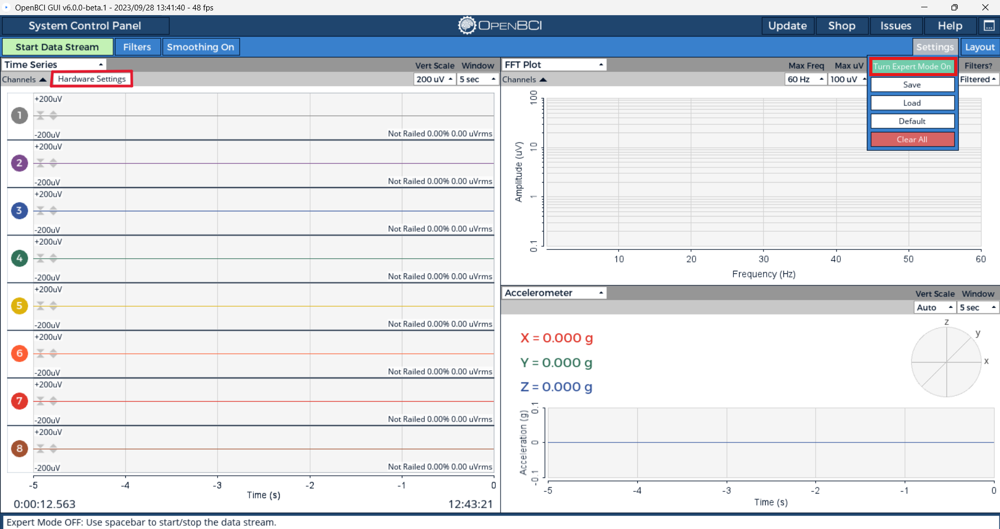
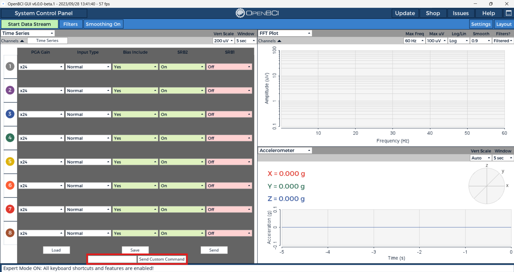
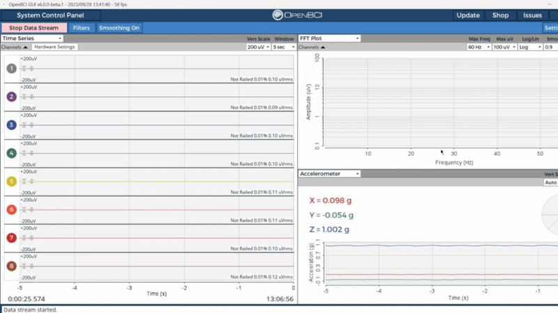

The OpenBCI Cyton boards communicate using a byte string (mostly ASCII) command protocol. This document covers command usage for the OpenBCI Cyton boards. Some of the commands are board-specific, where noted. Further, this document covers the commands needed to alter the radio system. There have been several iterations of the firmware: the 8-bit board runs `v0`, the Cyton runs `v1`, and boards shipped as of Fall 2016 run `v2.0.0`. `v3.0.0` began shipping with boards in August of 2017.

:::info

The Cyton 8-bit boards have been deprecated and so has `v0` and `v1` of the Cyton firmware. It is recommended to use the `v3.0.0` or later of the Cyton firmware. To update your Cyton firmware, follow the steps [here](../Cyton/05-Cyton_Board_Programming_Tutorial.md)

:::

## Cyton Command Protocol Overview

Cyton boards have two powerful microcontrollers onboard and come pre-programmed with firmware. The RFduino radio link uses the Nordic Gazelle stack and library. The board-mounted RFduino is configured as a DEVICE. The microcontroller (PIC32MX250F128B or ATmega328P) has been programmed with firmware that interfaces between the ADS1299 (Analog Front End), LIS3DH (Accelerometer), micro SD (if installed), and RFduino (Radio module). The user or application controls the board by sending commands over a wireless serial connection. You should have received a Dongle with the OpenBCI board. The Dongle has an RFduino running the Gazelle library configured as a HOST and interfaces with your computer through a Virtual Com Port (FTDI).

On startup, the OpenBCI Cyton board with firmware `v2.0.0` and later sends the following text over the radio:

```

OpenBCI V3 8-16 channel
ADS1299 Device ID: 0x3E
LIS3DH Device ID: 0x33
Firmware: v2.0.0
$$$

```

Device ID info is useful for general board health confirmation. The $$$ is a clear indication to the controlling application that the message is complete and the Cyton board is ready to receive commands. As of `v2.0.0`, there is an additional printout to indicate the exact firmware version.

## Command Set

To send a command to the Cyton board through the dongle wirelessly, you can use the Hardware Settings panel. But, you must turn on the Expert Mode in the OpenBCI GUI. To do this, connect to the Cyton board and then click on the Settings -> Turn Expert Mode On button as shown below.



In the Hardware Settings panel, the Custom Commands box can be used to send SDK commands to the board. If successful, you will see a GUI message that the command was sent successfully. 



### Turn Channels OFF

**1 2 3 4 5 6 7 8**

These ASCII characters turn the respective channels [1-8] off. The channel will read 0.00 when off during streamData mode. These commands work both in and out of streamData mode.

**returns** None; there is no confirmation.

### Turn Channels ON

**! @ # $ % ^ & \* **

These ASCII characters turn the respective channels [1-8] on. The channel will read ADC output values during streamData mode. These commands work both in and out of streamData mode.

**returns** None; there is no confirmation.

### Test Signal Control Commands

**0 - = p [ ]**

These commands are useful for self-test and calibration. If you feel like your Cyton or Daisy boards are malfunctioning, these commands are a great way to make sure the ADS1299 is not damaged. For example, you can measure the internal noise by sending **0**, which connects all inputs to an internal GND. If streaming, the stream will be stopped, the proper registers set on the ADS1299, and the stream will be resumed.

- `0` Connect to internal GND (VDD - VSS)

  When connected to Internal GND, the ADS1299 inputs are essentially shorted and measuring the internal or system noise. A normal working board will report 0.01% railed and 0.09-0.14 uVrms.
  

- `-` Connect to test signal 1xAmplitude, slow pulse

  A working Cyton or Daisy board will output square waves that are between 1855 - 1865 uVrms and 1.01% railed as shown below. To view the square waves properly, you will have to turn off all filters and set the scale to "Auto". 
  

- `=` Connect to test signal 1xAmplitude, fast pulse

  A working Cyton or Daisy board will output square waves that are between 1855 - 1865 uVrms and 1.01% railed as shown below. To view the square waves properly, you will have to turn off all filters and set the scale to "Auto". 
  

- `p` Connect to DC signal

  When connected to DC signal, the ADS1299 inputs are essentially measuring the DC Bias. A normal working board will report 2.01% railed and 0.13-0.16 uVrms.
  

- `[` Connect to test signal 2xAmplitude, slow pulse

  A working Cyton or Daisy board will output square waves that are between 3680 - 3715 uVrms and 2.01% railed as shown below. To view the square waves properly, you will have to turn off all filters and set the scale to "Auto". 
  

- `]` Connect to test signal 2xAmplitude, fast pulse

  A working Cyton or Daisy board will output square waves that are between 3680 - 3715 uVrms and 2.01% railed as shown below. To view the square waves properly, you will have to turn off all filters and set the scale to "Auto".
  

**returns** If not streaming, returns `Success: Configured internal test signal.$$$`; if streaming, there is no confirmation.

### Channel Setting Commands

** x (CHANNEL, POWER_DOWN, GAIN_SET, INPUT_TYPE_SET, BIAS_SET, SRB2_SET, SRB1_SET) X **

Channel Settings commands have six parameters for each ADS channel. To access Channel Settings, first send **x**. The OpenBCI board will then expect the next 7 bytes to be channel settings-specific commands. The first byte is the channel number. (If you have the Daisy Module, you can select up to 16 channels to set.) The following six ASCII characters are accepted as parameters to set. Lastly, sending **X** will latch the settings to the ADS channel.

**CHANNEL**

- **1 2 3 4 5 6 7 8** for single board channel select
- **Q W E R T Y U I** for selecting channels on the Daisy Module

**POWER_DOWN**

- 0 = ON (default)
- 1 = OFF

**GAIN_SET**

- 0 = Gain 1
- 1 = Gain 2
- 2 = Gain 4
- 3 = Gain 6
- 4 = Gain 8
- 5 = Gain 12
- 6 = Gain 24 (default)

**INPUT_TYPE_SET**  
Select the ADC channel input source

- 0 ADSINPUT_NORMAL (default)
- 1 ADSINPUT_SHORTED
- 2 ADSINPUT_BIAS_MEAS
- 3 ADSINPUT_MVDD
- 4 ADSINPUT_TEMP
- 5 ADSINPUT_TESTSIG
- 6 ADSINPUT_BIAS_DRP
- 7 ADSINPUT_BIAS_DRN

**BIAS_SET**  
Select to include the channel input in BIAS generation.

- 0 = Remove form BIAS
- 1 = Include in BIAS (default)

**SRB2_SET**  
Select to connect this channel's P input to the SRB2 pin. This closes a switch between P input and SRB2 for the given channel, and allows the P input also remain connected to the ADC.

- 0 = Disconnect this input from SRB2
- 1 = Connect this input to SRB2 (default)

**SRB1_SET**  
Select to connect all channels' N inputs to SRB1. This effects all pins, and disconnects all N inputs from the ADC.

- 0 = Disconnect all N inputs from SRB1 (default)
- 1 = Connect all N inputs to SRB1

**EXAMPLE**

User sends **x 3 0 2 0 0 0 0 X**

'x' enters Channel Settings mode. Channel 3 is set up to be powered up, with a gain of 2, normal input, removed from BIAS generation, removed from SRB2, and removed from SRB1. The final 'X' latches the settings to the ADS1299 channel settings register.

For firmware `v0` and `v1`, it is required that you allow a time delay (>10ms) when setting the channel and parameters. As of `v2.0.0`, you may stack multiple channel settings together, such as:

**EXAMPLE**

User sends **x1020000Xx2020000Xx3020000X**

This will set the first three channels.

**returns**

On success:

- If streaming, no confirmation of success.
- If not streaming, returns `Success: Channel set for 3$$$`, where 3 is the channel that was requested to be set.

On failure:

- If not streaming:
  - Not enough characters received: `Failure: too few chars$$$` (**example:** user sends x102000X)
  - 9th character is not the uppercase 'X': `Failure: 9th char not X$$$` (**example:** user sends x1020000V)
  - Too many characters or some other issue: `Failure: Err: too many chars$$$`
- If not all commands are received within 1 second: `Timeout processing multi byte message - please send all commands at once as of v2$$$`

### Default Channel Settings

**d** To set all channels to default

**returns** if not streaming, `updating channel settings to default$$$`

**D** To get a report of the default settings send.

**returns** When you query the default settings, expect to get 6 ASCII characters followed by **$$$**

_Note: Users can change the default channel settings in the initialization function inside the OpenBCI library. Requires re-programming the board_

### LeadOff Impedance Commands

**z (CHANNEL, PCHAN, NCHAN) Z**

This works similarly to the Channel Settings commands. For firmware `v0` and `v1`, care must be taken to delay between sending characters; as of `v2.0.0`, you may send as fast as possible in a byte stream. Impedance settings have two parameters for each ADS channel. Impedance is measurable by applying a small 31.5Hz AC signal to the given channel.

- 0 = Test Signal Not Applied (default)
- 1 = Test Signal Applied

**EXAMPLE**

User sends **z 4 1 0 Z** or `z410Z`

'z' enters Impedance Settings mode. Channel 4 is set up to measure impedance on the P input. The final 'Z' latches the settings to the ADS registers.

**returns**

On success:

- If streaming, no confirmation of success.
- If not streaming, returns `Success: Lead off set for 4$$$`, where 4 is the channel that was requested to be set.

On failure:

- If not streaming:
  - Not enough characters received, `Failure: too few chars$$$` (**example** user sends x102000X)
  - 5th character is not the upper case 'X', `Failure: 5th char not Z$$$` (**example** user sends x1020000V)
  - Too many characters or some other issue, `Failure: Err: too many chars$$$`
- If not all commands are not received within 1 second, `Timeout processing multi byte message - please send all commands at once as of v2$$$`

### SD card Commands

**A S F G H J K L**

Send to initiate SD card data logging for the specified time

- A = 5MIN
- S = 15MIN
- F = 30MIN
- G = 1HR
- H = 2HR
- J = 4HR
- K = 12HR
- L = 24HR
- a = about 14 seconds for testing

**j**

Stop logging data and close the SD file

### Stream Data Commands

**b**

Start streaming data

**returns** None; there is no confirmation.

**s**

Stop streaming data

**returns** None; there is no confirmation.

### Miscellaneous

**?**

Query register settings

**returns** Reads and reports all register settings for the ADS1299 and the LIS3DH. Expect to get a verbose serial output from the OpenBCI Board, followed by **$$$**

**v**

Soft reset for the Board peripherals  
The 8-bit board gets a reset signal from the Dongle any time an application opens the serial port, just like an Arduino. The Cyton board doesn't have this feature. So, if you want to soft-reset the Cyton board (`v1` or `v2.0.0`), send it a **v**.

**returns**
OpenBCI V3 8-16 channel
ADS1299 Device ID: 0x3E
LIS3DH Device ID: 0x33
Firmware: v3.1.1

$$

## 16 Channel Commands

Currently, the Daisy Module is implemented only on the Cyton board. The Daisy Module adds 8 more input channels for a total of 16. These are the commands specific to controlling the ADS1299 on the Daisy Module.

### Turn Channels OFF


**q w e r t y u i**
These ASCII characters turn the respective channels [9-16] off. The channel will read 0.00 during streamData mode. These commands work both in and out of streamData mode.

**returns** None; there is no confirmation.

### Turn Channels ON


**Q W E R T Y U I**
These ASCII characters turn the respective channels [9-16] on. The channel will contain ADC values during streamData mode. These commands work both in and out of streamData mode.

**returns** None; there is no confirmation.

### Select maximum channel number


**c**

Use 8 channels only. If the Daisy Module is attached, it will be unattached, and access to only channels 1-8 will be available.

**returns**

- If the Daisy is not present, no confirmation is sent because the board is already in 8-channel mode.
- If a Daisy is present, returns `daisy removed$$$`.


**C**
Use 16 channels.

**returns**

- If the Daisy is already attached, returns `16$$$`.
- If the Daisy is not currently attached and is **not** able to be attached, then `no daisy to attach!8$$$` is returned.
- If the Daisy is not currently attached and is able to be attached, then `daisy attached16$$$` is returned.


_Note: On reset, the OpenBCI Cyton board will 'sniff' for the Daisy Module, and if it is present, it will default to 16-channel capability._

## Firmware v2.0.0 New Commands

Firmware v2.0.0 was the first overhaul from Push The World which stabilized the core code and added several key new features to improve the user experience. As of firmware version `v2.0.0`, a set of commands has been implemented to change the radio system and improve over-the-air programming of the main Cyton board.

In order to use the commands, you must keep to the form of **key**-**code**-**(payload)** where **key** is `0xF0`, **code** is defined below, and **payload** is optional and dependent on the **code**. For example, to get system status, send `0xF0` then send `0x07`.


If the RFDuinos cannot communicate with each other, you will see a `Failure: Communications timeout - Device failed to poll host`, which means the Device RFDuino (on the Cyton) has stopped polling the Host RFDuino on the Dongle.

### Time Stamping

**&lt;**

Start time stamping and resynchronize command. When the Driver sends a **&lt;**, the Host radio will respond with a **,**. Since the Host cannot send packets to the Device ad hoc, it may be helpful to know when the Host was actually able to send the command. If the Board is not streaming, then expect a response of `Time stamp ON$$$`. If the board is streaming, then you will get a response in the data stream when the Driver receives a data packet with a different **stop byte** as described in the document titled [OpenBCI Streaming Data Format](Cyton/03-Cyton_Data_Format.md).

**returns** if not streaming, `Time stamp ON$$$`, if streaming then no confirmation

**&gt;**

Stops time stamping. If the Board is not streaming, then expect a response of `Time stamp OFF$$$`; however if the board is streaming, then you will get a response in a different **stop byte** as described in the document titled [OpenBCI Streaming Data Format](Cyton/03-Cyton_Data_Format.md).

**returns** if not streaming, `Time stamp OFF$$$`, if streaming then no confirmation

### Get Radio Channel Number

**0x00**

Returns either success or failure. If you get a failure, it will give you the host channel number and a failure message. If success it gives you both host and device channel numbers and a success message. Channel numbers can only be 1-25. The byte before EOT ($$$) will contain the channel number value in HEX.

**EXAMPLE**
User sends **0xF0** **0x00** to get the system to channel number

### Set Radio System Channel Number

**0x01**

If your radio system is up and talking, i.e. You sent `0xF007` and got a Success response signifying the Device and Host are on the same channel number.

Returns either success or failure. On failure it will ask you to verify the channel number and print a failure message. On success, it gives you both host and device channel numbers and a success message. Channel numbers can only be 1-25. The byte before EOT ($$$) will contain the channel number value in HEX.

**EXAMPLE**
User sends **0xF0** **0x01** **0x07** to set the system to channel 7

### Set Host Radio Channel Override

**0x02**

If your radio system is not up and talking, i.e. You sent `0xF007` and got a Failure response signifying the Device and Host are not on the same channel number OR your Cyton does not have power. If your Cyton is powered on you can cycle the Host through all possible 25 channels in an attempt to realign your Host and Device on the same radio channel.

Returns either success or failure. On failure it will ask you to verify the channel number and print a failure message. If success it sends "Host Override" followed by the channel number. Channel numbers can only be 1-25. The byte before EOT ($$$) will contain the channel number value in HEX.

**EXAMPLE**
User sends **0xF0** **0x02** **0x01** force the **only** the Host to channel 1

### Radio Get Poll Time

**0x03**

The poll time is a critical factor in over the air uploads. There is a direct correlation between poll time, CPU performance, and successful over the air uploads of the Pic32 software. If you are continuously getting failures, check out your poll time and increase if needed. If you have a good computer, you can try lowering the poll time to speed up your over the air uploads!

Returns success followed by the poll time in HEX.

**EXAMPLE**
User sends **0xF0** **0x03** to get the system to poll time number

### Radio Set Poll Time

**0x04**

The poll time is a critical factor in over the air uploads. There is a direct correlation between poll time, CPU performance, and successful over the air uploads of the Pic32 software. If you are continuously getting failures, check out your poll time and increase if needed. If you have a good computer, you can try lowering the poll time to speed up your over the air uploads!

Returns either success or failure. On failure it will send a "Communications Timeout" message. On success it sends success followed by the poll time in HEX. Values sent must be from 0-255 and must be sent in HEX. Defaults to 80ms.

**EXAMPLE**
User sends **0xF0** **0x04** **0x40** which sets the poll time to 64ms.

### Radio Set HOST to Driver Baud Rate to Default

**0x05**

Tells the Host RFDuino to send UART Serial data out at `115200` to the FTDI Virtual Serial Port.

Returns success and sends the baud rate in ASCII `115200`.

**EXAMPLE**
User sends **0xF0** **0x05** to set the baud rate to `115200`

### Radio Set HOST to Driver Baud Rate to High-Speed mode

**0x06**

Tells the Host RFDuino to send UART Serial data out at `230400` to the FTDI Virtual Serial Port. Note this does not help increase sample rate of the system, but it does help prevent dropped packets by allowing the computer to pull data off the serial-port faster because the data arrives so much faster to the FTDI virtual serial port.

Returns success and sends the baud rate in ASCII `230400`.

**EXAMPLE**
User sends **0xF0** **0x06** to set the baud rate to `230400`

### Radio Set HOST to Driver Baud Rate to Hyper-Speed mode

**0x0A**

Tells the Host RFDuino to send UART Serial data out at `921600` to the FTDI Virtual Serial Port. Note this does not help increase sample rate of the system, but it does help prevent dropped packets by allowing the computer to pull data off the serial-port faster because the data arrives so much faster to the FTDI virtual serial port.

Returns success and sends the baud rate in ASCII `921600`.

**EXAMPLE**
User sends **0xF0** **0x0A** to set the baud rate to `921600`

### Radio System Status

**0x07**

Get a health status check of your RFDuino to RFDuino communications.

Returns success or failure. On failure it will send a "Failure: System is down$$$" message. On success, it will send a "Success: System is up$$$" message.

**EXAMPLE**
User sends **0xF0** **0x07** to get status

## Firmware v3.0.0 New Commands

Supporting all v1.0.0 and v2.0.0, the v3.0.0 firmware extends the OpenBCI system to allow for a variable sample rate and analog or digital input readings!

### Sample Rate

**~(COMMAND)**

This works similarly to the Channel Settings commands; however, there is no latching character. Power cycling the OpenBCI board will cause the sample rate to reset back to the default of 250Hz.

:::important

**The Cyton cannot stream data over 250Hz.** These commands were created in anticipation of future capabilities, but due to radio restrictions, they cannot currently be utilized.
:::

**COMMAND**

- 0 = 16000 Hz
- 1 = 8000 Hz
- 2 = 4000 Hz
- 3 = 2000 Hz
- 4 = 1000 Hz
- 5 = 500 Hz
- 6 = 250 Hz
- ~ = Get current sample rate

**EXAMPLE**


First, the user sends **\~~**

**returns** `Sample rate is 250Hz$$$`


Then, the user sends **~5**

**returns** `Sample rate set to 500Hz$$$`

NOTE: if not all commands are not received within 1 second, `Timeout processing multi byte message - please send all commands at once as of v2$$$`

### Board Mode

**/(COMMAND)**

This works similarly to the sample rate. Power cycling the OpenBCI board will cause the board mode to return to default mode with the accelerometer in the aux bytes.

**COMMAND**

- 0 = Default mode - Sends accelerometer data in aux bytes
- 1 = Debug mode - Sends serial output over the external serial port which is helpful for debugging.
- 2 = Analog mode - Reads from analog pins A5(D11), A6(D12), and A7(D13) as well.
- 3 = Digital mode - Reads from analog pins D11, D12, D13, D17, and D18.
- 4 = Marker mode - Turns accel off and injects markers into the stream by sending _\`X_ where `X` is any char to add to the first AUX byte.
- / = Get current board mode

**EXAMPLE**


First, the user sends **//**

**returns** `Board mode is default$$$`


Then, the user sends **/2**

**returns** `Board mode set to analog$$$`

NOTE: if not all commands are not received within 1 second, `Timeout processing multi byte message - please send all commands at once as of v2$$$`

### Get Version

**V** To get firmware version

**returns** `v3.1.1$$$`

## Unused ASCII Characters

These are currently unused (and user available) characters in the OpenBCI Cyton platform:

**9 ( ) \_ o O f g h k l ' " n N M , . (space)**
$$
