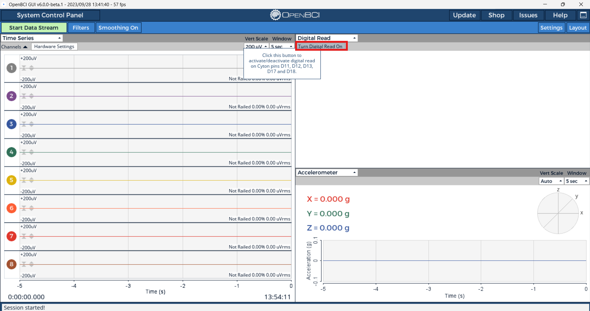
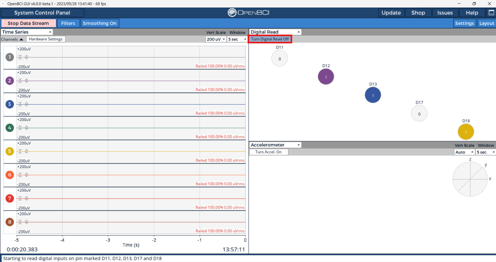

import D17PushButton from "../assets/CytonImages/D17PushButton.jpg";

In a lot of EEG experiments, there is a requirement for precise timing between external stimuli and the data stream. For example, with in an experiment collecting P300 data, it is necessary to know the exact time that the signal was presented to the subject in order to look for the recorded EEG signal that occurs about 300ms after the stimulus.

This tutorial will cover the methods to add an external trigger to the OpenBCI data stream on othe Cyton and Cyton+Daisy boards. Normally, the Cyton reads from the Accelerometer at 25 Hz. When the "Digital Read" or "Analog Read" widgets in the GUI and opened and enabled, signals are read from the GPIO pins at same rate as the NxP input headers. This is what allows for the precise timing required for external triggers.

## Access the Digital Read Widget

Launch the OpenBCI GUI for your operating system following the tutorial for the [OpenBCI GUI](../Software/OpenBCISoftware/01-OpenBCI_GUI.md#running-the-openbci_gui).

Once the GUI has launched, follow the guide to [connect to the Cyton board from the OpenBCI GUI](../GettingStarted/Boards/01-Cyton_Getting_Started_Guide.md#iv-connect-to-your-cyton-board-from-the-gui).

After connecting the board to the GUI, open and enable the "Digital Read" for one of your widgets. 



Then select the start digital read mode button in the top left of the newly populated widget. This will activate and send the proper commands to your Cyton. Note that the accelerometer will no longer be turned on because the trigger data is now sent instead.



When you use a Cyton dongle, you get up to 5 GPIO (General Purpose Input and Output) pins to read from: D11, D12, D13, D17, and D18! If there appears to be a delay between when you press the button and when the digital read widget in the GUI shows the button pressed, then you may want to lower your serial port latency. Check out the guides for lowering serial port latency for [Windows](../Troubleshooting/04-FTDI_Fix_Windows.md), [macOS](../Troubleshooting/05-FTDI_Driver_Fix_Mac.md), and [Linux](../Troubleshooting/03-FTDI_Fix_Linux.md)!

## Trigger Methods on the Cyton Board

### Utilize the on-device push button

The OpenBCI Cyton Board comes with a user-accessible pushbutton already on the board. This is the PROG button and it's attached to pin D17 with a 470K pulldown resistor. When you press the PROG button, D17 goes from LOW to HIGH. The PROG pushbutton is a great way to get user acknowledgment of a stimulus into the data stream.

<div style={{textAlign: 'center'}}>
    
</div>

Shown below is an example of what happens when the PROG button is pressed.


:::caution
The PROG button, when used along with the RST button, can put the board into programming mode, which will affect its normal operation. The blue LED will start blinking if it is in programming mode. To get the board out of programming mode and back to normal operation, refer to the ["Did you Press the Reset Button?"](../Troubleshooting/Reset_Button_Press.md) guide.
:::

We want to get the button press event into the data stream. (Reference the [OpenBCI Data Format Doc](03-Cyton_Data_Format.md) for data packet format.) There are 6 bytes available in each data packet, and the default format is to read them as three 16-bit integers (aka 'words' or 'shorts'). You can decide to add your flags into the auxData array any way you choose. In this example, we are setting each short to the value 0x6620. That's because our [OpenBCI GUI](https://github.com/OpenBCI/OpenBCI_Processing) converts these variables to Gs (the GUI is expecting accelerometer data) and 0x6620 converts to PI (3.14). Our sample rate of 250SPS gives us a 4ms resolution on external trigger events like the rising edge of the PROG button press.

Here's an example of what the data looks like after it's been logged by our GUI:

```

217, -18.08, -23.04, -21.59, -29.86, -23.76, -19.65, -28.79, -19.47, 0.00, 0.00, 0.00
218, -18.17, -22.82, -21.59, -29.93, -23.85, -19.65, -28.72, -19.16, 0.00, 0.00, 0.00
219, -17.97, -23.04, -21.39, -29.97, -23.92, -19.56, -28.74, -19.24, 0.00, 0.00, 0.00
220, -17.99, -23.07, -21.61, -30.00, -23.72, -19.71, -28.52, -19.16, 0.00, 0.00, 0.00
221, -17.90, -23.04, -21.48, -30.09, -23.85, -19.54, -28.43, -19.18, 3.14, 3.14, 3.14
222, -17.90, -22.96, -21.48, -30.20, -23.72, -19.38, -28.57, -18.95, 0.00, 0.00, 0.00
223, -17.93, -22.89, -21.26, -29.97, -23.96, -19.65, -28.54, -18.95, 0.00, 0.00, 0.00

```

And here's an example of what the data looks like after it's been logged to the SD card:

```

D9,FFFCD7,FFFBF9,FFFC3A,FFFAC8,FFFBD9,FFFC91,FFFAF8,FFFC99
DA,FFFCD3,FFFC03,FFFC3A,FFFAC5,FFFBD5,FFFC91,FFFAFB,FFFCA7
DB,FFFCDC,FFFBF9,FFFC43,FFFAC3,FFFBD2,FFFC95,FFFAFA,FFFCA3
DC,FFFCDB,FFFBF8,FFFC39,FFFAC2,FFFBDB,FFFC8E,FFFB04,FFFCA7
DD,FFFCDF,FFFBF9,FFFC3F,FFFABE,FFFBD5,FFFC96,FFFB08,FFFCA6,6220,6220,6220
DE,FFFCDF,FFFBFD,FFFC3F,FFFAB9,FFFBDB,FFFC9D,FFFB02,FFFCB0
DF,FFFCDE,FFFC00,FFFC49,FFFAC3,FFFBD0,FFFC91,FFFB03,FFFCB0

```

### Adding Trigger Markers from External Sources

Sometimes a situation may arise where you need to interface OpenBCI with an existing system, for example, an audio or visual event-related potential (ERP). In such a case, it is most desirable to have the onset of the signal tightly bound, temporally, with the EEG data. It is possible to interface the Cyton Board with the external signal-generating system using a few low-cost components.
Our goal with OpenBCI is to make biosensing safe and fun. The most important thing is making sure that you can't accidentally plug yourself into the mains electrical supply. If you are interfacing an external trigger that is **NOT** operating under a battery supply, we recommend thinking twice about incorporating it into your system/protocol. If you have thought through it twice, here's how we do it when we need to.

#### Isolating the Cyton from an External Voltage


The simplest trick is to isolate the OpenBCI circuit from the trigger signal-generating circuit. For this purpose, we picked an optoisolator with 5000 volts isolation between the input and the output. The [CNY17](http://www.mouser.ee/ProductDetail/Vishay-Semiconductors/CNY17F-2X006/?qs=sGAEpiMZZMteimceiIVCB7Uit3aMEvQQFLjPtOr%2f870%3d) family from Vishay is a great example of a low-cost, high-isolation optoisolator. It's usually available and costs under a dollar (USD) in singles. In the circuit to the right, when an external trigger of 3.3V is applied to the anode of the input (pin 1), the output (pin 5) will go from HIGH to LOW.

As always, help can be found at support@openbci.com and [openbci.com/forum](https://www.openbci.com/forum).
