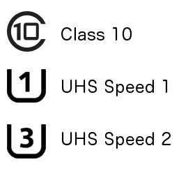

## Overview

There are many situations where logging biometric data to local storage may be desirable. You may be doing a sleep study, or out on the road with your OpenBCI, and the wireless connection to a PC may be tenuous. The amount of data you are producing may require more bandwidth than the BLE connection can handle. This tutorial will cover the basics of adding an SD card for local storage to OpenBCI, how the data is formatted on the card, and how to retrieve the data after you've logged it. 

The data saved to SD card is sampled at 250 Hz, even if you use a CytonDaisy 16-channel board! Therefore you are not limited to the 125 Hz sampling rate when streaming data from CytonDaisy. Note, the data still streams from CytonDaisy to computer at 125 Hz, but the sampling rate is 250Hz if you select the 'save to SD card' option in the GUI start screen.


## SD Card Basics




First thing to know is that low-cost cards and slow speed cards are **not** recommended. When shopping for SD cards, make sure to look for high quality (Scan Disk, eg) and high speed (class 10 minimum). Look for the symbols to the right to know you are getting the right kind of card. You will also want to look for a card that has a lot of memory. OpenBCI will generate about 1 mega bye of data per minute when it is recording 8 channels at the default rate of 250Hz. That's a lot of data!

We've used these two cards in the OpenBCI lab, and they both work great.

People have reported issues with _Transcend_ and _Samsung_ Class 10 cards.

### Formatting


**IMPORTANT** - If you are using a new card, or one that you've had around, you MUST format it to FAT32 or FAT. We've found that the most successful formatting method is one that overwrites the card, not just 'erasing' it which can leave old data intact. The Mac OS provides this option in the Disk Utility. Click the Erase tab, open Security Options, and slide the slider to the 'single pass of zeros' option. There are more comprehensive secure erase options, but they take longer. 


Another, and some say better, option is to use the SD Association's own formatter software. [Download it here](https://www.sdcard.org/downloads/formatter_4/). (available for Windows and Mac). We recommend using it if you are on a Windows machine, because the Windows format option does not allow for overwriting the disk. Make sure to select OverWrite Format Type when using the SDFormatter tool on Windows or Mac.

In our experience, it's best not to have any sort of file structure on the SD card. All files that OpenBCI boards create will be saved in the root.

### Block Writing

In order to write OpenBCI data to the SD card in a timely fashion, we are using a block writing technique in Arduino and chipKIT. Blocks are 512 bytes. That means that OpenBCI will collect bytes as they come in from the sensors, and when a block is complete (512 bytes) it is written to the file on SD card. First, of course, the file needs to be created, and memory on the card allocated. OpenBCI uses ASCII commands to control the creation of a file. The following key commands allocate different amounts of SD card memory

```

'A': BLOCK_COUNT = BLOCK_5MIN	= 5.6Mb
'S': BLOCK_COUNT = BLOCK_15MIN	= 17Mb
'F': BLOCK_COUNT = BLOCK_30MIN	= 34Mb
'G': BLOCK_COUNT = BLOCK_1HR	= 67Mb
'H': BLOCK_COUNT = BLOCK_2HR	= 133.5Mb
'J': BLOCK_COUNT = BLOCK_4HR	= 266.8Mb
'K': BLOCK_COUNT = BLOCK_12HR	= 800Mb
'L': BLOCK_COUNT = BLOCK_24HR	= 1.6Gb
'a': BLOCK_COUNT = ~14 seconds	= 262Kb

```

The OpenBCI Processing sketch allows for selecting recording blocks from 'A' to 'L'. The small 'a' block allocation is for testing. You can use it if you like. Make sure the card is installed correctly on the OpenBCI board before you send the command to create the file. If you don't have the card installed, all is not lost! The program will hang until a valid card is installed and the file created. One of the nice things about writing the data in blocks is that once the block is written, it is on the card. In other words, if you create a file that allocates 30 minutes of record time and then stop your recording after only 15 minutes (by resetting the uC, or powering down the board, or pulling out the card) all of the data that was written will still be on the card!

### OpenBCI Formatting

#### File Naming

We are using the SDFat library, which limits our file name to the old 8.3 format (8 character file name, three character file type extension). OpenBCI automatically creates SD files with an incrementing counter as part of the file name. For example, the first file that you ever make with your OpenBCI board will be called OBCI_01.TXT and the next one will be called OBCI_02.TXT. The numbering counts up in Hexadecimal until you get to file OBCI_FF.TXT, the next file will be OBCI_00.TXT. So, you have up to 256 discreet files that you can make on the SD card before you overwrite anything. The file name counter values are saved in the Arduino and chipKIT EEPROM, and incremented every time you create a file.

### Data Logging Format

We tried to make it as easy as possible to log the data, given the 512 block limitation. (A sample of a saved file is to the right) Because it's difficult to manage signed decimal values in a timely fashion, we are writing all of the data in hexadecimal. That also makes it easier to anticipate file size and record time. In the example you can see that each ADS channel value is a 24bit number separated by a comma. The Accelerometer/Aux values are 16bit, and only written when they get updated or are used (activated). In this example, the Accelerometer is sampling at 50Hz, while the ADS1299 is sampling at 250Hz.

```

Sample#, 8 ADS Channel Values, 3 Accelerometer/Aux Values

8B,028A3C,028A0E,028A86,028A04,0288FB,028AB7,028962,028A42
8C,028A3D,028A09,028A89,028A08,0288FE,028AC5,028960,028A3C
8D,028A3A,028A0B,028A85,028A01,0288ED,028AB1,02895A,028A3D
8E,028A41,028A06,028A83,0289FE,0288F2,028AAD,028953,028A3A,02A0,FF80,21A0
8F,028A42,028A02,028A79,0289FC,0288E8,028AAF,02894D,028A3F
90,028A32,028A0C,028A7C,0289FF,0288EE,028AB4,028959,028A3A
91,028A39,028A03,028A80,028A04,0288F6,028AB6,02894D,028A29
92,028A3B,028A0C,028A84,028A04,0288F1,028ABE,028952,028A37
93,028A3D,028A0F,028A7E,0289F6,0288EA,028AC2,02895A,028A35,02A0,FF80,2190
94,028A40,028A11,028A76,028A03,0288E4,028ABD,028953,028A38

```

The saved file also contains meta-data at the beginning and end. Lines of text start with a **%** symbol, so that conversion software will know they are just text. The first line time-stamps with the time in milliseconds **_since the board was turned on_**. If for any reason the streaming data is stopped during a recording session, The stop time will be inserted, and if re-started, there will be another start time stamp. At the end of the file there is a record of the total write time in milliseconds, and information about the block write performance: min block write and max block write in microseconds, as well as record of any blocks that took more than two milliseconds to write. Examples of the meta-data at right.

```

%START AT
00001C70
00,8822D0,882E56,8CB903,8AA6B0,88101E,881459,8C9E38,8CC28A
01,882194,882D1F,8CB47F,8AA0B5,880EE8,881321,8C9B2D,8CC403
....
50,876554,8770E3,8BFE9F,891AE4,875316,875739,8BE3A1,8C0FE0
%STOP AT
000025BD
%START AT
0000315A
00,866B60,8676F6,8B099A,86F099,8659F9,865DAA,8AE564
01,866A24,8675B7,8B05B9,86E9D6,8658B7,865C68,8AE291
....
%Total time mS:
00005F53
%min Write time uS:
0000012B
%max Write time uS:
00000131
%Over:
00000000
%block, uS

```

The OpenBCI Processing Sketch has the functionality to read and convert these hexadecimal files to 'normal' data files.

### Writing to SD Card using the OpenBCI GUI

Before starting the session, expand the dropdown in the "Write to SD Card?" section of the Control Panel with Cyton as the Data Source. Select the maximum file size in minutes. Note that the dropdown can scroll to show more options.


### Loading SD Card files for Playback using OpenBCI GUI

**SD file conversion is no longer necessary in GUI v5. Simply select an SD card file from the Cyton or Cyton+Daisy and it will load for playback!**


### Converting Hex files in OpenBCI GUI

<details><summary><b>DEPRECATED -- Expand this dropdown for instructions to convert SD files using GUI v4.2.0</b></summary>

<br />Note: To convert very large recordings, you must run the OpenBCI_GUI Sketch in Processing after changing "Increase Maximum Available Memory to: " at least 9000 MB aka 9GB.<br />

We don't currently have a way to recall the file contents from the OpenBCI board over the Radio link to the Dongle. You must remove the SD card from the OpenBCI board and access the files via your computer.<br />

<br />

On startup, the OpenBCI GUI will ask you for the data source you want to work with. Select **PLAYBACK(from file)** and click the **SELECT SD FILE** button.<br />

<br />

Navigate to the OpenBCI generated file, and click **OPEN**. The GUI will convert the file you selected. The resulting file will be placed inside a file called EEG_Data in the Processing OpenBCI GUI Sketch Folder. The file naming convention is **SDconverted-Year-Month-Day-Time.txt**. Example:<br />

_/Documents/OpenBCI_GUI/SDconverted-2015-01-14_13-35-54.txt_<br />

</details>
