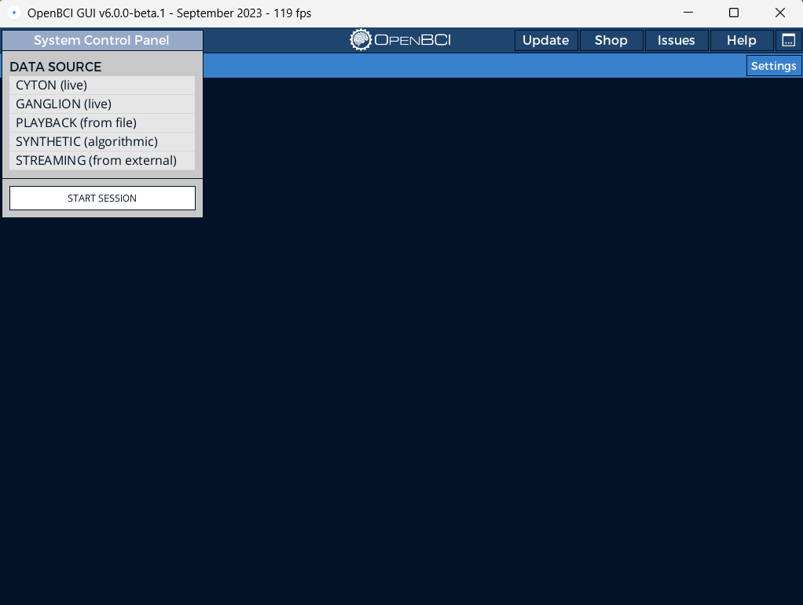
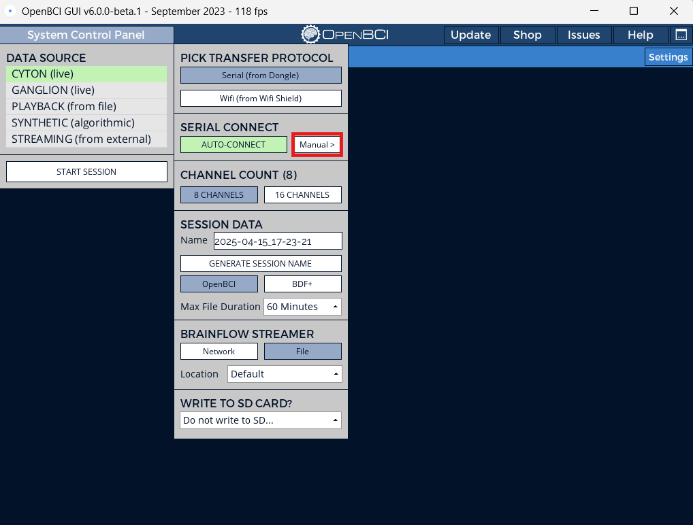
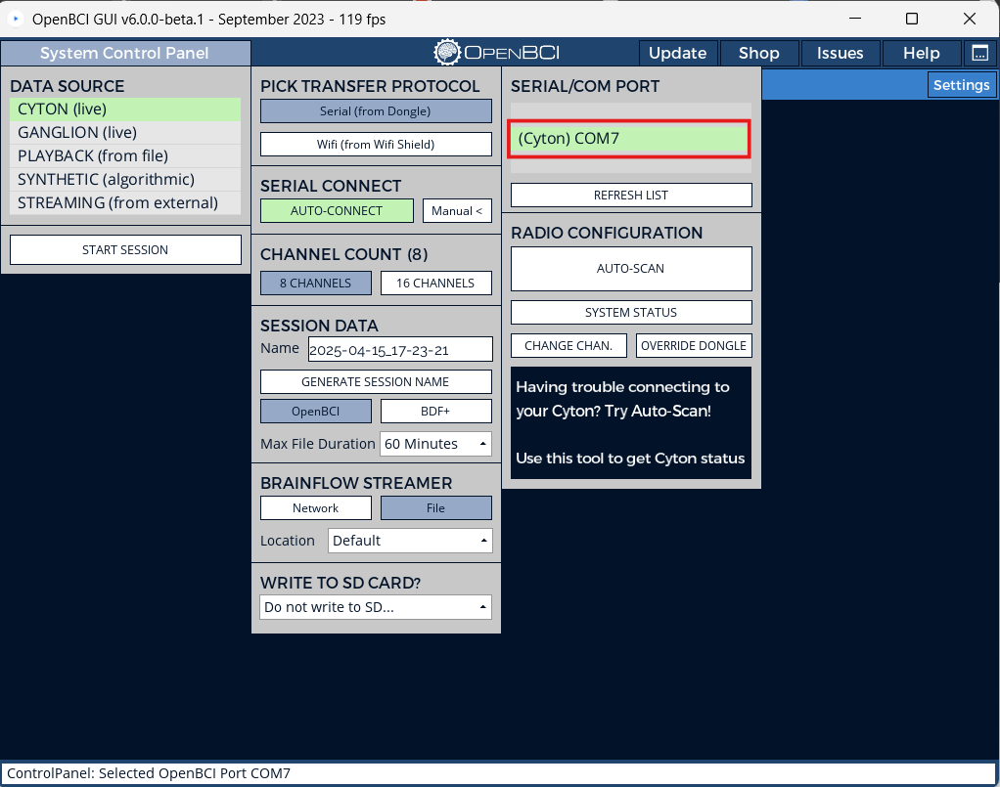
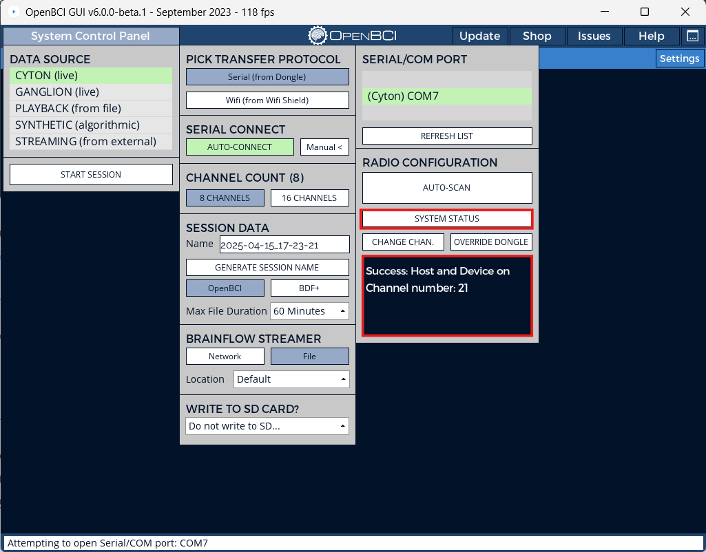
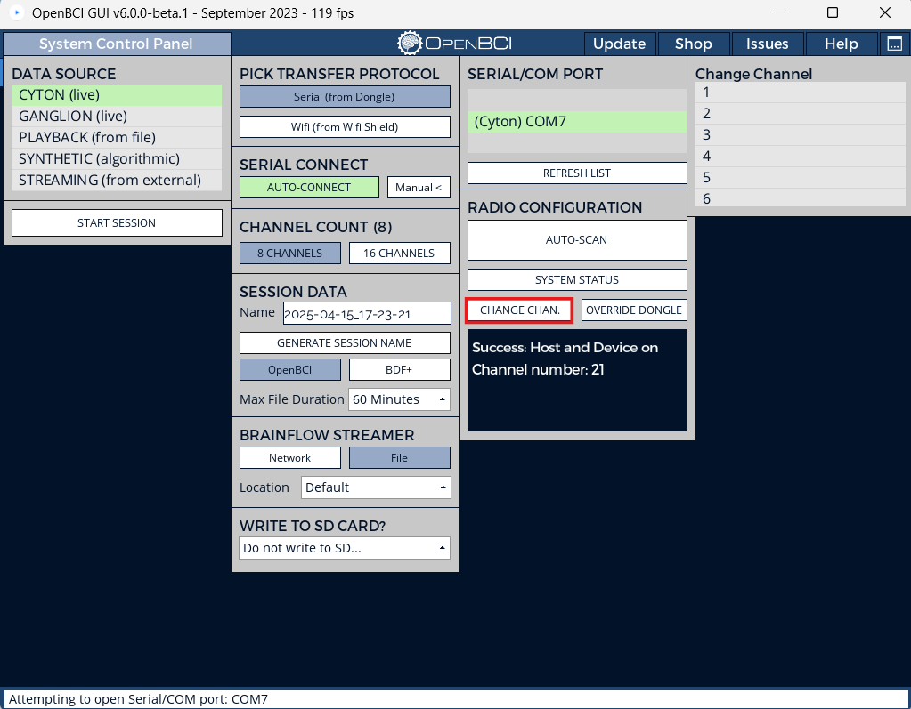

import ChangeRadioChannelStep7 from "../assets/CytonImages/ChangeRadioChannelStep7.png";
import LabelledCytonDonglePair from "../assets/CytonImages/LabelledCytonDonglePair.jpg";

:::caution

This guide covers how to change the Radio channel of the Cyton or Cyton+Daisy when used with a dongle so that multiple Cytons can be used in close proximity with each other. This guide does not cover programming the Radio of the Cyton or Dongle. All OpenBCI boards ship pre-programmed. DO NOT attempt to upload firmware to your Cyton board or dongle unless specifically instructed to do so. 

Changing the Radio channel of the Cyton is harmless and recommended if you plan to use multiple Cytons in the same room. 
:::

## Overview

The OpenBCI Cyton Boards come with a USB dongle that allows for communication between the Board and your computer. There is a BLE radio module ([RFduino 22301](http://www.rfduino.com/product/rfd22301-rfduino-ble-smt/index.html)) on the Dongle and Board that make the communication happen. Here's some terms that are important to note:

- The radio module on the Dongle is called the **HOST**
- The radio module on the Cyton Board is called the **DEVICE**
- Host-Device pairs can be programmed to transmit on up to **25** discreet channels
- There are _important_ differences in the firmware for 8-bit and 32-bit systems

This tutorial explains how to use any one of the 25 discreet channels with you Cyton or Cyton+Daisy and Dongle pair so that multiple pairs can be used in the same room or environment. 

## Steps to Change Radio Channel

1.  Launch the OpenBCI GUI.

2.  Turn on the Cyton or Cyton+Daisy board and plug in the Dongle to a USB port. Make sure that the Dongle is set to GPIO_6 when it is connected to the computer.

3.  Access the Serial/COM Port control panel within the Cyton settings. 

4. [Select the COM Port](https://docs.openbci.com/GettingStarted/Boards/CytonGS/#3-find-your-usb-dongles-serialcom-port) for the Cyton that requires a Radio channel change.

5. Click the "SYSTEM STATUS" button to check which channel the Dongle and board are using.

6. Access the Change Channel panel within the Radio Configuration settings.

6. Select any channel that other Cyton boards are not using and click the Channel number. The message box will update and display the selected channel number if this process is successful. To confirm, click the "SYSTEM STATUS" button again to confirm that the Dongle and board are set to the Channel selected.

    

The HOST and DEVICE have now been set to a unique channel! It is best practice to label the Dongle and Cyton or Cyton+Daisy board with the Channel number as shown below for easy identification and to prevent the same Radio channel from being used on another pair. 

    

:::note

This procedure must be done one pair at a time. If two pairs use the same channel, the data will not stream properly or the session will not start as there will be interference. While this does not damage the board in any way, it does cause issues if multiple data streams are being performed at the same time. 

:::