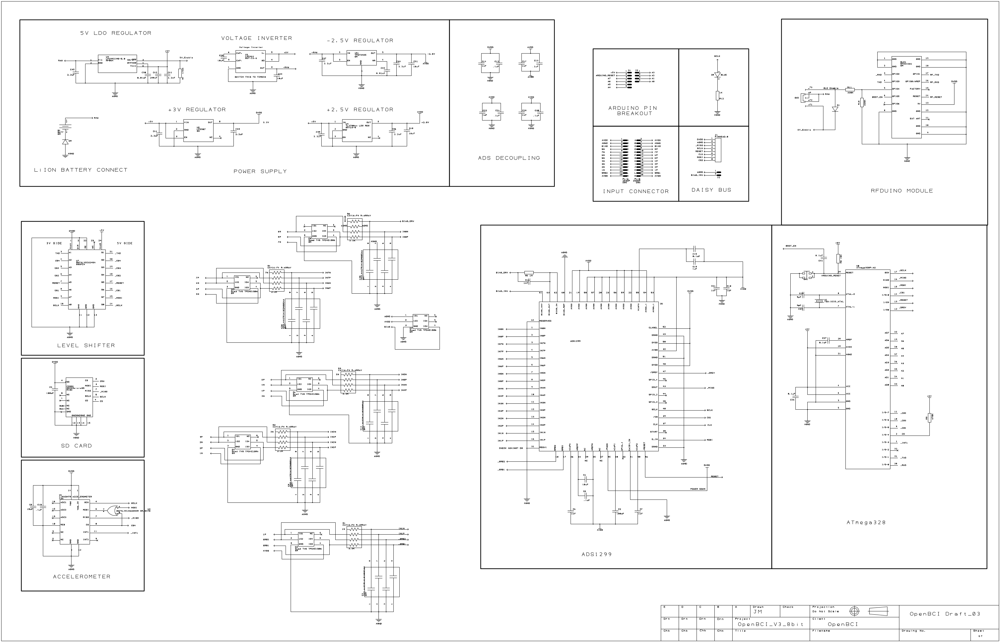

### 8-bit Board Specs:

- Power with 6-12V DC battery ONLY
- ATmega328P microcontroller with Arduino UNO bootloader
- ADS1299 analog front end
- LIS3DH 3-axis accelerometer
- RFduino BLE radio
- Micro SD card slot
- Voltage regulation (5V, 3V, +2.5V, -2.5V)
- SN74LVCC3245A level shifter
- Board dimensions: 2.41" x 2.41" (octagon has 1" edges)
- Mount holes are 1/16" ID, 0.8" x 2.166" on center

### Breakout Pins:

- ICSP pins on 5V side for bootloading ATmega
  - MISO, MOSI, SCLK, 5V, MCLR, GND
- Serial pins for programming RFduino
  - RFTX, RFRX, RFRST, GND
- SPI bus pins on the 3V side for Daisy Module expansion
  - DVDD, GND, MISO, MOSI, SCK, CS, CLK, RST
- Unused ATmega pins
  - A0, A1, A2, A3, A4, A5, A6, A7

The SPI bus pins on the 3V side include CLK, which is tied to the ADS1299 CLK pin for timing the Daisy Module, and an RST pin which is tied to the ADS1299 MCLR pin for hardware reset of the ADS. The A0 to A5 pins can be used as analog inputs or digital input/output just like on the Arduino UNO. A6 and A7 are analog input only.

### Push Button

The pushbutton switch is RESET for the ATmega.

### Slide Switch

The slide switch is the power for the board. The slide switch has three positions:

- BLE activates a pull-up on RFduino pin 4
- OFF disconnects the battery input
- PC does NOT activate pull-up on RFduino pin 4

  **NOTE: BLE|PC selection is NOT implemented!**

Switching either BLE or PC will produce the same result. The option is available for future development...

### OpenBCI 8-bit Board Circuit Schematic

### 8-bit Board PCB Layer Images

### 8-bit Board PCB Files

[OpenBCI 8-bit Gerber & BOM (568K zip)](http://ultracortex.com/downloads/hardware/OpenBCI_8bit.zip)
