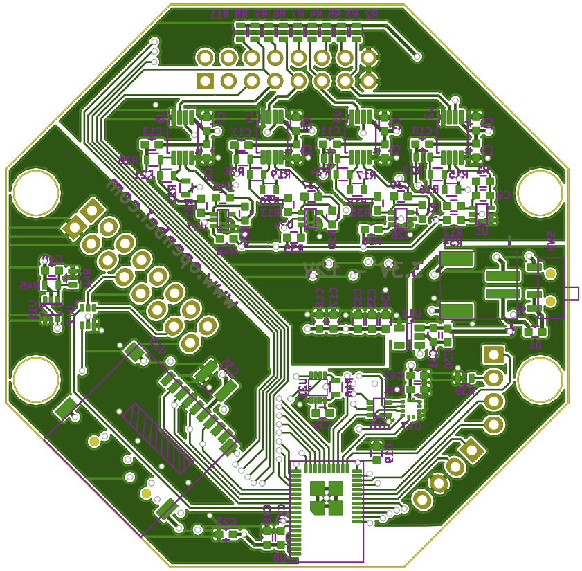

## [BUY IT!](https://shop.openbci.com/collections/frontpage/products/ganglion-board)

The OpenBCI Ganglion PCBs were designed with KiCAD, an Open Source PCB capture software. You can find a link to download KiCAD in our [Ganglion design files repository](https://github.com/OpenBCI/Ganglion_Hardware_Design_Files) where you will find design files and component library files to load into KiCAD and edit, if you like, along with the full BOM for this maiden production run.

## OpenBCI Ganglion Board

### Ganglion Board Specs

-   Power with 3.3V to 12V DC battery ONLY
-   Current Draw: 14mA when idle, 15mA connected and streaming data
-   [Simblee](http://www.simblee.com) BLE Radio module (Arduino Compatible)
-   [MCP3912](http://www.microchip.com/wwwproducts/en/MCP3912) Analog Front End
-   [LIS2DH](http://www.st.com/en/mems-and-sensors/lis2dh.html) 3 axis Accelerometer
-   MicroSD Card Slot
-   Board Dimensions 2.41" x 2.41" (octagon has 1" edges)
-   Mount holes are 1/16" ID, 0.8" x 2.166" on center
-   Switches to manually connect/disconnect inputs to the REF pin

### Simblee Breakout Pins:

-   Digital I/O Pins:
    -   D0, D1, D2, D3, D4, D5, D9, D11, D12, D21, D23, D24
-   Analog Input Pins:
    -   A3, A4, A5, A6
-   SPI bus pins:
    -   MOSI, MISO, SCK
-   Other Pins:
    -   Simblee Reset, VDD, GND

The SPI pins are available for user access. The blue LED on the board is connected to pin D23. Note that the Analog pins are shared with Digital I/Os. VDD is 3.0V.

### Push Button

The button switch is connected to the Simblee reset pin, along with a 10K pullup resistor. Pressing this button will put the Simblee into reset.

### Sensor Input Header

The Ganglion Board is a 4 channel biosensing board. There is a 16 pin Right Angle header, which can be used to interface electrode sensors of all types. The inputs pins connect to an [AD8237](http://www.analog.com/en/products/amplifiers/instrumentation-amplifiers/ad8237.html) InAmp buffer. This amplifier had differential inputs. the `+` input is called `non-inverting`, and the `-` input is called `inverting`. Here is a description of the pins.

-   `GNDA`
    -   Power Supply: 0 Volts. Connects to the top and bottom pin
-   `D_G`
    -   Driven Ground: 1.5 Volts. Connects to both the top and bottom pin
-   `REF`
    -   Combined Reference input. Connects to the top and bottom pin
-   `+4-`
    -   Channel input #4. `+` input on top, `-` input on bottom
-   `+3-`
    -   Channel input #3. `+` input on top, `-` input on bottom
-   `+2-`
    -   Channel input #2. `+` input on top, `-` input on bottom
-   `+1-`
    -   Channel input #1. `+` input on top, `-` input on bottom
-   `AVDD`
    -   Power Supply: 3.0 Volts Connects to the top and bottom pin  

[Both the schematic and layer diagrams](../assets/GanglionImages/ganglion_schematic.png) show that top and bottom pins of D_G and REF are connected together with traces. So makes no difference which you use.

### Inverting Input Select Switches

Each input channel is buffered by an [AD8237](http://www.analog.com/media/en/technical-documentation/data-sheets/AD8237.pdf) Instrumentation Amplifier with a differential input impedance of 100 MΩ. There are 4 small slide switches (SW1, SW2, SW3, SW4) which can be set to connect the `-` inputs from the InAmps either to their associated `-` pin, or to the `REF` pin.  

  

The **default** position for these switches when they are shipped to you is **UP**, which connects them to their associated differential channel `-` input pin on the bottom row of headers.  

  

When you move the switch **DOWN**, that associated channel's `-` input is connected to the **REF** pin. This allows you to 'gang' some or all of the `-` pins together if you are doing something like reading EEG, or have any reason to combine two or more of the `-` pins.  

### Ganglion Board Circuit Schematic

#### This is only the first page of the schematic. Download The Entire Schematic [here](https://github.com/OpenBCI/Ganglion_Hardware_Design_Files/blob/master/Ganglion_SCH.pdf)

### Ganglion Board PCB Layer Images

_Top Layer_  
  
_Inner Layer 1_  
  
_Inner Layer 2_  
  
_Bottom Layer_  
  

### Ganglion Board PCB Files

[OpenBCI Ganglion Board Gerber Files](https://github.com/OpenBCI/Ganglion_Hardware_Design_Files/tree/master/OBCI_Ganglion_Plots)
[OpenBCI Ganglion Board BOM](https://github.com/OpenBCI/Ganglion_Hardware_Design_Files/blob/master/Ganglion_01_BOM.xlsx)
