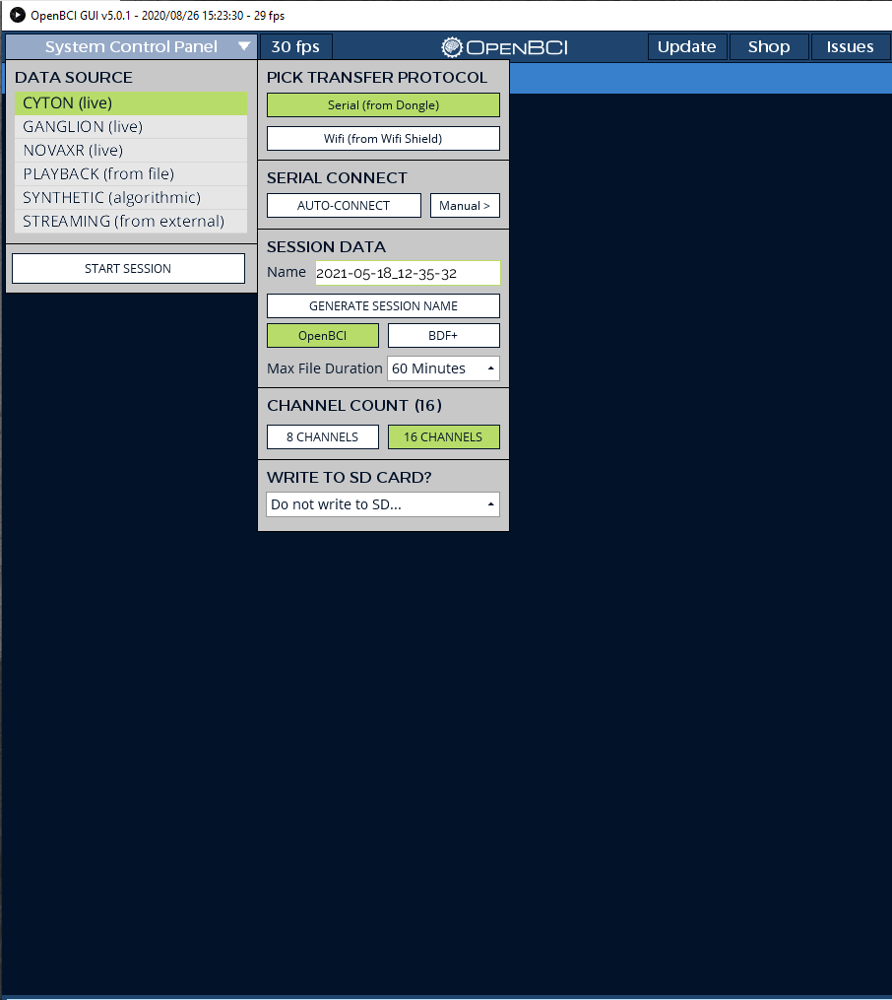

The OpenBCI Cyton, Cyton+Daisy and Ganglion boards offer a wide range of flexibility to collect ExG signals. ExG is meant to represent any referential or differential biosignal as a single term. This includes EEG, EMG, EOG, ECG etc. This tutorial will show you how to measure EEG, ECG and EMG at the same time using the Cyton, Cyton+Daisy and Ganglion boards.

After going through this tutorial, you will learn how to configure the OpenBCI boards to measure multiple ExG recordings at the same time. You could apply the same principle to build channel layouts to fit your application (i.e., 3-lead ECG vs. 5-lead ECG; eight or more EEG channels etc).

## Preliminary

Before starting this tutorial, we recommend you go through at least one of the following guides to familiarize yourself with the OpenBCI system before starting this tutorial:

-   [EEG](01-EEG-Setup.md): scalp surface recording brain activity. [Learn more](https://en.wikipedia.org/wiki/Electroencephalography)  
-   [EMG](02-EMG-Setup.md): forearm measurement of muscle nerve signals [Learn more](https://en.wikipedia.org/wiki/Electromyography)
-   [ECG](03-ECG-Setup.md): measure heart rhythm on the chest [Learn more](https://en.wikipedia.org/wiki/Electrocardiography)

:::info
ECG and EKG are used interchangeably and mean the same thing. Both terms measure the electrical activity of the heart muscles.
:::

## Materials Needed

Here's a list of material you will need for this tutorial:

1.  EEG hardware, can be one of the following Ultracortex
    [Headband kit](../../AddOns/Headwear/03-Headband_Tutorial.md)
    , [Ultracortex Mark IV](../../AddOns/Headwear/01-Ultracortex-Mark-IV.md)
    , [Ultracortex Mark III](../../Deprecated/02-Ultracortex-Mark-III-Nova-Revised.md)
    , [Electrode Cap](../../AddOns/Headwear/04-Electrode_Cap_Tutorial.md); we will be using
       the [Headband kit](../../AddOns/Headwear/03-Headband_Tutorial.md) in this tutorial.
2.  EMG/ECG hardware including [Skintact sticky electrodes](https://shop.openbci.com/collections/frontpage/products/skintact-f301-pediatric-foam-solid-gel-electrodes-30-pack?variant=29467659395) or [IDUN Dryode](https://shop.openbci.com/collections/frontpage/products/idun-dryode-kit)
    and [EMG/ECG Snap Electrode Cables](https://shop.openbci.com/collections/frontpage/products/emg-ecg-snap-electrode-cables?variant=32372786958)
3.  OpenBCI [Cyton](https://shop.openbci.com/products/cyton-biosensing-board-8-channel?_pos=1&_sid=77582f260&_ss=r), [Cyton + Daisy](https://shop.openbci.com/collections/frontpage/products/cyton-daisy-biosensing-boards-16-channel?variant=38959256526) or [Ganglion board](https://shop.openbci.com/products/ganglion-board?_pos=2&_sid=5c75c7cc7&_ss=r).
4. [Y-Jumper Cable](https://shop.openbci.com/products/y-splitter-cable). This is required only when using a Daisy board with the Cyton and is usually included when you buy a Cyton+Daisy Kit.
4. [Cyton Bluetooth Dongle](https://shop.openbci.com/products/dongle) or [Ganglion Bluetooth Dongle](https://shop.openbci.com/products/ganglion-dongle).
5.  Computer with [OpenBCI GUI](../../Software/OpenBCISoftware/01-OpenBCI_GUI.md)

## Requirements for ExG

EEG, EMG, and ECG have different channel requirements. This is because EEG is referential and EMG and ECG are differential. Referential biosignals are those that measure signals from an electrode location with a common reference point (like the earlobe). Differential biosignals are those that are localized to a certain area and the measured signal is the difference in voltage generated at that area. EEG is a referential signal because the signal is measured between an electrode location on the scalp and an electrically inert part of the head like earlobes, bridge of the nose etc. EMG and ECG are differential signals because two electrodes are used to measure the signal of a particular muscle on the body or heart. 

The labels for the channels can be found below the pin on the boards. Here we call BIAS and SRB the reference channels as they provide reference to the data channels. The data channels are N1P-N8P. The data streams come from the data channels. Each channel come with a top and bottom pin 

Here are the reference channels needed for EEG, EMG, and ECG, respectively.

-   EEG: two reference channels - one SRB, and one BIAS
-   ECG and EMG: one reference channel - BIAS

SRB serves as a reference for the EEG channels. BIAS is used for noise-canceling; it combines the common noise on all channels and is subtracted from
the data channels. If you look into the ADS1299 datasheet, we use SRB2 as the reference in all OpenBCI Cyton and Daisy boards.

## ExG Measurement with Cyton+Daisy boards

The Cyton and the Daisy boards both use the ADS1299 which makes this setup very simple and flexible. You just need to make sure that the settings in the OpenBCI GUI are correct so that the appropriate channels are configured properly. You can also setup just the Cyton to measure EEG, EMG and ECG but for simplicity, this section will use both the Cyton and the Daisy boards.

In this section, we will use the Cyton to measure EEG, and the Daisy to measure EMG and ECG. First, attach the Daisy the Cyton board if they are not already attached. Be sure to attach them correctly as shown below

### INSERT PICTURE HERE

### Setting up 3-channel EEG

In this section, we will show you how to connect the EEG electrodes to the Cyton to measure EEG. You can later increase the number of EEG channels based on your needs as long as there are enough input headers (N1P-N8P) on the board.

As shown in the below image, connect the EEG electrodes to Channels 1, 2 and 3 of the Cyton by connecting them to the bottom row of the N1P, N2P and N3P pins. Then, connect an earclip electrode to the **bottom SRB pin** and a Y-jumper to the **bottom BIAS pin**. 

### INSERT PICTURE HERE

### Setting up EMG and ECG

For EMG and ECG, we set this up on the Daisy board. Since EMG and ECG are differential signals, both the top and bottom input header pins are required. For this tutorial, we will use 1 channel for EMG and another one for ECG.

For **ECG**, connect two cables to **N1P** top and bottom pin and connect the other end of the Y-Jumper cable to bottom pin of **BIAS**. Attach the electrodes to your chest, the recommended layout is described in the [ECG tutorial](03-ECG-Setup.md). For note on ECG signal quality, you can refer to the section _Improving Signal Quality_ in the [ECG tutorial](03-ECG-Setup.md).

For **EMG**, connect two cables to **N2P** top and bottom pin. Attach the electrodes to your arm, the recommended layout is described in the [EMG tutorial](02-EMG-Setup.md).

* * *
**Note**
Please refer to the [ECG tutorial](03-ECG-Setup.md) for alternative 5-lead ECG setup.
* * *

The complete setup should look like this
### INSERT PICTURE HERE

## Visualizing the data in OpenBCI GUI

If you don't have the GUI installed, please refer to [this guide](../../../Software/OpenBCISoftware/GUIDocs) to learn about how to set up the OpenBCI GUI for your operating system.

Attach battery, power on the board in Bluetooth mode by flipping the switch towards the top of the board (where the pins are). Connect the USB dongle to your computer. Flip the switch on the dongle, so it's at GPIO6 (closer to the USB port).

Open the [OpenBCI GUI](../../../Software/OpenBCISoftware/GUIDocs), select CYTON (live) -&gt; Serial (from Dongle) -&gt; 16 CHANNELS. Click AUTO-CONNECT. Note that we are not using all 16 channels, we are going to turn
off the channels that we don't use in the GUI.

Turn off the channels that we are not using. EEG is on channels 1, 2, 3. EMG is on channel 8.
ECG is on channel 16.

Go to Hardware Settings (at the right of 'Channels'), turn off SRB for channels 9 and 16. These are the EMG and 
ECG channels.

If everything connects correctly, you should see the 3-channel EEG, ECG, and EMG in the GUI. Check
the following GIF for some signature signal in these physiological data streams.

