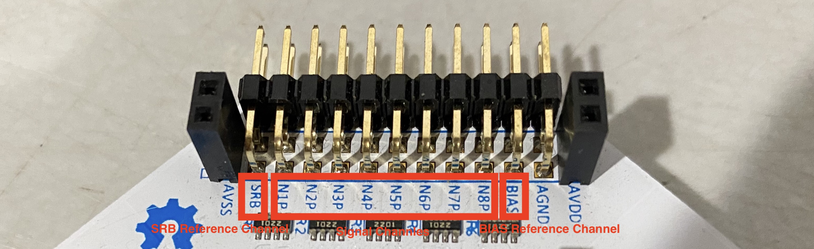
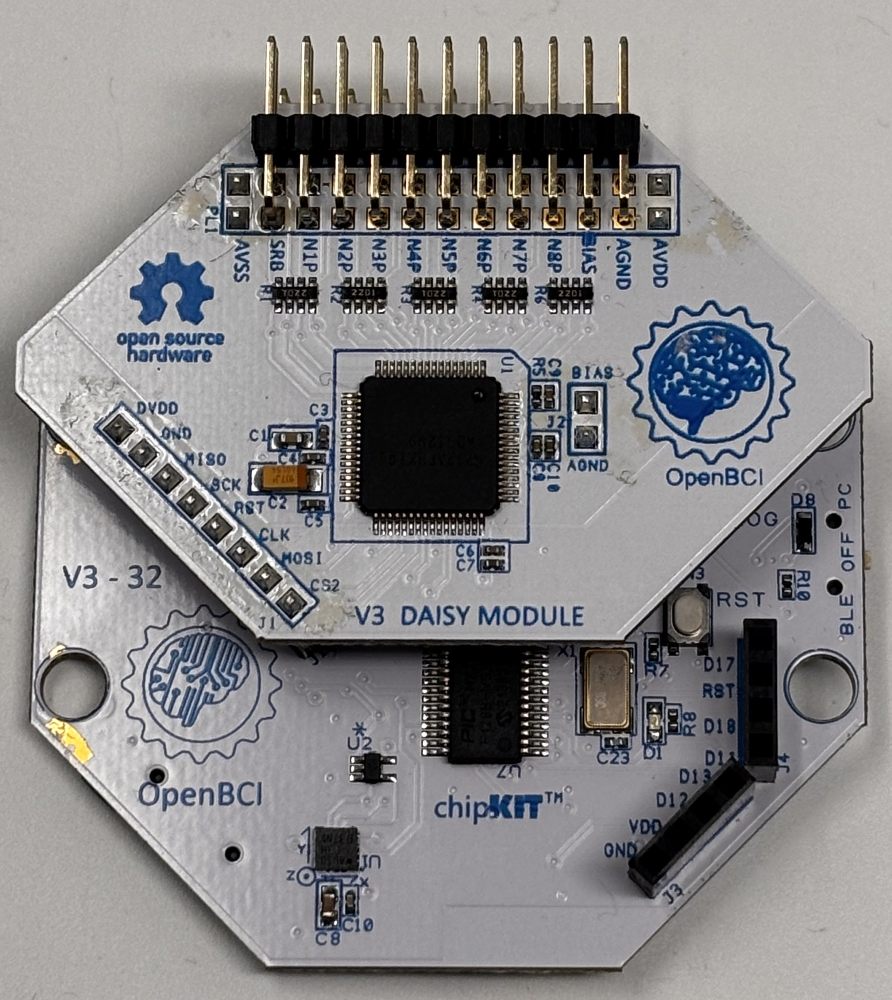
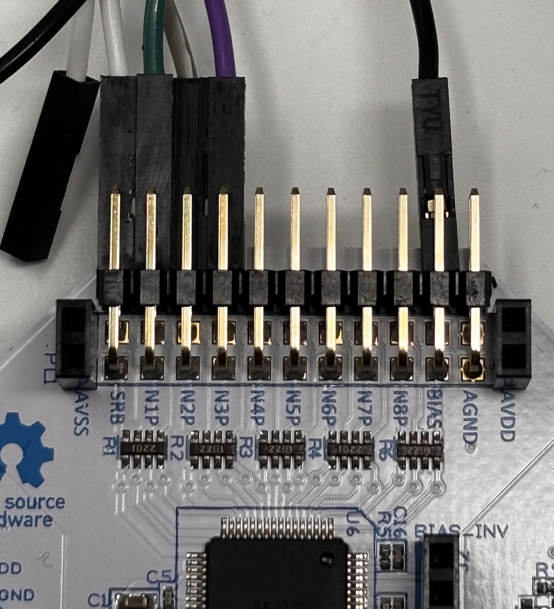
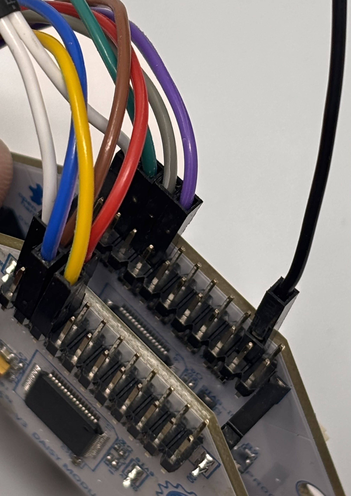

The OpenBCI Cyton, Cyton+Daisy and Ganglion boards offer a wide range of flexibility to collect ExG signals. ExG is meant to represent any referential or differential biosignal as a single term. This includes EEG, EMG, EOG, ECG etc. This tutorial will show you how to measure EEG, ECG and EMG at the same time using the Cyton, Cyton+Daisy and Ganglion boards.

After going through this tutorial, you will learn how to configure the OpenBCI boards to measure multiple ExG recordings at the same time. You could apply the same principle to build channel layouts to fit your application (i.e., 3-lead ECG vs. 5-lead ECG; eight or more EEG channels etc).

## Background Information

Before starting this tutorial, we recommend you go through at least one of the following guides to familiarize yourself with the OpenBCI system before starting this tutorial:

-   [EEG](01-EEG-Setup.md): scalp surface recording brain activity. [Learn more](https://en.wikipedia.org/wiki/Electroencephalography)  
-   [EMG](02-EMG-Setup.md): forearm measurement of muscle nerve signals [Learn more](https://en.wikipedia.org/wiki/Electromyography)
-   [ECG](03-ECG-Setup.md): measure heart rhythm on the chest [Learn more](https://en.wikipedia.org/wiki/Electrocardiography)

:::info
ECG and EKG are used interchangeably and mean the same thing. Both terms measure the electrical activity of the heart muscles.
:::

## Referential and Differential Signals with the ADS1299

EEG, EMG, and ECG have different input requirements. This is because EEG is referential and EMG and ECG are differential. Referential biosignals are those that measure signals from an electrode location with a common reference point (like the earlobe). Differential biosignals are those that are localized to a certain area and the measured signal is the difference in voltage generated at that area. EEG is a referential signal because the signal is measured between an electrode location on the scalp and an electrically inert part of the head like earlobes, bridge of the nose etc. EMG and ECG are differential signals because two electrodes are used to measure the signal of a particular muscle on the body or heart. 

The labels for the channels can be found below the pin on the boards. Here we call BIAS and SRB the reference channels as they provide reference to the data channels. The data channels are N1P-N8P. The data streams come from the data channels. Each channel come with a top and bottom pin  

Here are the reference channels needed for EEG, EMG, and ECG, respectively.

-   EEG: two reference channels - one SRB, and one BIAS
-   ECG and EMG: one reference channel - BIAS

The BIAS and SRB are functions of the ADS1299 and this functionality provides the flexibility to measure differential and referential signals at the same time. SRB stands for Stimulus, Reference and Bias and acts as a common point for referential signals like EEG to compare against. SRB has two different pins on the ADS1299 - SRB1 and SRB2. 

SRB1 acts as a common reference for all the Positive inputs (meaning that it connects all the Negative inputs interally to the SRB1 pin) and SRB2 acts as a common reference for all Negative inputs (meaning that it connects all the Positive inputs internally to the SRB2 pin). To measure EEG with the Cyton and Cyton+Daisy, we use SRB2 as the common reference because it has the flexibility to be used individually for each channel instead of SRB1 which does not provide individual control. Therefore, the EEG measurements will look like (SRB2 - Negative Input) which is why the EEG signals might look inverted.

BIAS on the other hand is used for noise-canceling due to connecting all Positive inputs to a common reference point. When doing this, a phenomenon called "Common Mode Noise" leaks into the board because multiple inputs are connected to the same point. Therefore, a BIAS connection to the body helps the ADS1299 account for this and a common mode voltage is subtracted from all measurements. It also helps in filtering out 50/60 Hz mains noise which is why we use it in all our referential and differential biosensing setups. 

For more information on SRB2, refer to Section 9.3.1.1 - Input Multiplexer and for more information on BIAS, refer to Section 9.3.2.4.5 - BIAS Drive of the [ADS1299 Datasheet](https://www.ti.com/lit/ds/symlink/ads1299.pdf?ts=1751268776160&ref_url=https%253A%252F%252Fwww.ti.com%252Fproduct%252FADS1299%253FkeyMatch%253DADS1299%2526tisearch%253Duniversal_search%2526usecase%253DGPN)

## ExG Measurement with Cyton+Daisy boards

The Cyton and the Daisy boards both use the ADS1299 which makes this setup very simple and flexible. You just need to make sure that the settings in the OpenBCI GUI are correct so that the appropriate channels are configured properly. You can also setup just the Cyton to measure EEG, EMG and ECG but for simplicity, this section will use both the Cyton and the Daisy boards.

Here's a list of material you will need for this tutorial:

1.  EEG hardware, can be one of the following Ultracortex
    [Headband kit](../../AddOns/Headwear/03-Headband_Tutorial.md)
    , [Ultracortex Mark IV](../../AddOns/Headwear/01-Ultracortex-Mark-IV.md)
    , [Ultracortex Mark III](../../Deprecated/02-Ultracortex-Mark-III-Nova-Revised.md)
    , [Electrode Cap](../../AddOns/Headwear/04-Electrode_Cap_Tutorial.md); we will be using
       the [Headband kit](../../AddOns/Headwear/03-Headband_Tutorial.md) in this tutorial.
2.  EMG/ECG hardware including [Skintact sticky electrodes](https://shop.openbci.com/collections/frontpage/products/skintact-f301-pediatric-foam-solid-gel-electrodes-30-pack?variant=29467659395) or [IDUN Dryode](https://shop.openbci.com/collections/frontpage/products/idun-dryode-kit)
    and [EMG/ECG Snap Electrode Cables](https://shop.openbci.com/collections/frontpage/products/emg-ecg-snap-electrode-cables?variant=32372786958)
3.  OpenBCI [Cyton](https://shop.openbci.com/products/cyton-biosensing-board-8-channel?_pos=1&_sid=77582f260&_ss=r), [Cyton + Daisy](https://shop.openbci.com/collections/frontpage/products/cyton-daisy-biosensing-boards-16-channel?variant=38959256526)
4. [Y-Jumper Cable](https://shop.openbci.com/products/y-splitter-cable). This is required only when using a Daisy board with the Cyton and is usually included when you buy a Cyton+Daisy Kit.
4. [Cyton Bluetooth Dongle](https://shop.openbci.com/products/dongle)
5.  Computer with [OpenBCI GUI](../../Software/OpenBCISoftware/01-OpenBCI_GUI.md)

In this tutorial, we will use the Cyton to measure EEG, and the Daisy to measure EMG and ECG. First, attach the Daisy the Cyton board if they are not already attached. Be sure to attach them correctly as shown below

### Setting up 3-channel EEG

In this section, we will show you how to connect the EEG electrodes to the Cyton to measure EEG. You can later increase the number of EEG channels based on your needs as long as there are enough input headers (N1P-N8P) on the board.

As shown in the below image, connect the EEG electrodes to Channels 1, 2 and 3 of the Cyton by connecting them to the bottom row of the N1P, N2P and N3P pins. Then, connect an earclip electrode to the **bottom BIAS pin** and a Y-jumper to the **bottom SRB pin**. 

### Setting up EMG and ECG

For EMG and ECG, we set this up on the Daisy board. Since EMG and ECG are differential signals, both the top and bottom input header pins are required. For this tutorial, we will use 1 channel for EMG and another one for ECG.

For **ECG**, connect two cables to **N1P** top and bottom pin and connect the other end of the Y-Jumper cable to bottom pin of **SRBU**. Attach the electrodes to your chest, the recommended layout is described in the [ECG tutorial](03-ECG-Setup.md). For note on ECG signal quality, you can refer to the section _Improving Signal Quality_ in the [ECG tutorial](03-ECG-Setup.md).

For **EMG**, connect two cables to **N2P** top and bottom pin. Attach the electrodes to your arm, the recommended layout is described in the [EMG tutorial](02-EMG-Setup.md).

* * *
**Note**
Please refer to the [ECG tutorial](03-ECG-Setup.md) for alternative 5-lead ECG setup.
* * *

The complete setup should look like this

### Visualize the data in OpenBCI GUI

If you don't have the GUI installed, please refer to [this guide](../../../Software/OpenBCISoftware/GUIDocs) to learn about how to set up the OpenBCI GUI for your operating system. Connect the battery to the Cyton or Cyton+Daisy and power on the board and connect the USB dongle to your computer (make sure the dongle switch is set to GPIO_6).

Open the [OpenBCI GUI](../../../Software/OpenBCISoftware/GUIDocs), select CYTON (live) -&gt; Serial (from Dongle) -&gt; 16 CHANNELS. Click AUTO-CONNECT and the board should be connected to the GUI. 

If you are using just the Cyton, select the 8 Channel option. Since we are using both the Cyton and the Daisy for this tutorial, we select 16 Channel Mode. We also do not need all 16 Channels. Therefore, before starting a data stream, turn off the channels that are not being used by clicking on the Channel number and hide them from the Time Series Widget as shown below.

### INSERT GIF HERE OF TURNING OFF CHANNELS AND HIDING THEM FROM WIDGET

Also, before starting a data stream, remember that you need to select SRB2 for those channels that are EEG and deselect SRB2 for those channels that are EMG or ECG as shown below. For channels that are turned off, this does not matter as they will not be collecting data. But, if you change the channel configurations you must also select and deselect SRB2 accordingly. If you do not, then the data will not look right because the reference is wrong.

### INSERT PICTURE OF HARDWARE SETTINGS HERE

Now click "Start Stream" and you should see EEG, EMG and ECG signals on the channels that have been configured so as shown below.

### INSERT PICTURE OF CORRECT DATA

## ExG Measurement with Ganglion boards

The Ganglion board uses the MCP3912 ADC chip and does not have the flexibility that the ADS1299 chip has to change configurations through software. But, you can still change the Ganglion board input pins to act as referential or differential inputs based on hardware select switches present on the board. For more information on how to use the select switches, refer to this [guide](https://docs.openbci.com/Ganglion/GanglionSpecs/#inverting-input-select-switches). 

The Ganglion board is a 4 channel board and so, for this tutorial, we will measure 2 channels of EEG, 1 channel of ECG and 1 channel of EMG at the same time. For this tutorial, you will need the following materials as shown below:

1.  EEG hardware, can be one of the following Ultracortex
    [Headband kit](../../AddOns/Headwear/03-Headband_Tutorial.md)
    , [Ultracortex Mark IV](../../AddOns/Headwear/01-Ultracortex-Mark-IV.md)
    , [Ultracortex Mark III](../../Deprecated/02-Ultracortex-Mark-III-Nova-Revised.md)
    , [Electrode Cap](../../AddOns/Headwear/04-Electrode_Cap_Tutorial.md); we will be using
       the [Headband kit](../../AddOns/Headwear/03-Headband_Tutorial.md) in this tutorial.
2.  EMG/ECG hardware including [Skintact sticky electrodes](https://shop.openbci.com/collections/frontpage/products/skintact-f301-pediatric-foam-solid-gel-electrodes-30-pack?variant=29467659395) or [IDUN Dryode](https://shop.openbci.com/collections/frontpage/products/idun-dryode-kit)
    and [EMG/ECG Snap Electrode Cables](https://shop.openbci.com/collections/frontpage/products/emg-ecg-snap-electrode-cables?variant=32372786958)
3.  OpenBCI [Ganglion board](https://shop.openbci.com/products/ganglion-board?_pos=2&_sid=5c75c7cc7&_ss=r).
4. [Ganglion Bluetooth Dongle](https://shop.openbci.com/products/ganglion-dongle).
5.  Computer with [OpenBCI GUI](../../Software/OpenBCISoftware/01-OpenBCI_GUI.md)

### INSERT PICTURE OF MATERIALS NEEDED

### Setting up EEG, ECG and EMG

For this tutorial, we will use Channels 1 and 2 as EEG, Channel 3 as ECG and Channel 4 as EMG. So, push the input select switches for Channels 1 and 2 to the DOWN position and push the input select switches for Channels 3 and 4 to the UP position. If you are having trouble pushing the switches, use a pair of tweezers to help you. After configuring the channels, the switches should be in the positions as shown below.

### INSERT PICTURE OF SELECT SWITCHES

The Ganglion board also has a REF and D_G pin which act exactly as the SRB2 and BIAS pins in the Cyton and Cyton+Daisy. The REF pin acts as a common reference when measuring EEG and the D_G pin acts as the BIAS pin for cancelling common-mode noise and 50/60 Hz noise. Although there is a top and bottom pin for REF and D_G, these are the same pins are can be used for any setup. For ease of use, we will use the bottom pins of REF and D_G.

For **EEG**, connect the bottom pins of +1- and +2- headers to the EEG electrodes and the bottom pins of the REF and D_G pins to the earclips. For **ECG** and **EMG**, connect the top and bottom pins of the +3- and +4- headers to the Snap electrode cables and connect them to [ECG electrode locations](../../GettingStarted/Biosensing-Setups/ECGSetup/#connect-the-electrodes-to-your-body) and [EMG electrode locations](../../GettingStarted/Biosensing-Setups/EMGSetup/#obtain-emg-data-with-openbci-ganglion-board). The final pin connections should be as shown below.

### INSERT PICTURE OF CONNECTED PINS

:::note
When using EEG with another differential signal, the earlobe location can be used as a BIAS for a differential signal. But, if are facing signal quality issues with the differential signal, you can connect a sticky electrode to the top D_G pin.
:::

### Visualize the data in the OpenBCI GUI

If you don't have the GUI installed, please refer to [this guide](../../../Software/OpenBCISoftware/GUIDocs) to learn about how to set up the OpenBCI GUI for your operating system. Connect the battery to the Ganglion board, power on the board and connect the Ganglion USB dongle to your computer.

Refer to this guide to [connect the Ganglion board to the OpenBCI GUI](../../GettingStarted/Boards/GanglionGS/#connect-the-gui-to-your-ganglion-board). You do not need to change any hardware settings through software for the Ganglion and you are using all 4 channels which means you do not need to turn off or hide any channel. Make sure that the input select switches are in the right position because an incorrect position will cause data issues and you will not see biopotential measurements in the GUI.

Now click "Start Stream" and you should see EEG, EMG and ECG signals on the channels that have been configured so as shown below.

### INSERT PICTURE OF CORRECT DATA