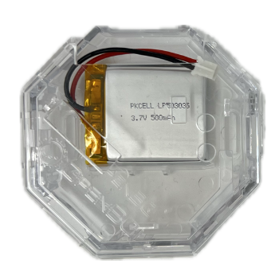

### Overview

This guide will walk you through setting up your Ganglion, connecting it to your computer, and then connecting it to yourself. Please review this guide in its entirety before starting, and consult the [Ganglion Biosensing Tutorial Video](https://youtu.be/l13R_99h0qQ). Have fun!

**Note that the Ganglion is not set to be discoverable out of the box, you need the [GUI](https://openbci.com/downloads).**

## What You Need

1.  OpenBCI [Ganglion Board](https://shop.openbci.com/collections/frontpage/products/ganglion-board)
2.  An [OpenBCI Ganglion Dongle](https://shop.openbci.com/products/ganglion-dongle)
3.  Lithium battery and USB charger OR 6V battery pack (AA batteries not included)
4.  (x4) plastic feet for board stabilization
5.  EEG electrodes: OpenBCI [Gold Cup Electrodes](http://shop.openbci.com/collections/frontpage/products/openbci-gold-cup-electrodes?variant=9056028163), or your own electrodes, and [Electrode Paste](https://shop.openbci.com/products/ten20-conductive-paste-8oz-jar) 
6.  or EMG electrodes: [Snap Electrode Cables](http://shop.openbci.com/collections/frontpage/products/emg-ecg-snap-electrode-cables?variant=32372786958) and [Snap Electrodes](https://shop.openbci.com/products/kendall-emg-ecg-foam-solid-gel-electrodes-30-pack).
7.  A computer connected to the internet

### 1. Your Ganglion

The battery connector on the back can accept 3V to 12V DC power input. Note the removable orange stickers on the four switches (SW1, SW2, SW3, SW4). For more information on the Ganglion Hardware, visit the [OpenBCI Ganglion Hardware Doc](../../Ganglion/02-Ganglion.md#sensor-input-header).

### 2. OpenBCI Ganglion Dongle

Plug the OpenBCI Ganglion Dongle into your computer before launching the GUI.

### 3. Your Lithium Polymer Battery and USB Charger (or 6V Battery Pack & 4 AA Batteries, pre-2023)

Fully charge the Lithium Polymer Battery, until the charger's indicator LED turns green.

Pre-2023: 
Install 4 AA batteries in your battery pack

Both power source types can be plugged into the 2-pin JST, on the underside of your Ganglion board.

Turn on the power switch. You should see the BLUE LED blink gently.
Blinking means that the BLE radio is not connected or paired with any computer or phone/tablet. Once the Ganglion is connected, the LED stays steady on.

**Important note**
If you are using a non-OpenBCI battery holder (not recommended), please check the polarity (red +/black -) BEFORE powering up your OpenBCI board. A reversed polarity will burn out your board.

### 4. Clear Board Case or (x4) Plastic Feet

If you do not have a board case, your Cyton kit comes with 4 plastic feet that can be snapped into the holes of your board to provide extra stability while working.
The case and plastic feet cannot be used at the same time.

### 5. Gold Cup Electrodes and Paste

If you ordered OpenBCI [Gold Cup Electrodes](http://shop.openbci.com/collections/frontpage/products/openbci-gold-cup-electrodes?variant=9056028163) and [Electrode Paste](https://shop.openbci.com/products/ten20-conductive-paste-8oz-jar), it should come with:

-   10 passive, gold cup electrodes on a color-coded ribbon cable
-   Jar of Ten20 conductive electrode paste

If you plan to work with your own electrodes, the [Touch-Proof Adapter](http://shop.openbci.com/collections/frontpage/products/touch-proof-electrode-cable-adapter?variant=31007211715) will come in handy. It will convert any electrode that terminates in the industry-standard touch-proof design to an electrode that can be plugged into any OpenBCI Board!

For best results, when plugging female header pins onto the OpenBCI board, orient the sides with the 'silver latch bit' face-up since that side is a tiny bit wider than 0.1".

## Download/Install/Run the OpenBCI GUI

Please [follow the step by step guide](../../Software/OpenBCISoftware/01-OpenBCI_GUI.md#installing-the-openbci-gui-as-a-standalone-application) to install the OpenBCI_GUI as a standalone application.

Come back to this guide when your GUI is running!

## Start Using The OpenBCI GUI

### Connect the GUI to your Ganglion board

Make sure your computer's Bluetooth feature is turned on. **Select `LIVE (from Ganglion)` from the first drop down.**

**Select `Bluetooth (BLED112 Dongle)` as the transfer protocol.**

The GUI will automatically start searching for Ganglion devices.

Each Ganglion has its own unique 4 character ID (in HEX), and you will see it listed in the `BLE DEVICES` window. If you don't see any Ganglions, check to make sure your Ganglion has a battery connected, is switched on, and the blue LED is blinking. If there are multiple Ganglions in the room, you can find yours by turning it off, clicking the `REFRESH LIST` button, then turn on your Ganglion again. Make a note of _your_ Ganglion's 4 character ID.  

**Select the desired Ganglion device from the dropdown list.**

The GUI will automatically generate a recording to a file. You have an option at this point to create your own file name, in the `DATA LOG FILE` window, should you choose to.

**Press `START SYSTEM` when you're ready to begin streaming.**

### Navigating the GUI

When the GUI connects, it opens up to the default window layout. For a more in-depth guide to the GUI interface and functionality, check out the [OpenBCI GUI Widget Guide](../../Software/OpenBCISoftware/02_GUI_Widget_Guide.md). For the purposes of this introductory tutorial, You should follow the following steps to setup the GUI.  

**Click on the `Layout` dropdown menu, and select the one outlined in red.**

If the Accelerometer is off, turn on the Accelerometer by clicking the `Turn Accel. On` button.

**Then, click `Start Data Stream` to stream data from your Ganglion board.**

  

You should see the `Time Series` window scrolling some data to the left, the `FFT Plot` container will show you the power level of the signals at different frequencies. The `Accelerometer` window will also scroll data.

:::info
**By default, the GUI stores all user data and raw EEG recordings in `[USER]/Documents/OpenBCI_GUI` and names each session with an autogenerated timestamp by default.**
:::

Learn about the `Time Series` and other built-in widgets in the [GUI Widget Guide](../../Software/OpenBCISoftware/02_GUI_Widget_Guide.md). Refer to the Ganglion Data Format [guide](../../Ganglion/08-Ganglion_Data_Format.md#binary-format) to learn how to interpret the raw data directly from the device. However this is already handled gracefully by [BrainFlow](../../ForDevelopers/01-SoftwareDevelopment.md#introducing-brainflow) for a number of programming languages and use cases.

Pick up your board, and move it around. You should see the data in the `Accelerometer` window also move around, and if you're touching the input pin header, you will see some noise in the other windows. Nice!  

**NOTE: If you're having connection issues, refer to the troubleshooting tips below.**

-   check that you have fresh batteries
-   move the Ganglion board closer to its dongle
-   hit 'AUTOSCAN' a couple of times
-   exit the GUI and restart the computer to reboot your USB port

Now that you've got your computer connected to the Ganglion, it's time to connect your _self!_

## Connect yourself to OpenBCI

To learn how to connect yourself to OpenBCI using your newly set up board, see the following tutorials:

-   [EEG Setup](../../GettingStarted/Biosensing-Setups/01-EEG-Setup.md)
-   [EMG Setup](../../GettingStarted/Biosensing-Setups/02-EMG-Setup.md)
-   [ECG Setup](../../GettingStarted/Biosensing-Setups/03-ECG-Setup.md)
