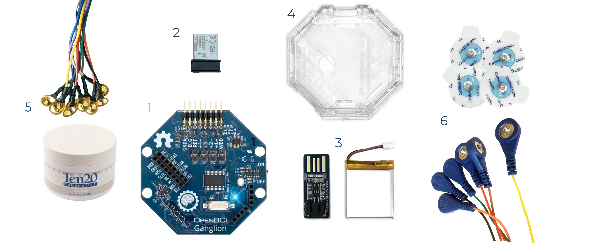
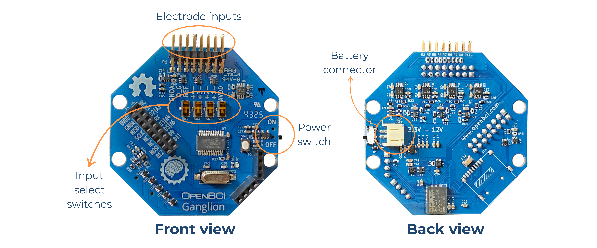
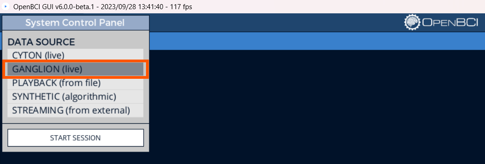
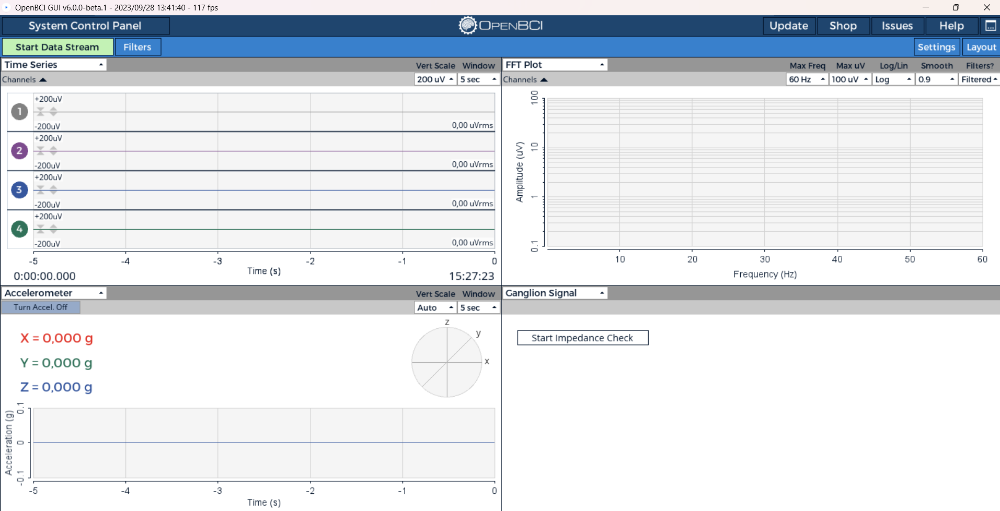
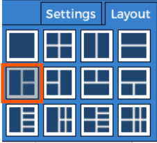
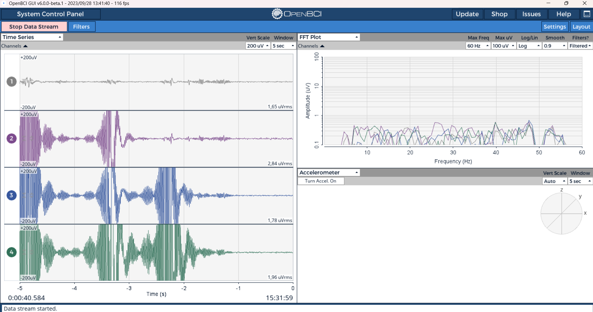
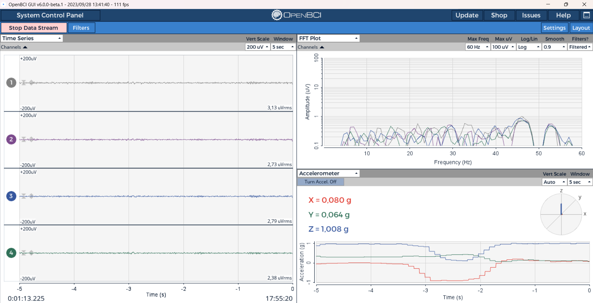

### Overview

This guide will walk you through setting up your Ganglion, connecting it to your computer, and then connecting it to yourself. Please review this guide in its entirety before starting, and consult the [Ganglion Biosensing Tutorial Video](https://youtu.be/l13R_99h0qQ). Have fun!

## What You Need

1.  **OpenBCI [Ganglion Board](https://shop.openbci.com/collections/frontpage/products/ganglion-board)**

    The Ganglion is OpenBCI's 4-channel bioamplifier — a low-cost biosensing board you can use to measure EEG, EMG, or ECG signals with electrodes. For full specs (power input, switches, pinout, schematics), see the [OpenBCI Ganglion Hardware Doc](../../Ganglion/02-Ganglion.md).

    

2.  **[OpenBCI Ganglion Dongle](https://shop.openbci.com/products/ganglion-dongle)**

    Required on macOS, Windows, and Linux. The Ganglion will pair via Bluetooth with this USB adapter.

3.  **Lithium battery and USB charger**

    :::note Using an older Ganglion? (pre-2023 units)
    Earlier kits shipped with a 6V battery pack that takes 4 AA batteries (not included) instead of a lithium battery and charger. If you have one of these, everything else in this guide works the same way.
    :::

4.  **Board Case**

    The clear case snaps around the Ganglion board to protect it while keeping the power switch, battery connector, and electrode inputs accessible.

5.  **EEG electrodes:** OpenBCI [Gold Cup Electrodes](https://shop.openbci.com/collections/frontpage/products/openbci-gold-cup-electrodes?variant=9056028163), or your own electrodes, and [Electrode Paste](https://shop.openbci.com/products/ten20-conductive-paste-8oz-jar)

    If you ordered OpenBCI Gold Cup Electrodes and Electrode Paste, it should come with:

    -   10 passive, gold cup electrodes on a color-coded ribbon cable
    -   Jar of Ten20 conductive electrode paste

    If you plan to work with your own electrode cap or electrodes, the [Touch-Proof Adapter](https://shop.openbci.com/collections/frontpage/products/touch-proof-electrode-cable-adapter?variant=31007211715) will come in handy: it converts any touch-proof style electrode into one that can be plugged into an OpenBCI board.

6.  **Or EMG/ECG electrodes:** disposable [solid gel snap electrodes](https://shop.openbci.com/products/kendall-emg-ecg-foam-solid-gel-electrodes-50-pack) that snap onto [Snap Electrode Cables](https://shop.openbci.com/collections/frontpage/products/snap-electrode-cables-emg-ecg-eeg?variant=32372786958), which can be plugged directly into the Ganglion's pin headers.

7.  **A computer with the OpenBCI GUI installed and with an available USB port for the dongle.**

    Don't have the GUI installed yet? [Follow the step-by-step guide](../../Software/OpenBCISoftware/01-OpenBCI_GUI.md#installing-the-openbci-gui-as-a-standalone-application) to install the OpenBCI_GUI as a standalone application before continuing.

## Setting Up Your Hardware

1.  **Charge your battery**

    Fully charge the Lithium Polymer Battery, until the charger's indicator LED turns green. To do this, insert the battery's white plug into the matching slot on the USB charger, and connect the charger into a USB port.

2.  **Place the battery and the case**

    Plug the charged battery into the 2-pin JST connector on the underside of your Ganglion board.

    **Important note:** If you are using a non-OpenBCI battery holder (not recommended), please check the polarity (red +/black -) BEFORE powering up your OpenBCI board. A reversed polarity will burn out your board.

    Then align the board so the switches face the case's cutout, and press the two halves together until they click into place.

3.  **Attach your electrodes**

    For EEG electrodes, when plugging female header pins onto the OpenBCI board, orient the sides with the 'silver latch bit' face-up since that side is a tiny bit wider than 0.1".

    For EMG/ECG electrodes, plug the snap cables directly into the Ganglion's pin headers, then snap the foam electrodes onto the other end of each cable.

    See the [**Connect yourself to OpenBCI**](#connect-yourself-to-openbci) section below for guides on where to place electrodes on the body and how to set up your reference electrodes for different biosensing setups.

4.  **Plug in the Ganglion Dongle**

    Plug the OpenBCI Ganglion Dongle into your computer before launching the GUI.

5.  **Power on your Ganglion**

    Turn on the power switch. You should see the BLUE LED blink gently. Blinking means that the BLE radio is not connected or paired with any computer or phone/tablet. Once the Ganglion is connected, the LED stays steady on.

## Start Using The OpenBCI GUI

Open the OpenBCI GUI now that your hardware is set up.

### Connect the GUI to your Ganglion board

**Select `GANGLION (live)` from the first drop down.**

**Select `Bluetooth (BLED112 Dongle)` as the transfer protocol.**

The GUI will automatically start searching for Ganglion devices.

Each Ganglion has its own unique 4 character ID (in HEX), and you will see it listed in the `BLE DEVICES` window. If you don't see any Ganglions, check to make sure your Ganglion has a battery connected, is switched on, and the blue LED is blinking. If there are multiple Ganglions in the room, you can find yours by turning it off, clicking the `REFRESH LIST` button, then turning it back on. Make a note of _your_ Ganglion's 4 character ID.  

**Select the desired Ganglion device from the dropdown list.**

In the `SESSION DATA` panel, `Name` indicates the name of that session's subfolder — it's auto-generated, but you can rename it or click `GENERATE SESSION NAME` for a new one — and you can choose the file format (`OpenBCI` or `BDF+`). Under `BRAINFLOW STREAMER`, `Location` lets you change where that folder is saved: leave it on the default option to use `[USER]/Documents/OpenBCI_GUI/Recordings`, or select `Custom` to open a folder picker and choose your own destination.

**Press `START SYSTEM` when you're ready to begin streaming.**

If you're having trouble finding your Ganglion or getting it to start streaming, see the [Troubleshooting Connection Issues](#troubleshooting-connection-issues) section below.

### Navigating the GUI

When the GUI connects, it opens up to the default window layout, shown below.

For a more in-depth guide to the GUI interface and functionality, and the different built-in widgets, check out the [OpenBCI GUI Widget Guide](../../Software/OpenBCISoftware/02_GUI_Widget_Guide.md). Refer to the Ganglion Data Format [guide](../../Ganglion/08-Ganglion_Data_Format.md#binary-format) to learn how to interpret the raw data directly from the device. However this is already handled gracefully by [BrainFlow](../../ForDevelopers/01-SoftwareDevelopment.md#introducing-brainflow) for a number of programming languages and use cases.

For the purposes of this introductory tutorial, you should follow the following steps to setup the GUI.  

**Click on the `Layout` dropdown menu in the top-right corner, and select the one outlined in orange.** 

By default, this layout shows the `Time Series` widget on the left (for all 4 channels), displaying the incoming data in real time; and on the right, `FFT Plot` on top, showing the power level of the signals at different frequencies, and `Accelerometer` on the bottom, displaying the accelerometer data in real time. You can swap any of these for other widgets as you like.

**Click `Start Data Stream`, in the top-left corner, to stream data from your Ganglion board.**

You should see the `Time Series` widget go from a flat line at 0 to plotting your live data across all 4 channels.

  

You can also touch your input pin header and see this reflected as noise in the channels.

Now let's check out another sensor built into the board: the onboard three-axis accelerometer, which measures the acceleration of the board itself on the XYZ axis.

**If the accelerometer is off, click the `Turn Accel. On` button to activate it** (or `Turn Accel. Off` to deactivate it).

Pick up your board, and move it around. You should see this reflected in the `Accelerometer` widget. Nice!  

Now that you've got your computer connected to the Ganglion, it's time to connect yourself!

## Connect yourself to OpenBCI

To learn how to connect yourself to OpenBCI using your newly set up board, see the following tutorials:

-   [EEG Setup](../../GettingStarted/Biosensing-Setups/01-EEG-Setup.md)
-   [EMG Setup](../../GettingStarted/Biosensing-Setups/02-EMG-Setup.md)
-   [ECG Setup](../../GettingStarted/Biosensing-Setups/03-ECG-Setup.md)
-   [Multiple ExG Signals Setup](../../GettingStarted/Biosensing-Setups/04-ExG-Setup.md)

## Troubleshooting Connection Issues

If you're having connection issues, try the following:

-   check that you have fresh batteries
-   move the Ganglion board closer to its dongle
-   hit 'AUTOSCAN' a couple of times
-   exit the GUI and restart the computer to reboot your USB port
-   on macOS 11+, see the [macOS BLE Workaround](../../Troubleshooting/MacOS_Ganglion_BLE_Workaround.md) if the stream won't start or keeps dropping