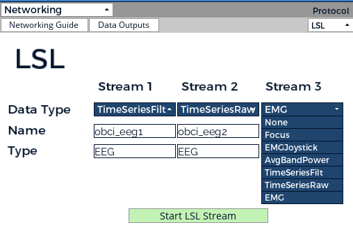

[Lab streaming layer](https://github.com/sccn/labstreaminglayer) is a system for synchronizing streaming data for live analysis or recording. LSL is a good way to send your OpenBCI stream to applications that can record or manipulate the data, such as Matlab (see our Matlab tutorial for using LSL in this context).

This tutorial will show you how to set up LSL using the OpenBCI Python API and then explain the various ways you can use LSL to perform experiments or record data.

## Setup

1.  **Download or clone the [OpenBCI_GUI](https://github.com/OpenBCI/OpenBCI_GUI) repo from Github.**

2.  **Download or clone the [Lab Streaming Layer (LSL)](https://github.com/labstreaminglayer/App-LabRecorder) repo from Github.**

3.  **Download and install [Python](https://www.python.org/downloads/) (either version 2 or 3).**
    Python might already be installed on your computer. Type python --version to check if you have Python version 2 or 3 installed.
4.  **Install Python requirements**
    To use this program, you need the following Python packages installed:

- pylsl (version 1.10.5 or greater)
- pyserial (version 3.1.1 or greater)
- numpy (version 1.11.1 or greater)
- brainflow (version 5.10.0 or greater)

To automatically install using pip, navigate to the "Networking-Test-Kit/LSL/" folder on your command line and terminal, and type:

```

pip install --upgrade numpy brainflow pylsl

```

:::note
`pip` may have issues installing `numpy` and `scipy` for some users. Install these manually if you have issues.

If you get the message `pip: command not found`, you need to install pip using `sudo easy_install pip`. Then, retry the command above.
:::

## Usage

### Simple Stream

Open the OpenBCI GUI and click on the Networking widget. Below is the Networking Widget, you can select LSL protocol and have three data streams:

<div align="center">
    
</div>

Open your lab recorder from the LSL repo. Once you click on Start LSL Stream you will be able to see the three data streams in the Lab Recorder application.


### Configuring the board from the command line interface

You also configure board settings from this interface. For full information regarding board settings and commands, see the [Cyton board programming tutorial](Cyton/05-Cyton_Board_Programming_Tutorial.md).

To enter Channel Settings mode, you would need to enter an "x", followed by certain channel settings, followed by an "X". For example:

```

 x3020000X

```

This command will do the following: ‘x’ enters Channel Settings mode. Channel 3 is set up to be powered up, with gain of 2, normal input, removed from BIAS generation, removed from SRB2, removed from SRB1. The final ‘X’ latches the settings to the ADS1299 channel settings register.

To view current board and register settings, enter: `?`

If you get an error message at any point while using the command line interface, check the Troubleshooting section, or pull up an issue on the Github repository.

**Changing Channel Locations from the command line interface**
To change the channel location metadata of the stream, type /loc followed by a space and then a comma-separated list of new set of channel locations. For example, to change the default channel locations to a new set of eight channels, the command might look like this:

```

/loc F3,F4,C3,C4,T3,T4,P3,P4

```

This can only be done while the board is not currently streaming.

## Advanced Settings in LSL

If you would like to modify your LSL streams, you can use the files in Networking-Test-Kit/LSL/. Files include different LSL test streams including band power for all channels, 3 data streams, FFT plot stream, and more.

## Troubleshooting

To double check if you are receiving the correct streams, run the script [lslStreamTest](https://github.com/OpenBCI/OpenBCI_GUI/blob/master/Networking-Test-Kit/LSL/lslStreamTest.py). The script will allow you to read multi-channel time series from LSL.

## Next Steps

Once you have the Lab Streaming Layer set up with your OpenBCI board, check out these other tutorials to view the stream in a variety of different programs:

[Matlab tutorial](Software/CompatibleThirdPartySoftware/01-Matlab.md)
