</img>&nbsp;
<big><big><strong><a href="https://github.com/OpenBCI/OpenBCI_GUI/releases/download/v6.0.0-beta.1/openbcigui_v6.0.0-beta.1_macosx.dmg">Download Mac version here</a></strong></big></big><br></br>
</img>&nbsp;
<big><big><strong><a href="https://github.com/OpenBCI/OpenBCI_GUI/releases/download/v6.0.0-beta.1/openbcigui_v6.0.0-beta.1_macosx.dmg">Download Windows version here</a></strong></big></big><br></br>
</img>&nbsp;
<big><big><strong><a href="https://github.com/OpenBCI/OpenBCI_GUI/releases/download/v6.0.0-beta.1/openbcigui_v6.0.0-beta.1_macosx.dmg">Download Linux version here</a></strong></big></big><br></br>


The OpenBCI GUI is OpenBCI's powerful software tool for visualizing, recording, and streaming data from the OpenBCI Boards. Data can be displayed in live-time, played back, saved to your computer in .txt or .bdf/.edf format, as well as streamed in live-time to third-party software such as MATLAB.
It can be launched as a standalone application or as a sketch from Processing (a Java-based programming language). In this guide, we will cover both scenarios.

## Hardware/Driver Setup for OpenBCI_GUI

The Ganglion, Cyton, and CytonDaisy Boards are compatible with the OpenBCI GUI.

#### Ganglion on macOS/Windows/Linux

The OpenBCI Ganglion uses Bluetooth LE (aka Bluetooth Smart, Bluetooth 4.0). In order to use the Ganglion, you need the **[Ganglion USB Dongle](https://shop.openbci.com/products/ganglion-dongle).**

**important MacOS BLE Workaround
If you are running MacOS 11+ and having issues streaming your Ganglion, see the [MacOS BLE workaround](../../Troubleshooting/MacOS_Ganglion_BLE_Workaround.md).**

#### Cyton and Cyton+Daisy Drivers

If it’s your first time working with OpenBCI and you own the Cyton or Cyton+Daisy, [make sure to install the latest FTDI driver](https://www.ftdichip.com/Drivers/VCP.htm) for your operating system.

**The FTDI driver is only necessary for Windows 8, Windows 10, and Mac OS X 10.9 through 10.15. If you are running a Mac that is mid 2015 or newer, you do not need to install the FTDI driver.**

### Linux Users: Serial Port Permissions

<p /><details>

<summary><b><i>Attention Linux Users: Expand this dropdown for important details. This fix affects all communications between Ganglion/Cyton and your computer via serial ports.</i></b></summary><br />

Before trying to connect to any OpenBCI boards on Linux, you need to make sure you have permission to access the serial ports on your machine. Otherwise, you will get the error `Failed to connect using /dev/ttyUSB0` or similar. This can be fixed by adding the user to the `dialout` group in Ubuntu. Here is a [full explanation and fix](https://websistent.com/fix-serial-port-permission-denied-errors-linux/). Here is the short version:<br /><br />

1.  First, verify if the user does belong to the "dialout" group using the “id” command.<br />
        - Type `id -Gn <username>` in terminal and check if it prints `dialout` as one of the options.<br />
        - Replace username with your Linux username. Example: `id -Gn susieQ`
2.  Next, add the user to the “dialout” supplementary group.
        - Type `sudo usermod -a -G dialout <username>` in terminal.
        - Example: `sudo usermod -a -G dialout susieQ`
3.  Restart Ubuntu
4.  Try "id" command again - Repeat step one

</details><p />

## Installing the OpenBCI GUI as a "Standalone" Application

### Download the Appropriate Application For Your OS

The fastest way is to download the standalone .exe/.app for your machine and operating system. To do this, head to the [Downloads](https://openbci.com/downloads) page of the OpenBCI website, and click the download link that correlates to your OS and machine.


### Install OpenBCI_GUI On macOS

Drag and drop the `OpenBCI_GUI` application to you `Applications` folder.


### Install OpenBCI_GUI On Windows

Move the `OpenBCI_GUI` directory anywhere you like.

<details>

<summary><i>Windows Users: How to run the GUI with High DPI Screens</i></summary>

<br />If you have a high DPI screen and are running Windows 10, you may notice that the GUI is hard to see, and nothing seems to scale correctly.<br />

1.  First, close the GUI if it is open.<br />

2.  Next, right click on `OpenBCI_GUI.exe` and select `Properties`. The following window should pop up:<br />

<br />

3.  Select the `Compatibility` tab at the top of this window, and then click `Change high DPI settings`.<br />

<br />

4.  In the section labeled `High DPI scaling override`, check the box `Override high DPI scaling behavior` and change from `Application` to `System (Enhanced)`.<br />

<br />

5.  That's it! Once the settings have been changed, restart the GUI!

</details>

### Install OpenBCI_GUI On Linux

<p>Unzip the downloaded application and place in desired location.</p><br />

<p /><details>

<summary><i>Linux Users: How to run the GUI with High DPI Screens</i></summary>

On Linux, there is no way to force scaling. However, here is a <a href="https://github.com/kaueraal/run_scaled">link to a script that should work</a>.

</details><p />

## Running the OpenBCI_GUI

**Important Notes:**

- In some cases, there may be issues with the way your machine handles the BLE application that enables communication with the Ganglion Board.
- If you run into additional issues, please visit the [OpenBCI_GUI Section](https://openbci.com/forum/index.php?p=/categories/openbci_gui) of our Forum

### Running on macOS

Navigate to your `Applications` folder and double click the `OpenBCI_GUI` You may see a message pop up asking you if you're sure you want to open it. Click Open and the app will launch.


### Running on Windows

Navigate to your `OpenBCI_GUI` directory, double click `OpenBCI_GUI.exe`.

### Running on Linux

Open a terminal application and navigate to the directory (with `cd`) of the unzipped application.

Then, launch the Application from terminal with the command:

```

$ ./OpenBCI_GUI

```

or

```

$ sudo ./OpenBCI_GUI

```

This will launch the OpenBCI_GUI. **If you experience issues, try running with or without `sudo`.**

## Using the OpenBCI GUI

### BrainFlow Java Library

**Starting with GUI v5, simply run the GUI and connect to all OpenBCI hardware!** In the background, we are using the included [BrainFlow Java library](../../ForDevelopers/01-SoftwareDevelopment.md#brainflow---java) to handle communications with the boards.

### Tutorial


Check out this [Youtube video](https://www.youtube.com/watch?v=agV1B2l-QLw) on how to use the OpenBCI GUI. Note: Uses an older version of the GUI.

### Access Recorded Data

OpenBCI users always have free access to live and recorded data! Recorded data is saved to your local computer to respect privacy and freedom of use. Also, you have the option to save data as a CSV text file or BDF+ format.

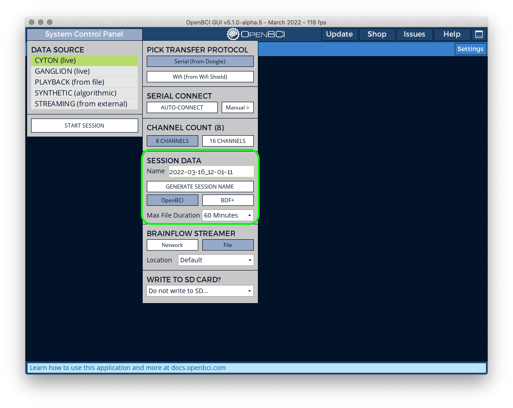

:::info Where do I find my Data?
By default, **the GUI stores all user data and raw EEG recordings in `[USER]/Documents/OpenBCI_GUI`** and names each session with an autogenerated timestamp. Saved data does not have filters applied. This gives you the freedom to change and experiment with other filters during playback.
:::

Starting with GUI 5.1.0, you can save data simultaneously to the BrainFlow CSV format, which [can be used directly in BrainFlow](../../ForDevelopers/01-SoftwareDevelopment.md) for offline processing, training, and experimentation.

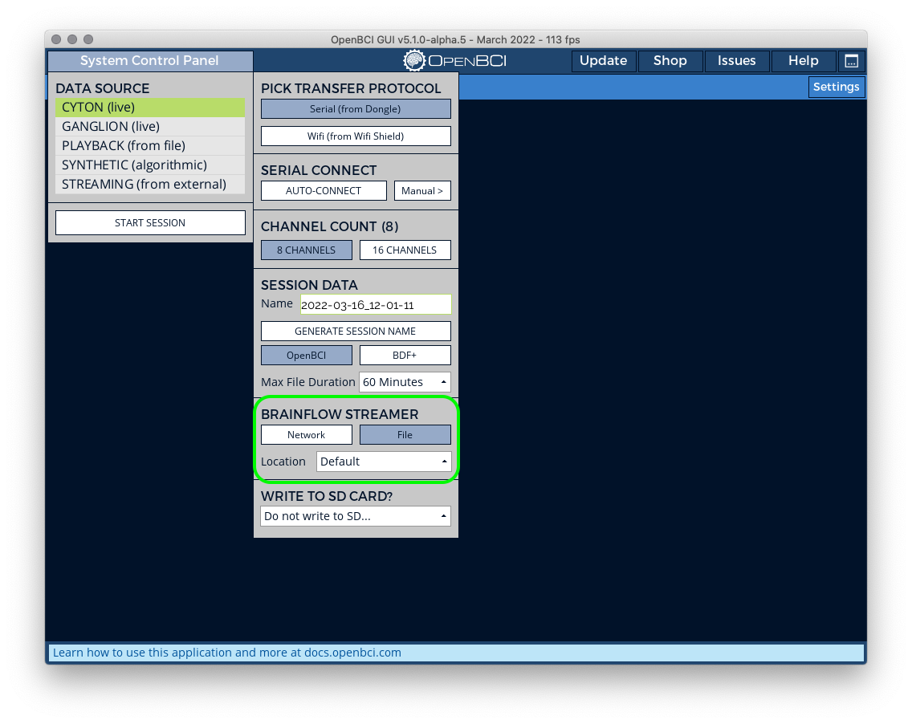

Cyton users can save data to an SD card. To playback these files using the GUI, copy the files to your computer from the SD card. This works better than reading files from the SD card. With GUI v5, it is no longer necessary to convert SD files for playback in the GUI. A few users may still want to [convert large SD file recordings](#converting-large-sd-card-recordings).

### Customize Your Layout

The OpenBCI GUI displays up to six customizable windows in twelve layouts! You can choose what each window displays by clicking the dropdown menu at the upper left of each window. The bottom row of layouts work best on higher resolution monitors.

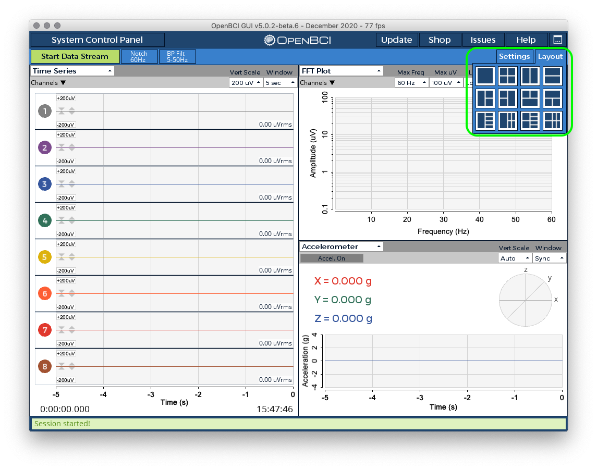

### Impedance Testing

The impedance widget is a valuable tool for evaluating electrode contact before data acquisition.
Press `Test` to start impedance test on an individual channel.

The impedance value is in colored font as a visual guide to the pre-set thresholds. A red impedance value means you should adjust your electrodes, part your hair, add gel, use paste, or such measures as appropriate for the electrode you’re using. Experienced users can also adjust these thresholds in the bracket-field beneath the table.

:::info
During the impedance test, the board sends a small current through the selected channel to obtain the impedance value.
**For this reason, you won't be able to stream data on a channel and obtain the impedance value simultaneously from the channel.**
:::

The screenshot below shows the GUI Impedance Widget for Cyton:
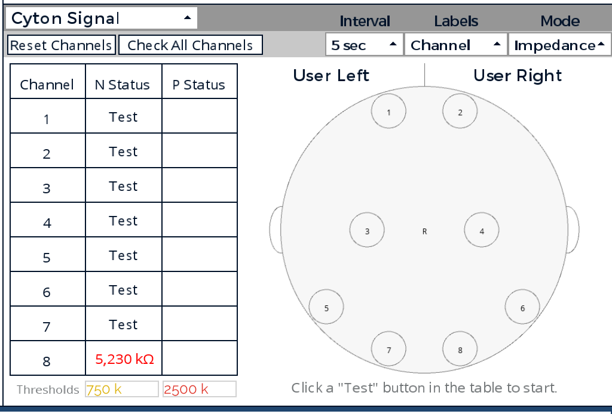

To test impedance for Ganglion, use the Ganglion Signal Widget.


### Decrease Setup Time by Saving/Loading Settings

Starting with GUI V3, you can save and load a snapshot of nearly every setting in the GUI (ex. Layout, Time Series Channel Settings, Networking Settings, etc.) by using a dropdown menu (pictured below) or keyboard shortcuts. If you change anything during a session, save your settings or click "Stop System" before exiting. **Save with lowercase 'n'** and **Load with capital 'N'** on your keyboard to and from _/Documents/OpenBCI_GUI/Settings/_.


Start the system first. Then, arrange the GUI to suit your needs and **click "Settings"-->"Save"**. A dialog box will open to confirm file name and path _(e.g. GanglionUserSettings.json)_. After, you will see a message saying "Settings Saved!" When you click "Stop System", all settings will be auto-saved.

The GUI automatically loads settings from _/Documents/OpenBCI_GUI/Settings/_ when the system starts!

To load settings, just **click "Settings"-->"Load"**. Select a settings file from the dialog box that opens. If the settings are incompatible (ex. loading 16 channels while using 8), the GUI will display an error at the bottom or "Default Settings Loaded". If all is well, the GUI will display "Settings Loaded!" as the GUI snaps directly to your desired settings.

**Click "Settings"-->"Default" to revert the GUI to default settings.**

For all data modes, the GUI will load all GUI-related settings automatically. After starting a session, hardware settings (channel on/off, gain, etc.) will need to be set by the user manually.

### BrainFlow Streaming Board Feature

#### External Process to GUI

This feature allows more advanced users to connect to OpenBCI boards using an external process (such as a Python script) and simultaneously send unfiltered data to the OpenBCI GUI. **Users may find this necessary for developing apps while wanting to use the GUI to visualize data.** Make sure to specify the same IP address and port mentioned in the primary process. Here is the [official BrainFlow Documentation for Streaming Board](https://brainflow.readthedocs.io/en/stable/SupportedBoards.html?highlight=streaming%20board#streaming-board).

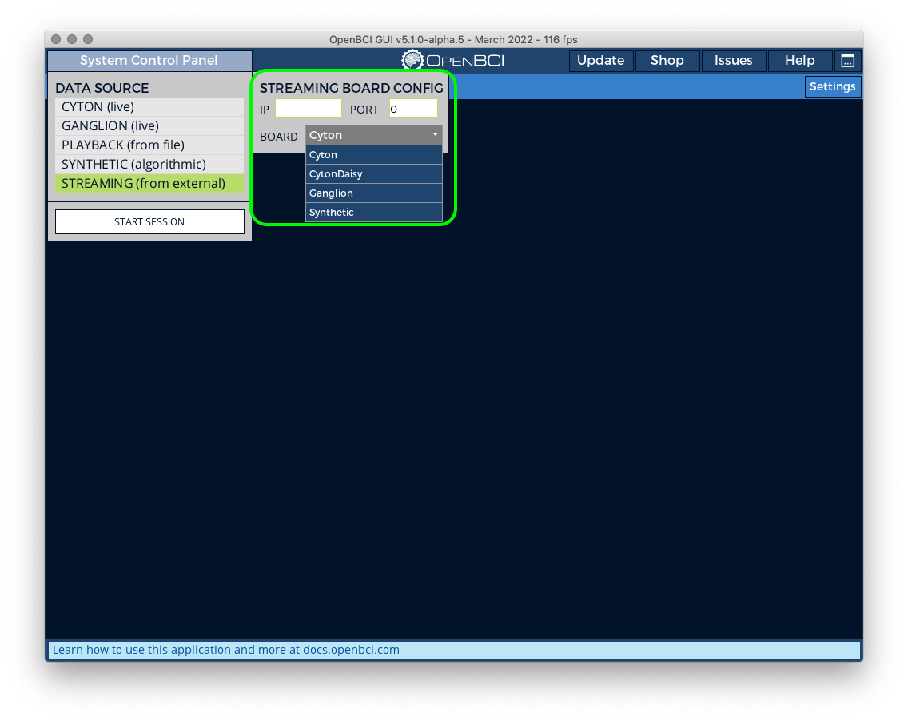

#### GUI to External Process

Similarly, you can reverse this process by using the BrainFlow Streamer set to "Network" and specifying the IP address and port there. The data sent out from the GUI is unfiltered. Here is the [official BrainFlow Documentation for Streaming Board](https://brainflow.readthedocs.io/en/stable/SupportedBoards.html?highlight=streaming%20board#streaming-board).

:::tip Recommendation
This method can be more reliable and quicker to implement than sending Time Series data out from the Networking Widget over UDP, LSL, or OSC!
:::

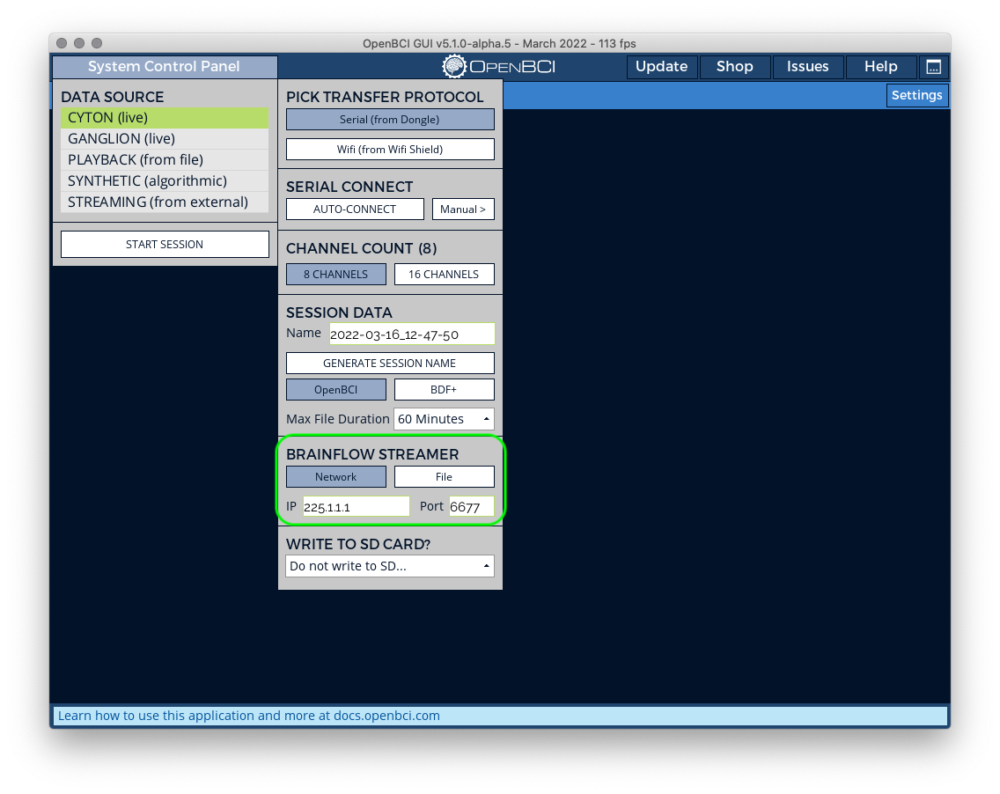

#### GUI To GUI Data Streaming

The OpenBCI GUI can stream data to another OpenBCI GUI using the BrainFlow streamer. Since this is a one-to-many [multicast](https://en.wikipedia.org/wiki/Multicast), it is possible to receive the stream from multiple devices simultaneously. To start the networked GUI stream on the host machine:

1. Start the OpenBCI GUI and select your board type.
2. Toggle on the **network** option under the BrainFlow Streamer settings.


3. Enter the IP address and port for your stream. You need to be able to reach this IP address. The easiest way to do this is using a LAN or VLAN network. You can use a VPN to communicate with devices outside your local network.
4. Start session.

To receive this stream on a different machine:

1. Open the GUI and select **Streaming (from external)**.

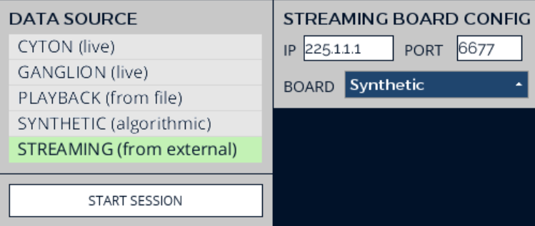

2. Enter the IP address, port, and board type of the data stream.
3. Start session.

### GUI Keyboard Shortcuts

**Use the spacebar to start or stop the data stream!**

#### Expert Mode

**To enable all keyboard shortcuts, set "Expert Mode On" in the settings dropdown.** This mode is off by default to prevent accidentally sending a command to the board.


Expert Mode Keyboard Shortcuts:

- Other than spacebar, you can press 's' to stop data stream, and 'b' to begin, or start the data stream.

- You can _use lowercase 'k' to set "Bias Don't Include"_ on all channels, or _lowercase 'l' to set "Bias Include"_ on all channels.

- **Press lowercase 'd' to set all channels settings to default.**

- Using an _English keyboard_, you can deactivate channels 1-16 using:

  - 1,2,3,4,5,6,7,8
  - q,w,e,r,t,y,u,i

- Similarly, activate channels 1-16 using:

  - !, @, #, $, %, ^, &, \*
  - Q,W,E,R,T,Y,U,I

- **Take a screenshot of the GUI using lowercase 'm'!** It will be saved to _/Documents/OpenBCI_GUI/Settings/_.

- **Enter presentation mode using Enter (Win), or Return (Mac).**

- To change to the alternate color scheme, use '{"{"}'.

## Running the OpenBCI GUI from the Processing IDE

**Most users should start by downloading the [standalone GUI](https://www.openbci.com/downloads). The Processing IDE is for adding features, modifying existing code, or testing development versions.**

The OpenBCI GUI is built using [Processing 4](https://processing.org/), a popular, Java-based creative coding framework. If you are interested in adding features or modifying the existing code, it is really easy to do so if you are familiar with Java. If you're not familiar with Java, don't fret! Processing is one of the easiest software packages to pick up as a beginner coder.

The things you will need to run the OpenBCI GUI in Processing are:

- [Processing App](https://processing.org/download)
- [OpenBCI GUI Sketch](https://github.com/OpenBCI/OpenBCI_GUI)

### Installing Processing 4

First, go to Processing's website and [download the latest version of Processing](https://processing.org/download). For more information on Processing, you can review the official [Processing Getting Started Guide](https://processing.org/tutorials/gettingstarted) or the [Processing Documentation](https://processing.org/environment).

Go ahead and install the Processing application as you normally would for your operating system. If this is the first time that you are running Processing, it will create what it calls it's `Sketch` folder in the following locations:

- On a Mac -`Users/<user-name>/Documents/Processing`
- On Windows - `C:\Users\<user-name>\Documents\Processing`
- On Linux -`/home/<user-name>/sketchbook`

:::info
Linux Users

[Here is a walkthrough on how to install Processing on Ubuntu Linux.](http://www.artsnova.com/processing/installing-processing-ubuntu-linux-tutorial.html)
:::

:::info
Mac Users

Please use the **Intel 64-bit** version of Processing 4 on all Mac computers. This will still run great on Apple Silicon. This allows us to continue using libraries that may not have a build for Arm64 architecture.
:::

### Downloading the code for the OpenBCI GUI

The OpenBCI GUI code repository is located [here on Github](https://github.com/OpenBCI/OpenBCI_GUI). Complete the following steps to download it to your computer:

- Click on the `Clone or download` button in green on the right, and select `Download ZIP`. If you are an advanced GitHub user, go ahead and clone it or fork it as you normally would.

- If you downloaded the repository as a zip, please unzip it. You can change the folder name from `OpenBCI_GUI-master` to `OpenBCI_GUI`, if you prefer. You can then place this folder wherever you like (Mac Example: `Users/<user-name>/Documents/GitHub/OpenBCI_GUI`).

:::info Copy 3rd Party Libraries
Inside the `OpenBCI_GUI` folder, there is a folder called `libraries`. These are the 3rd party libraries that the OpenBCI GUI depends on to work. It's important to **copy all of these folders** into:

On a Mac `Users/<user-name>/Documents/Processing/libraries`  
On Windows `C:\Users\Username\Documents\Processing\libraries`  
On Linux `/home/<user-name>/sketchbook/libraries`

If there is no folder called `libraries` in that location, go ahead and make one. Once you have done that, close the Processing app and reopen it. If you get an error saying "Duplicate Packages", you may need to remove the `jna` package from the `Processing\libraries` folder.
:::

### Open The OpenBCI GUI Project in Processing & Launch It!

:::note
If you are on Windows, please set Processing to `Run this program as an administrator`.
:::

When you get Processing running again, you will see a window open up. This is the Processing IDE (Integrated Development Environment). Select `File > Open` and open the `OpenBCI_GUI.pde` file from where you saved your fork or clone of the repository.

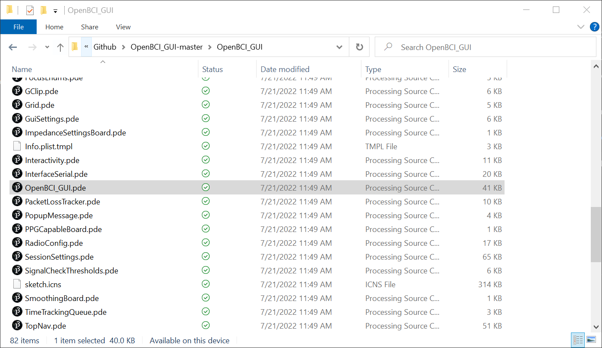
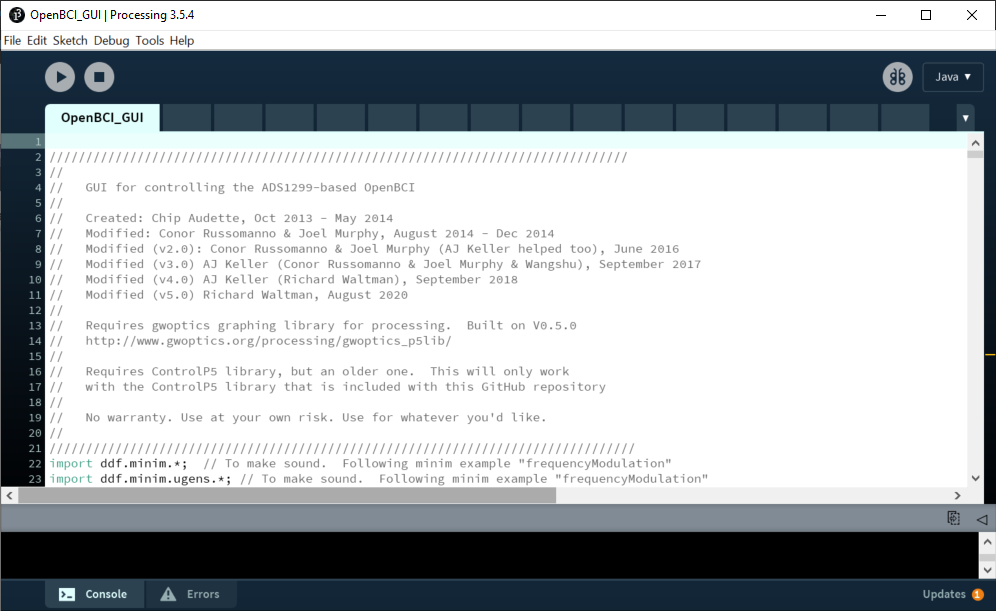

If you don't know anything about coding, don't edit these files. If you like to dig in to the meat of what makes things work, by all means. have at it. You are looking at the program code that makes the OpenBCI GUI work it's magic. Now, it's time to run it!


Press the `play` button on the upper left of the IDE, and the sketch will try to launch!

If you are encountering issues launching the GUI at this point, please head to the [OpenBCI_GUI section](https://openbci.com/forum/index.php?p=/categories/openbci_gui) of our Forum and look for help or post a question.

## Converting Large SD Card Recordings

**Note: This can only be done with GUI v4.2.0 or earlier.** In order to convert large SD card recordings made using Cyton or Cyton+Daisy, you will need to run the GUI from Processing, but we need to change one crucial setting in Processing's Preferences. As mentioned in the screenshot below, open Processing preferences and increase max available memory to at least 9GB to convert a 12 hour SD recording. Click OK to save these preferences, restart Processing to make sure the changes take effect, and re-launch the GUI.

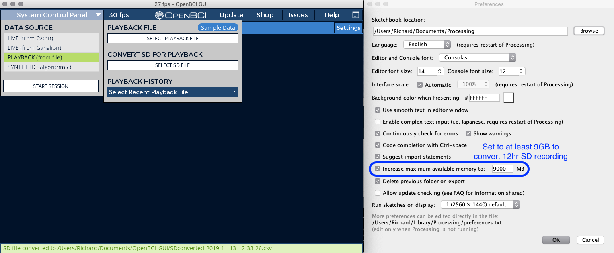

## Exported Data

### Location of saved data

**By default, all GUI recordings are stored in `User/Documents/OpenBCI_GUI/Recordings` on all operating systems.**

### More information about saved data

Data from the GUI is recorded into a `BrainFlow-RAW_date_time` CSV file and `OpenBCI-RAW_date_time` CSV file in txt format. Each GUI session will have its own directory titled `OpenBCISession_date_time`. The picture below shows three recordings within one GUI session.

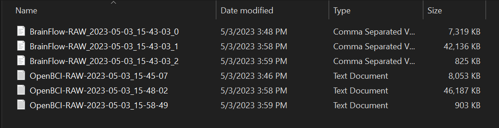

The BrainFlow CSV files are generated by the BrainFlow Streamer feature when set to stream to file. _This feature can also be used to send raw data over a network._ By default, BrainFlow streamer saves data to this folder.

:::tip
As a general policy, **the OpenBCI GUI will always store unfiltered data to file. These files will also be contiguous.** This means that if you stop and restart streaming data, a new file will be created within the same Session folder. This allows all users the freedom to select different filters when playing back files in the GUI or in offline data processing pipelines.

If you would like to copy these settings for using in another pipeline (e.g. Matlab), take a screenshot of the [GUI Filter UI](02_GUI_Widget_Guide.md#filters) for reference.

You can also use the exact same BrainFlow filters in every language with a supported binding when playing back a BrainFlow CSV file. For more info, you can refer to the [OpenBCI Software Development Documentation](../../ForDevelopers/01-SoftwareDevelopment.md).
:::

### Cyton

Here is a table of the column headers and descriptions for the Cyton.

| Column | Name                    | Description                                              |
| ------ | ----------------------- | -------------------------------------------------------- |
| 1      | Sample Index            | The index of the sample per second (0-250)               |
| 2      | EXG Channel 0           | EEG/EMG/ECG channel connected to N1P pins                |
| 3      | EXG Channel 1           | EEG/EMG/ECG channel connected to N2P pins                |
| 4      | EXG Channel 2           | EEG/EMG/ECG channel connected to N3P pins                |
| 5      | EXG Channel 3           | EEG/EMG/ECG channel connected to N4P pins                |
| 6      | EXG Channel 4           | EEG/EMG/ECG channel connected to N5P pins                |
| 7      | EXG Channel 5           | EEG/EMG/ECG channel connected to N6P pins                |
| 8      | EXG Channel 6           | EEG/EMG/ECG channel connected to N7P pins                |
| 9      | EXG Channel 7           | EEG/EMG/ECG channel connected to N8P pins                |
| 10     | Accel Channel 0         | Accelerometer channel 0 (X)                              |
| 11     | Accel Channel 1         | Accelerometer channel 1 (Y)                              |
| 12     | Accel Channel 2         | Accelerometer channel 2 (Z)                              |
| 13     | Not Used                | See below                                                |
| 14     | Digital Channel 0 (D11) | See below                                                |
| 15     | Digital Channel 1 (D12) | See below                                                |
| 16     | Digital Channel 2 (D13) | See below                                                |
| 17     | Digital Channel 3 (D17) | See below                                                |
| 18     | Not Used                | See below                                                |
| 19     | Digital Channel 4 (D18) | See below                                                |
| 20     | Analog Channel 0        | Analog channel 0                                         |
| 21     | Analog Channel 1        | Analog channel 1                                         |
| 22     | Analog Channel 2        | Analog channel 2                                         |
| 23     | Timestamp               | Unix timestamp                                           |
| 24     | Marker Channel          | Channel for adding manual markers to data                |
| 25     | Timestamp (Formatted)   | Year-Month-Day Hour:Minute:Second (Not in BrainFlow csv) |

Here is a table of the column headers and descriptions for the **Cyton + Daisy**.

| Column | Name                    | Description                                              |
| ------ | ----------------------- | -------------------------------------------------------- |
| 1      | Sample Index            | The index of the sample per second (0-250)               |
| 2      | EXG Channel 0           | EEG/EMG/ECG channel connected to N1P pins on Cyton       |
| 3      | EXG Channel 1           | EEG/EMG/ECG channel connected to N2P pins on Cyton       |
| 4      | EXG Channel 2           | EEG/EMG/ECG channel connected to N3P pins on Cyton       |
| 5      | EXG Channel 3           | EEG/EMG/ECG channel connected to N4P pins on Cyton       |
| 6      | EXG Channel 4           | EEG/EMG/ECG channel connected to N5P pins on Cyton       |
| 7      | EXG Channel 5           | EEG/EMG/ECG channel connected to N6P pins on Cyton       |
| 8      | EXG Channel 6           | EEG/EMG/ECG channel connected to N7P pins on Cyton       |
| 9      | EXG Channel 7           | EEG/EMG/ECG channel connected to N8P pins on Cyton       |
| 10     | EXG Channel 8           | EEG/EMG/ECG channel connected to N1P pins on Daisy       |
| 11     | EXG Channel 9           | EEG/EMG/ECG channel connected to N2P pins on Daisy       |
| 12     | EXG Channel 10          | EEG/EMG/ECG channel connected to N3P pins on Daisy       |
| 13     | EXG Channel 11          | EEG/EMG/ECG channel connected to N4P pins on Daisy       |
| 14     | EXG Channel 12          | EEG/EMG/ECG channel connected to N5P pins on Daisy       |
| 15     | EXG Channel 13          | EEG/EMG/ECG channel connected to N6P pins on Daisy       |
| 16     | EXG Channel 14          | EEG/EMG/ECG channel connected to N7P pins on Daisy       |
| 17     | EXG Channel 15          | EEG/EMG/ECG channel connected to N8P pins on Daisy       |
| 18     | Accel Channel 0         | Accelerometer channel 0 (X)                              |
| 19     | Accel Channel 1         | Accelerometer channel 1 (Y)                              |
| 20     | Accel Channel 2         | Accelerometer channel 2 (Z)                              |
| 21     | Not Used                | See below                                                |
| 22     | Digital Channel 0 (D11) | See below                                                |
| 23     | Digital Channel 1 (D12) | See below                                                |
| 24     | Digital Channel 2 (D13) | See below                                                |
| 25     | Digital Channel 3 (D17) | See below                                                |
| 26     | Not Used                | See below                                                |
| 27     | Digital Channel 4 (D18) | See below                                                |
| 28     | Analog Channel 0        | Analog channel 0                                         |
| 29     | Analog Channel 1        | Analog channel 1                                         |
| 30     | Analog Channel 2        | Analog channel 2                                         |
| 31     | Timestamp               | Unix timestamp                                           |
| 32     | Marker Channel          | Channel for adding manual markers to data                |
| 33     | Timestamp (Formatted)   | Year-Month-Day Hour:Minute:Second (Not in BrainFlow csv) |

:::info Cyton Aux Channels
In Digital Read mode, the 4th "Other" channel is connected to the D17 pin by default. This pin can be triggered by pressing the "PROG" button. This is useful for adding manual timestamps to your data.

You can also attach your own button to another pin, as shown in [the Puppies and Kittens Experiment](../../Examples/Video_Experiment.md#step-2-breadboard-setup).

Depending on the [Cyton board mode](../../Cyton/04-OpenBCI_Cyton_SDK.md#board-mode), the other channels will not display meaningful data. There are three modes currently used by the OpenBCI GUI: default (with Accelerometer), Analog Mode, and Digital Mode. These can be toggled within the appropriate widget during live recording sessions, and data will be displayed when using Playback Mode in the corresponding widgets. We recommend changing your board more _before_ starting your recordings.
:::

### Ganglion

Here is a table of the column headers and descriptions for the Ganglion.

| Column | OpenBCI-RAW           | Description                                              |
| ------ | --------------------- | -------------------------------------------------------- |
| 1      | Sample Index          | The index of the sample per second (0-250)               |
| 2      | EXG Channel 0         | EEG/EMG/ECG channel connected to N1P pins                |
| 3      | EXG Channel 1         | EEG/EMG/ECG channel connected to N2P pins                |
| 4      | EXG Channel 2         | EEG/EMG/ECG channel connected to N3P pins                |
| 5      | EXG Channel 3         | EEG/EMG/ECG channel connected to N4P pins                |
| 6      | Accel Channel 0       | Accelerometer channel 0 (X)                              |
| 7      | Accel Channel 1       | Accelerometer channel 1 (Y)                              |
| 8      | Accel Channel 2       | Accelerometer channel 2 (Z)                              |
| 9      | Other                 | Not used                                                 |
| 10     | Other                 | Not used                                                 |
| 11     | Other                 | Not used                                                 |
| 12     | Other                 | Not used                                                 |
| 13     | Other                 | Not used                                                 |
| 14     | Timestamp             | Unix timestamp                                           |
| 15     | Marker Channel        | Channel for adding manual markers to data                |
| 16     | Timestamp (Formatted) | Year-Month-Day Hour:Minute:Second (Not in BrainFlow csv) |
