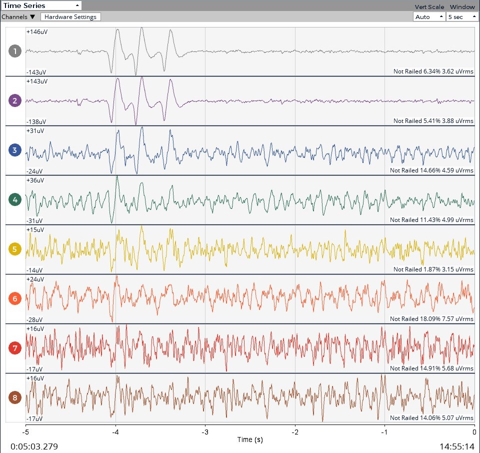
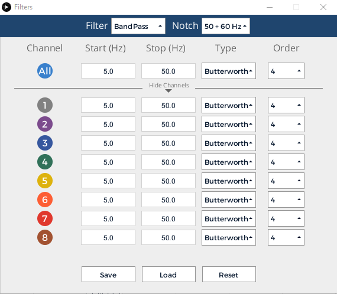
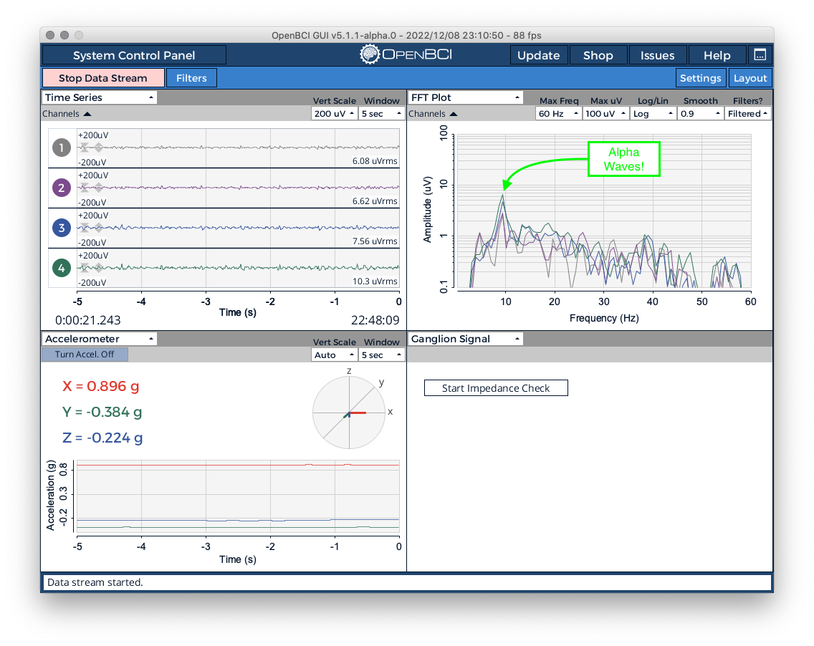
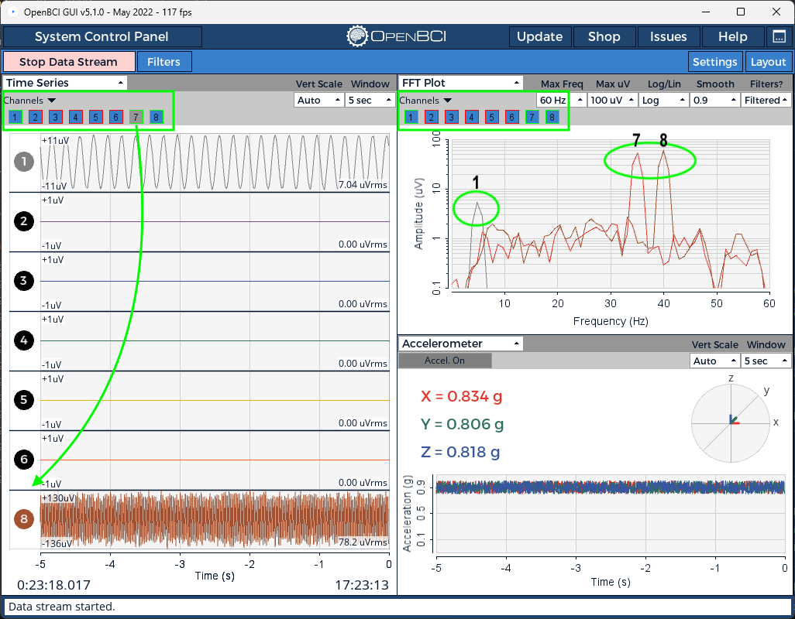
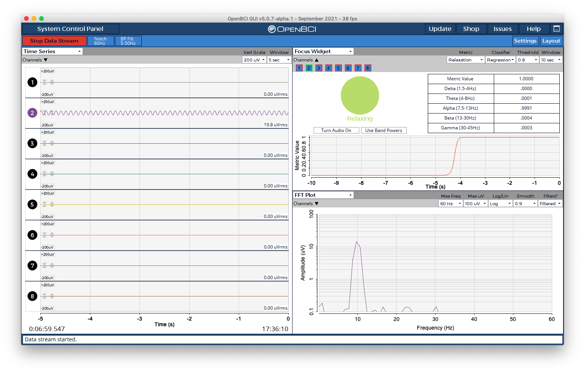
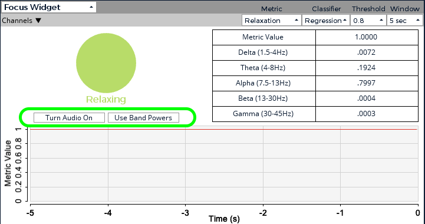
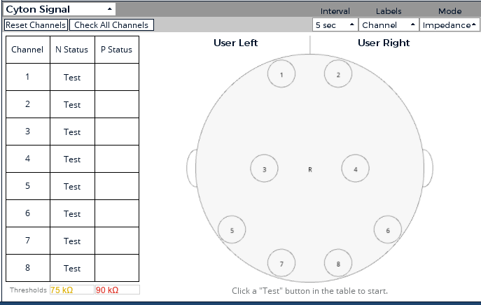
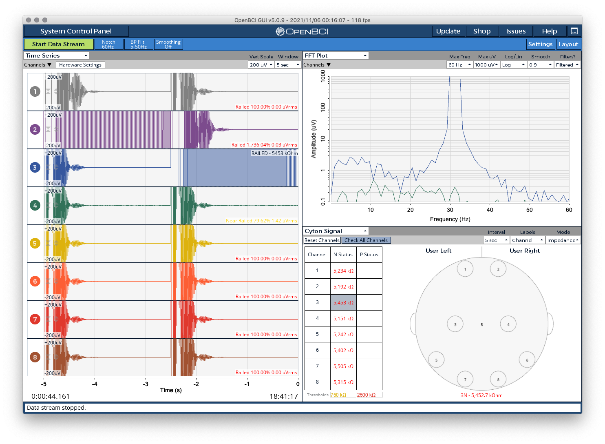
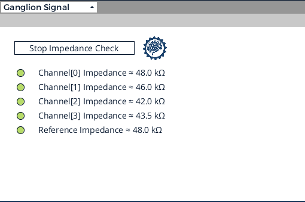

## What is a GUI Widget?

GUI widgets are the mini tools that fit into the OpenBCI GUI’s interface panes. Examples of GUI widgets include the Time Series, the FFT widget, the Networking widget, and so on. In the upper left-hand corner of every widget, there is a dropdown menu that lists all of the available widgets. If you click the dropdown and select a new widget from the dropdown, it will replace the current widget in that window. You can rearrange the layout of the widgets by clicking the “Layout” button in the upper right-hand side of the GUI.

The OpenBCI GUI software is compatible with MacOS, Windows 10, and Linux. Download the stand-alone GUI directly from the [OpenBCI GitHub](https://github.com/OpenBCI/OpenBCI_GUI/releases/latest).

## Time Series



The time series is the main widget for displaying biosensing data. It processes and displays the electrophysiological signal in real-time, with each graph representing the voltage detected at one point in time by an electrode.

It measures the absolute amplitude of the signal in voltage, in units of μVrms (microvolts, root mean squared). In the above photo, we can clearly see three eye blinks on channels one and two.

Each Ultracortex comes with wires that are color-coded to match the GUI, which can be a useful way of keeping track of which electrode maps to which channel.

### Hardware Settings


For Cyton users, clicking the Hardware Settings button opens a menu that allows you to fine-tune the PGA Gain, Bias, and other hardware settings for each channel. After updating these settings, the channel will be highlighted in blue to show that there are unapplied settings. As an example, you can see Channel 1 has been highlighted in the above screenshot. Next, click `Send` to send the updated settings to the board. Then, click the `Time Series` button again to view the data.

:::tip
To change the gain of a channel, you can click a dropdown and then scroll to view more options.
:::

Starting with GUI v5.0.2, all ADS1299 boards (Cyton, Cyton+Daisy) will use a dynamic scaler. This ensures that the scale factor, set in the Hardware Settings view, is always in sync with the numbers shown on user interface displays and recordings. Also, users will need to stop the data stream in order to access the Hardware Settings UI inside the Time Series Widget.

### Filters



The GUI contains several built-in filters that can be applied to the data in real-time. These can be accessed by clicking on the `Filters` button. This will open a menu that allows you to toggle the filters on/off, choose the frequency range, type, and order of the filters. On the top right you will find the notch filter, which can be used to [reduce AC noise](Troubleshooting/01-MinimizingNoise.md#get-rid-of-ac-noise) by filtering out 50Hz or 60Hz noise. To the left of the notch filter, there is a dropdown menu to choose between applying a bandpass or bandstop filter to your data. The bandpass filter allows a specific range of frequencies to pass through while attenuating frequencies outside of that range. On the other hand, the bandstop attenuates a specific range of frequencies while allowing frequencies outside of that range to pass through.

The filter parameters specify the start and stop frequencies, the filter type (Butterworth, Chebyshev, Bessel), and order of the filter. You can also toggle the filter on/off by clicking on the circle under the 'Channel' header (you will see the circle turn black if turned off). If you want to apply different filter settings to a specific channel, you can click on the 'Show Channels' dropdown to edit the parameters for each individual channel. The picture above shows the expanded filter menu.

Click the save button to save your current filter settings. If you want to load a previous filter configuration, click the load button and choose the settings file you want to load. The reset button will return all filter settings to their default values.

### Other Settings

**Channel Buttons**: These buttons represent each connected electrode channel. You can toggle them on/off to control whether or not you want to collect data from that electrode.

**View Settings**:

_Vertical Scale_ — Controls the range of μV displayed in the time series.
Note: Set to auto to avoid chopping off data and showing good peaks and troughs. Fine-tune as necessary.

_Window_ — Controls the amount of time that is shown in the series.

**Railed/Near Railed Warnings**:
These warnings show that there is no or poor signal and that you need to check the electrodes to ensure that they are making good contact with your body.

:::info
As of GUI 5.0.9, use the new [Cyton Signal Widget](#cyton-signal-widget) to check the impedance on individual channels. While in Live mode, you can check the "Railed Percentage" to check the status of all electrodes at once.
:::

## FFT Plot


This is a standard data visualization feature of biosensing tools. The x-axis displays various frequencies, and the y-axis shows each frequency’s respective amplitudes in μV. These amplitudes are displayed logarithmically by default — a recommended setting — but you can alter this in the "Log/Lin" dropdown.

:::note
Each color in the FFT Plot is color-coded to match the channels in the time series.\_
:::

:::tip
In the picture below, you can see great Alpha Waves centered around 10 Hz using the [OpenBCI Ganglion](https://shop.openbci.com/products/ganglion-board) and [Headband Kit](https://shop.openbci.com/products/openbci-eeg-headband-kit).
:::



## Accelerometer


Each OpenBCI board is fitted with a three-axis accelerometer, the data from which is streamed to this widget. This accelerometer measures the acceleration of the board itself on an XYZ-axis.

**Axis Graph**: Displays relative XYZ-acceleration at the current moment visually on a graph

**Timeline**: Displays relative XYZ accelerations over time, color-coded by axis.

## Channel Select UI (Multiple Widgets)

Some widgets in the OpenBCI GUI have a feature which allows you to select the channels that will control the behavior of that widget. Clicking on the `Channels` button will expand the UI and show buttons which correlate to each available channel. This feature gives users more control over visualizing data. Let's go over the UI and what it means.

### Border

- Green Border: Data is streaming for that channel
- Red Border: Data is not streaming for that channel

### Fill

- Blue Fill: Data will be used by this widget for that channel
- Grey Fill: Data will not be used by this widget for that channel

### Example Configuration

In the screenshot below, we see the Channel Select UI open in both the Time Series and FFT widgets. In both widgets, we see buttons correlating to each channel. We have disabled streaming for channels 2 through 6 using the round buttons in the Time Series widget on the left side of each channel. As such, these channels have a red border in the Channel Select UI. In contrast, channels 1, 7, and 8 are still streaming data and they have a green border. However, we have turned off the Channel Select button for channel 7 in the Time Series widget, which causes it to not be shown only in this widget.

Next, let's look closely at the FFT Plot widget in the top right. Though we have hidden channel 7 from the Time Series widget, the data is still streaming and we see a blue fill on button for Channel 7. In this case, we still want to see data in the FFT Plot from all channels, and we can do just that! We see the peeks in the graph correlating to channels 1, 7, and 8. We do not see data from Channels 2 through 6 only because the data is all zeros.



While this example is not a realistic setup, it shows the level of control and customization that is possible across all widgets that have the Channel Select UI. Find your perfect layout and then remember to [save your Settings using the `Settings` tab in the top right of the GUI!](Software/OpenBCISoftware/01-OpenBCI_GUI.md#decrease-setup-time-by-savingloading-settings) Have fun!

## Head Plot

The head plot displays which regions of the head are experiencing the most activity. The deeper the red in a region, the more brain activity there is occurring in that region. Contour lines are also shown to connect various regions of similar activity levels.

Each number on the diagram corresponds to an electrode channel displayed in the time series widget. These numbers correspond with the suggested assembly for the Ultracortex Mark IV. However, each can be dragged to different locations for custom configurations.

### Default Node Placement

Based off of 10-20 model

| #   | 10-20 Node |
| --- | ---------- |
| 1   | Fp1        |
| 2   | Fp2        |
| 3   | C3         |
| 4   | C4         |
| 5   | P7/T5\*    |
| 6   | P8/T6\*    |
| 7   | O1         |
| 8   | O2         |

\* P7 and P8 are the new terminologies for nodes T5 and T6

### Polarity

When compared to a reference, the pin inputs can produce a positive or negative value. Choosing "+/-" will display the true value as measured from the reference. So if the voltage is measured as lower than the reference, your value will appear negative (or blue), and if the voltage is measured to be higher the value will be positive.


Alternatively, "+" will display only an absolute value, without regard to whether the signal was positive or negative.


## Spectrogram Widget


This widget contains a dual spectrogram display which allows users to see changes in FFT data over time. In the above screenshot, you can see GUI synthetic data being plotted in the Spectrogram widget, and this can be confirmed by counting the "peaks" in the TimeSeries data for each channel. Also, you can see the FFT widget is open and has been labeled. This allows us to see and confirm the data that is in the dual spectrogram display.

The channel selector in this widget has two rows. The top row selects channels to include in the top spectrogram, and the bottom row selects channels for the lower spectrogram. By default, this widget will be setup to compare Left hemisphere vs Right hemisphere.

The "Max Freq." dropdown controls the maximum frequency to display. The "Samples" dropdown controls how fast data is fed to the graph (1Hz == Once per second). The "Log/Lin" dropdown toggles the color gradient to use on both spectrograms. On the right of the Spectrogram widget, you will see a thick line to display the current color gradient.

_Important: The data/graphs displayed in this widget are an approximation, and should not be used in any serious contexts or diagnosis._

## Focus Widget

The widget uses the BrainFlow Metric feature to detect Relaxation or Concentration, aka Focus. We also have the ability to change the classification method used! In the screenshot below, you will see synthetic Alpha waves from Channel 2 being used to control the Relaxation metric. **Make sure to try the built-in [Auditory Feedback](#auditory-feedback) feature!**



**Channel Select**: Using the "Channels" button at the top left of the widget, we can select which channels/electrodes to feed into the BrainFlow metric. The accuracy of the metric will depend on the channels used. With OpenBCI hardware and the GUI, users have the freedom to change physical electrode positions and select the best combination for the desired metric!

**Metric**: Choose from "Relaxation" or "Concentration" as the desired flavor of Focus to detect. "Relaxation" generally looks at FFT values associated with Delta, Theta and Alpha brainwaves, while "Concentration" looks at Beta and Gamma brainwaves. Relaxation is usually achieved by "meditating" with eyes closed, while Concentration can be achieved by focusing intently with eyes open. Models were trained using band powers. There is no training phase, and predefined coefficients are used.

**Classifier**: Using BrainFlow Metrics allows us to choose our classifier for both metrics. This can be Regression, KNN, SVM, or LDA. You are free to change this setting at any time to experiment! We recommend Regression by default.

**Threshold**: Use this dropdown to select the threshold for the metric to determine if you are "Relaxing" or "Concentrating". You can see the metric value displayed in the top row of the table in this widget, it ranges from 0 to 1.

**Window**: This allows you to select the window of time used to calculate the metric value by looking at the average band powers over the selected time period.

### **Auditory Feedback**

Starting with GUI 5.0.6, the Focus Widget is able to provide auditory feedback. This means you can use your brain control the volume of a peaceful musical chord. Simply press the "Turn Audio On" button to activate this feature. We recommend the default settings as a fun way to practice mindfulness and relaxation using OpenBCI hardware and one or two electrodes attached to the forehead (usually Fp1 and Fp2).



**In-depth Info on Auditory Feedback Feature**: There are two modes which are controlled via the second button under the large circle: metric value and band powers.

- Using the metric value, the volume of all of the musical notes will increase or decrease based on the metric value (0 to 1) displayed in the table.
- Using the band powers, certain musical notes will get louder or quieter and are directly correlated to the band power values displayed in the table (0 to 1). Lower notes are associated with lower frequencies, and higher notes are associated with higher frequencies. So, if you have predominate alpha brainwaves, you will likely hear lower and middle tones from the chord.

## Band Power

The band power widget shows the relative voltages of the various brain wave categories. Each type of brain wave represents a subset of frequencies, which represent different states of activity. The widget is a great "at-a-glance" look into your brain’s activity.

### Types of Waves

| Wave  | Frequency (Hz) | Description                                                                                                                                                                               |
| :---: | :------------: | ----------------------------------------------------------------------------------------------------------------------------------------------------------------------------------------- |
| Gamma |     32-100     | Signifies heightened perception, learning and problem solving tasks, as well as alertness. It occurs when there is simueltaneous information processing from multiple parts of the brain. |
| Beta  |     13-32      | Signfies normal alert consciousness and active thinking. It occurs when one is focusing on work, solving a problem, learning a new concept, or engaging in active conversation.           |
| Alpha |      8-13      | Signifies physical and mental relaxation. They occur when your eyes are closed, when one is being artistic, and during yoga.                                                              |
| Theta |      4-8       | Signifies deep relaxation, creativity, insight, reduced consciousness. They are picked up during day dreaming and deep meditation.                                                        |
| Delta |     0.5-4      | Signifies sleep, dreaming. Occurs when we enjoy restorative, deep, dreamless sleep.                                                                                                       |

## EMG

In a nutshell, we are trying to map the current flex of a muscle into the “comfortable flex range” of said muscle, and then represent that as a decimal between 0 and 1. In theory, if you relax, the value will be 0, and if you flex, the value will go to 1.

The current EMG strength is a collection of raw voltage values averaged (or smoothed) over a known window of time. The bigger the window you are averaging over, the smoother the data. We establish an upper threshold (the outer dark blue circle of the circular visualizer) and a lower threshold (the inner dark blue circle) for the constantly updating “comfortable EMG range.” Then we’re mapping the current EMG (the filled circle that matches the color of the channel) value between the upper and lower thresholds.

This pseudo-analog mapped value is represented more clearly in the bar graph off to the right of each channel’s circular visualizer. The upper threshold is constantly creeping downwards and the lower threshold is constantly creeping upwards until they get the Min ΔμV away from one another. This ensures that the overall system never creates an upper/lower flex range that is too big to influence with a muscle flex.

### Options

The drop-downs of the widget are designed to allow you to tweak the various parameters of this relationship. There are 4 dropdowns used to control certain parameters:

**Smooth**: This is the size of the window. If we set this value at the smallest setting of 0.01 seconds (ie., lowering the smooth value), our data will be very jittery but responsive. Alternatively, if we increase the smooth and set our window to 2.0 seconds, the output will be very smooth but much less responsive.

**μV Limit**: This is a cutoff point for an allowable μV value in any individual data block. Any μV values above this number will be chopped off and set to this upper μV limit. This is to prevent erratic blips in the data from substantially distorting the average. Sometimes dropped packets and rapid body movements can create large spikes that don’t correlate to muscle activity. This helps account for those issues.

**Creep**: This value indicates how quickly the upper μV threshold creeps downward and how quickly the lower limit creeps upward. Notice that by adjusting this value, the upper threshold and lower threshold rings will approach each other more quickly. We generally recommend this to be slow. If this is too fast and we wait too long between muscle activations, the upper threshold will have crept closer to the lower threshold and the system will be hypersensitive.

**Min ΔμV**: This value sets the minimum voltage range between the upper threshold and the lower threshold. The upper threshold and lower threshold cannot get any closer than this. By making this value bigger, you will have to flex harder to go from 0 to 100% flex, after the thresholds have crept as close as they will get to one another (aka Min ΔμV).

## Networking

The networking widget allows the streaming of data to other apps. Keep scrolling for an explanation of the four data types: Serial, UDP, OSC, and LSL. To see how it can be used with our different apps, check out our [Software page](Software/SoftwareLanding.md).

With the networking widget, you can send Time Series, FFT, EMG, Band Power, Accel/Aux, and Pulse data. The Accel/Aux option allows you to send Accelerometer, Analog Read, or Digital Read data.

:::important
Make sure to have the corresponding widget open, depending on the data type you would like to stream. **Full details of all possible outputs can be found at the [GUI Networking Guide](https://docs.google.com/document/d/e/2PACX-1vR_4DXPTh1nuiOwWKwIZN3NkGP3kRwpP4Hu6fQmy3jRAOaydOuEI1jket6V4V6PG4yIG15H1N7oFfdV/pub).**
:::

### Serial

Able to stream one data type. The data is sent sequentially, bit by bit, in consecutive packets. Serial is the main networking protocol that can be used when using OpenBCI with Arduino.

**Baud Rate**: The rate of data transfer in bits per second. This should correspond with the chosen baud rate for the receiving application.

**Port**: The port of the receiving device. For Arduino, for example, this will likely be a "USB modem" with a serial number attached.

### UDP

User Datagram Protocol is used primarily for establishing low-latency and loss-tolerating connections between applications on the internet. The UDP protocol allows for up to three different data sets to be sent to three different applications.

### LSL

Lab Streaming Layer is a system for synchronizing streaming data for live analysis or recording. LSL is a good way to send your OpenBCI stream to applications that can record or manipulate the data, such as [Matlab](Software/CompatibleThirdPartySoftware/01-Matlab.md).

FFT data can now be sent over LSL, starting with [GUI v.4.1.5-beta.3.](https://github.com/OpenBCI/OpenBCI_GUI/releases)

As of GUI v5.0.5, the `# Chan` textfield has been removed.As an example, here's a screenshot streaming 3 data types to Python:


You can find the [example Python script here in the GUI Networking Test Kit](https://github.com/OpenBCI/OpenBCI_GUI/tree/master/Networking-Test-Kit). Note: You will need to do `pip install pylsl` if the dependency is not already installed.

### OSC

Open Sound Control is a protocol for networking sound synthesizers, computers, and other multimedia devices for purposes such as musical performance or show control. OSC's advantages include interoperability, accuracy, flexibility, and enhanced organization and documentation.

OSC works with MaxMSP, PureData, and Resolume.

## Cyton Signal Widget

Use this widget to check the signal quality of attached electrodes. There are two modes for this widget: Impedance and Live. You will find a description of each mode below along with screenshots. _For now, a placeholder image of the headplot with default electrode positions is displayed on the right side of this widget. We will be updating this in the next major version of the GUI._



### Impedance Mode

Use this mode to check the status of each pin/electrode using an injected current. This method is quite reliable and the most accurate method of checking signal quality.

Please be patient when sending commands and pressing buttons while in this mode. The Cyton needs a few milliseconds to reconfigure the board between checking channels. After checking the signal quality, the Cyton board may reset to the default board settings. You may also choose to do this manually by pressing the "Reset Channels" button found in the top right of this widget.

We recommend using this widget and mode before starting a recording session. **Also, note that this data will not be recorded to a file, though you may see some data in the Time Series widget.** In the future, we would like to save this data to a separate file for those advanced users who may wish to analyze it further.



In the above screenshot, take note of the injected current in the Time Series widget on channel 3. Also, you can see that the baseline values for all channels are around 5000 kOhms with no electrodes attached or touching a user. Many users should simply opt to use the "Check All Channels" button to automatically check signals on all channels. You can adjust the "Interval" at the top of the widget using a dropdown menu.

:::info
The impedance check mode injects 31.5Hz noise into an individual channel, and we can only check one at a time due to the noise this creates on other nearby channels. This is the only way to get reliable measurements using this method. It is not advised to check impedance using injected current on more than one channel.
:::

### Live Mode

Use this mode to check the status of all channels at once while streaming data. This information is also displayed on each channel in the Time Series Widget. Though, it can be helpful to view all of this data together in a table to make comparisons.


'Railed' indication in the GUI just means your signal amplitude is exceeding the maximum value for the scale you are using. Generally, this indicates that an electrode may not be making direct contact with skin. If it is already touching, you could try lowering the gain on that channel via the Hardware Settings feature.

## Ganglion Signal Check

Use this mode to check the status of each pin/electrode using an injected current. This method is quite reliable and the most accurate method of checking signal quality. Please be patient while this widget cycles through checking each channel one by one.

We recommend using this widget and mode before starting a recording session. **Please note that this data will not be recorded to a file, though you may see some data in the Time Series widget.** You may also see values of zero in the accelerometer widget, this is normal during impedance testing with Ganglion. In the future, we would like to save this data to a separate file for those advanced users who may wish to analyze it further.

:::info
In the picture below, you will see an example of some acceptable impedance values using the [Headband Kit](https://shop.openbci.com/products/openbci-eeg-headband-kit) with the [Ganglion channels set to EEG mode](../../AddOns/Headwear/03-Headband_Tutorial.md#hardware). The circle off the to left of each channel will show either green, yellow, or red. Green and yellow values are acceptable, though green is better.
:::



## Playback Widget

This Widget only appears when in playback mode. It allows you to select a different playback without having to “Stop System”. There is a button in the top right of the Widget that allows you to select any OpenBCI playback file (.txt or .csv). Selecting other types of files may cause an error.

## Pulse Widget

This widget will only show for Cyton in Live mode. It uses the Analog Read mode to get data from the pin marked D11 on the Cyton. Using this data, the widget will calculate the Beats per minute (BPM) and the Interbeat Interval (IBI). When using the Networking widget, this data type will send BPM, Raw Signal, and IBI.

---

## Custom Widget

This tutorial shows you how to create custom widgets for the [OpenBCI GUI](https://github.com/OpenBCI/OpenBCI_GUI). In just a few easy steps, you can have your mini-applications added to the dropdown menus of the OpenBCI GUI for running specialized applications in real-time. These widgets can tap directly into the main data structure of the OpenBCI GUI, so you can experiment with brain waves and other biodata right in the GUI.

#### Helpful Background Skills

- Knowledge of [Processing](https://processing.org/) or Java-based programming
- Experience with [running the OpenBCI GUI from the Processing IDE](Software/OpenBCISoftware/01-OpenBCI_GUI.md#running-the-openbci-gui-from-the-processing-ide)
- [Developer Setup using Visual Studio Code or Processing](https://github.com/OpenBCI/OpenBCI_GUI/wiki/Developer-Setup)
- Alternatively, you can edit using [Atom with Processing packages](https://atom.io)

### Step 1 - Duplicate the W_template.pde file & rename

The [W_template.pde](https://github.com/OpenBCI/OpenBCI_GUI/blob/master/OpenBCI_GUI/W_Template.pde) file is designed to serve as a simple starting point for creating your widgets. You'll want to start by duplicating this file and renaming it to something like `W_MyNewWidget.pde`, where "MyNewWidget" is something relevant to the purpose of your new widget! Try to adhere to the naming convention and put `W_` in front to make sure that all of your widgets end up next to one another in your project directory.

_You need to remember to rename the class to make sure that it is unique and not the same class as W_template.pde._ The first uncommented line of your file should read:

```

class W_MyNewWidget extends Widget {

```

### Step 2 - Add your new widget to the widgetManager.pde file

Before adding any fancy code that grabs ahold of local data structures, make sure you add your new widget to the [widgetManager.pde](https://github.com/OpenBCI/OpenBCI_GUI/blob/master/OpenBCI_GUI/WidgetManager.pde) file. By doing this, you make sure your new widget is added to the dropdown menu of each widget. This is helpful because now you can see what you are doing as you add graphics to your widget as you continue to develop it.

Follow the protocol instantiating your widget globally by adding it here:

```

// MAKE YOUR WIDGET GLOBALLY
W_timeSeries w_timeSeries;
W_fft w_fft;
W_Networking w_networking;
W_BandPower w_bandPower;
W_Accelerometer w_accelerometer;
W_CytonImpedance w_cytonImpedance;
W_GanglionImpedance w_ganglionImpedance;
W_HeadPlot w_headPlot;
W_template w_template1;
W_emg w_emg;
W_PulseSensor w_pulsesensor;
W_AnalogRead w_analogRead;
W_DigitalRead w_digitalRead;
W_playback w_playback;
W_Spectrogram w_spectrogram;
W_PacketLoss w_packetLoss;
W_Focus w_focus;
W_MyNewWidget w_myNewWidget;

```

Then, make sure to "setup" your widget and add it to the array of all widgets by mimicking the setup code lines

```

  ...

  w_networking = new W_networking(_this);
  w_networking.setTitle("Networking");
  addWidget(w_networking, w);

  w_myNewWidget = new W_myNewWidget(_this);
  w_myNewWidget.setTitle("My New Widget");
  addWidget(w_myNewWidget, w);

  w_bandPower = new W_BandPower(_this);
  w_bandPower.setTitle("Band Power");
  addWidget(w_bandPower, w);

  ...

```

### Step 3 - Add dropdowns to control your widget, if needed

**Note:** Before you can compile the GUI, you'll need to rename the global functions at the bottom of your W_myNewWidget.pde file so that they are different from the global functions at the bottom of W_template.pde. While running the GUI, these functions are automatically activated when the corresponding dropdown is activated in the nav of your widget. Make sure that string (ex: "Dropdown1") in the `addDropdown()` function of the constructor is the same string as the name of your corresponding global function at the bottom of your .pde file. The index of the menu item selected is what is passed into the function (ie "int n").

```

//These functions need to be global! These functions are activated when an item from the corresponding dropdown is selected

void Dropdown1(int n){
  println("Item " + (n+1) + " selected from Dropdown 1");
  if(n==0){
    //do this
  } else if(n==1){
    //do this instead
  }

  closeAllDropdowns(); // do this at the end of all widget-activated functions to ensure proper widget interactivity ... we want to make sure a click makes the menu close
}

void Dropdown2(int n){
  println("Item " + (n+1) + " selected from Dropdown 2");
  closeAllDropdowns();
}

void Dropdown3(int n){
  println("Item " + (n+1) + " selected from Dropdown 3");
  closeAllDropdowns();
}

```

Run the GUI, and make sure you can see your new widget in the widget dropdown menu in the upper left corner of all widgets. If you don't see it, make sure you did the above steps properly.

### Step 4 - Design your custom widget

Explore how the existing widgets are accessing data structures internal to the GUI, and see if you can make something cool!

**Some cool things to know:**

- Every widget has `x, y, w, h` variables that correspond to the left edge of the widget (horizontal pixel location), the top edge of the widget (vertical pixel location), the # of pixels wide, and the # of pixels tall, respectively. These variables update automatically when the screen is resized or when the widgets are cycled through the layout containers. When adding graphics to your widget, do everything based on these variables to ensure responsiveness.
- Aside from setting up your widget in the widgetManager.pde file, all of your code can live inside of the W_myNewWidget.pde file (if done correctly).
- To see how to access global data structures like FFT data and Time Series data, check out how the [other widgets](https://github.com/OpenBCI/OpenBCI_GUI/tree/master/OpenBCI_GUI) are accessing data in their `update()` functions
- One way that we add features such as dropdowns and radio buttons to our widgets is the [ControlP5 Library](https://github.com/sojamo/controlp5). This library has been modified extensively from the original to improve functionality in the GUI.
- To learn more about how widgets work, look at the [widget.pde](https://github.com/OpenBCI/OpenBCI_GUI/blob/master/OpenBCI_GUI/Widget.pde) file. That said, I don't recommend changing anything!

### Step 5 - Add any dropdown settings to SessionSettings.pde

As of GUI v4, the app attempts to auto-save and auto-load user settings. Otherwise, users would need to reconfigure the GUI every time! So, if you use dropdowns in your new widget, you need to include those settings in SoftwareSettings.pde in save() and load().

There are a few details at the top of SessionSettings.pde that should be helpful. Just follow the style that is already in place to save and load from [JSON](https://en.wikipedia.org/wiki/JSON). Skim through the code in save() or load(), you will see settings from some of your favorite widgets. Use this as your example!

### Step 6 - Widget Testing

**Debugging:**
If you've added any `println()` or `verbosePrint()` in your widget, you can use the Console Log feature to see these messages, or just look at the console in your favorite IDE.

**Screen Resized:**
Some objects may need to be resized or re-positioned when the user changes the GUI screen size. This is why the widget class has the `screenResized()` method. Something not displaying right after the GUI is resized? This is where you need to add code. Typically, object x, y, width, and height are declared when the widget is instantiated, and again in `screenResized()` using relative positioning.

**Settings:**
To test that everything is working, you should see the data in a settings JSON file for each data mode in the `Documents/OpenBCI_GUI/Settings/` folder. JSON files can be viewed as text. Confirm that your new JSON object and data are being written to file. Finally, confirm that the settings work properly when configuring the widget, saving, and loading.

**GUI Crash:**
One of the most common ways to crash the GUI with a new widget is drawing `null` data, or some other error related to `draw()`. Another common crash is an `Exception`, which will print to the console of Atom, VSCode, or Processing IDE.

### Step 7 - Share your custom widget with the world!

If you make a functional widget that you think others could benefit from, please share it with the world by submitting a pull request to the [OpenBCI_GUI repo](https://github.com/OpenBCI/OpenBCI_GUI)!
