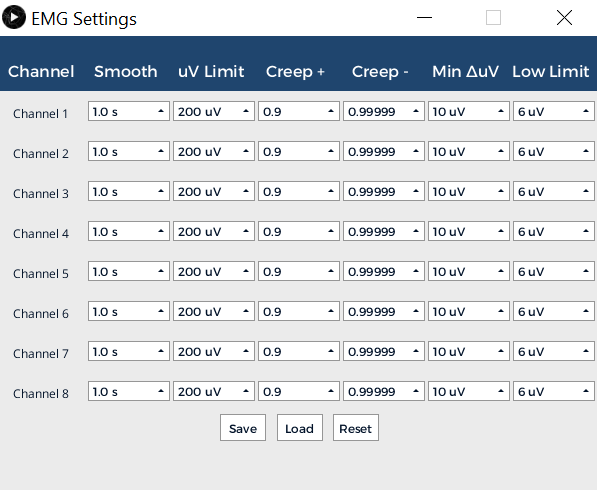
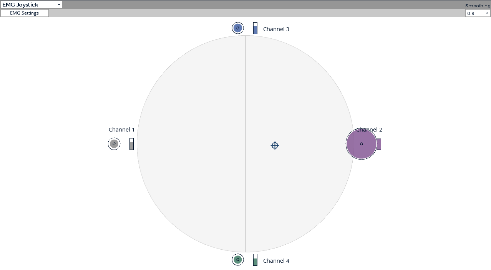

This tutorial will show you how to control a joystick using EMG data with the OpenBCI GUI. You can then use this customizable, muscle-activated joystick for any purpose of your choosing! OpenBCI used this to control a drone in the 2023 OpenBCI TED Talk.

## Materials Required

1.  OpenBCI [Cyton Board](https://shop.openbci.com/collections/frontpage/products/cyton-biosensing-board-8-channel?variant=38958638542) or [Ganglion Board](https://shop.openbci.com/products/ganglion-board)
2.  [Skintact sticky electrodes](https://shop.openbci.com/collections/frontpage/products/skintact-f301-pediatric-foam-solid-gel-electrodes-30-pack?variant=29467659395) or [IDUN Dryode](https://shop.openbci.com/collections/frontpage/products/idun-dryode-kit)
3.  [EMG/ECG Snap Electrode Cables](https://shop.openbci.com/collections/frontpage/products/emg-ecg-snap-electrode-cables?variant=32372786958)
4.  Computer with downloaded [OpenBCI GUI](Software/OpenBCISoftware/01-OpenBCI_GUI.md). **Be sure to use [OpenBCI GUI v5.2.0](https://github.com/OpenBCI/OpenBCI_GUI/releases/latest) or later**.

## Video Walkthrough
[NeuroFly by OpenBCI - How it works](https://www.youtube.com/watch?v=fYHwCLIIkJY)


## Step 1: Hardware Assembly

Follow the [EMG Getting Started tutorial](GettingStarted/Biosensing-Setups/02-EMG-Setup.md) to connect the electrodes to your body and the Cyton board. We will read data from the Cyton using the OpenBCI GUI. For this tutorial, you will need to connect up to four channels. The number of channels depends on how many degrees of freedom are needed. Four channels will enable control of both positive and negative X/Y directions of the joystick. Only one ground is needed.

Here is a mapping of channel numbers to X/Y joystick directions:

| Channel | Direction   |
| ------- | ----------- |
| 1       | - X (left)  |
| 2       | + X (right) |
| 3       | + Y (up)    |
| 4       | - Y (down)  |

:::tip
The most complex part of this tutorial will be finding the right placement for each pair of electrodes. It is important to find the muscle locations that are the easiest for the user to precisely control. You may need to play around with different locations before finding your optimal electrode setup.
:::

## Step 2: GUI Setup

Start by streaming data using the GUI. Follow this [getting started tutorial](../../Software/OpenBCISoftware/01-OpenBCI_GUI.md/#using-the-openbci-gui) to get the board streaming. You will need to open the EMG Joystick and EMG Settings widgets.

### EMG Settings

This widget contains the tuneable parameters used for the threshold algorithm that determines how active each channel is. The output value is a normalized value, from 0 to 1, mapped between the lower threshold and upper threshold.



| Parameter | Definition                                                                                             |
| --------- | ------------------------------------------------------------------------------------------------------ |
| Smooth    | This is the size of the window. If we set this value at the smallest setting of 0.01 seconds (ie., lowering the smooth value), our data will be very jittery but responsive. Alternatively, if we increase the smooth and set our window to 2.0 seconds, the output will be very smooth but much less responsive. This reduces the effect of outliers in the dataset. |
| uV Limit  | This is a cutoff point for an allowable μV value in any individual data block. Any μV values above this number will be chopped off and set to this upper μV limit. This is to prevent erratic blips in the data from substantially distorting the average. Sometimes dropped packets and rapid body movements can create large spikes that don’t correlate to muscle activity. This helps account for those issues. |
| Creep+    | This value indicates how quickly the upper μV threshold creeps downward. Notice that adjusting this value will affect how fast the the upper threshold decreases if not triggered. We generally recommend this to be slow. If this is too fast and we wait too long between muscle activations, the upper threshold will have crept too close to the lower threshold and the system will be hypersensitive. |
| Creep-    | This value indicates how quickly the lower μV threshold creeps upward. Notice that adjusting this value will affect how fast the lower threshold increases if it is less than the current uV. A lower value enables easier activation, but the signal is more prone to noise. A large value is the opposite. It is harder to activate, but the signal will be less prone to noise. |
| Min ΔuV   | This value sets the minimum voltage range between the upper threshold and the lower threshold. The upper threshold and lower threshold cannot get any closer than this. Increasing this value will result in you having to create a larger EMG signal to go from 0 to 100% activation. This is useful when your EMG signal is strong, but can make it difficult to reach 100% if your EMG signal is weak. Decreasing the value will make it easier to reach 100% activation with a weak signal, but may result in false activations when the signal is strong. |
| Low Limit | This is the minimum value the lower threshold can be. In general, this value should be set just above the noise floor so that environmental noise does not trigger false activations. |

### EMG Joystick Widget

This widget has an indicator that moves in the direction of the activated EMG channels. This visualization should be used in combination with the EMG settings to find your ideal EMG joystick setup.



## Step 3: Stream Data Using Networking Widget

Follow the [Networking Tutorial](../../Software/OpenBCISoftware/02_GUI_Widget_Guide.md/#networking) to learn how to stream data using UDP from the GUI. For this project, you will need to stream the EMG channel data from the Networking Widget. **Make sure your EMG joystick widget is open when streaming**. Your Networking settings should look as follows:


The EMG Joystick UDP stream will be sent to the IP address and port specified in the Networking Widget. The JSON packets will look like this:
<!-- #### Packet Example -->
```json
{"type":"emgJoystick","data":[0.664,-0.749]}
```
Here is an example of how we use the deserialized JSON messages in our NeuroFly Unity application.
```C#
EMGJoystickX = packet.data[0];
EMGJoystickY = packet.data[1];
```

Once your UDP stream is running, you will be able to use this EMG joystick for any use case! We are excited to see how our global Community uses this widget to create awesome projects and research!
