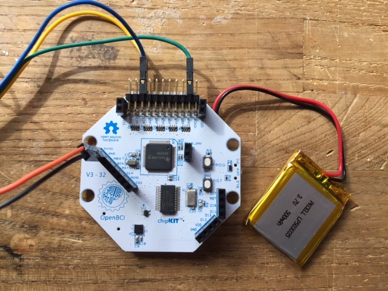
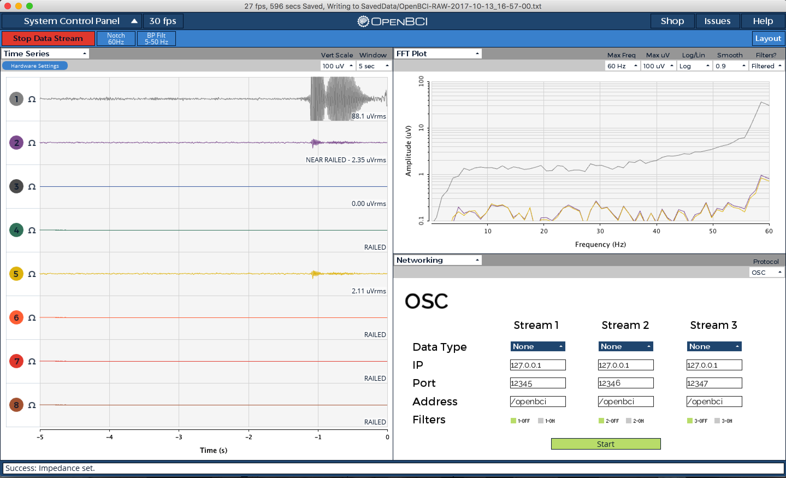

### Overview

This tutorial will show you how to read EMG data (electrical signals from muscles) using a MyoWare board, an OpenBCI Cyton board, and the OpenBCI GUI. 

### Materials Needed

1.  MyoWare board
2.  OpenBCI Cyton board, with power source
3.  OpenBCI dongle
4.  Disposable 24mm sticky electrodes (for using the MyoWare board)
5.  Soldering iron and materials
6.  Five male header pins (like [these](https://www.adafruit.com/product/2671)) 
7.  Five male-female jumper wires (like [these](https://www.adafruit.com/product/826))

Note: Jumper wires and header pins aren't sold on the OpenBCI website, but we used some from Adafruit (linked above) for this tutorial

### 1. Soldering the MyoWare Headers

Break the male headers into a set of 2-pin headers and 3-pin headers as shown below

### ADD IMAGE HERE

Solder the 3-pin header to the VIN, GND and ENV pads and solder the 2-pin header to the RECT and RAW pads of the MyoWare board. 

The male-female jumper wires can then be used to interface with the Cyton from the Myoware board. The female part of the jumper wire is plugged into the Myoware whereas the male part is plugged into the Cyton.

The wires attached to the "+" and "-" connects will be used to supply power to the board. They'll be attached to high voltage and ground outputs on the OpenBCI Cyton board.

The wires attached to the R, E, and M connects will transmit electrical signals from MyoWare's three electrodes to the OpenBCI Cyton board. R is the reference electrode, the one attached to the black wire. M is the middle electrode, and E is the end electrode. The E and M electrodes will measure activity across a muscle.

### 2. Preparing OpenBCI Cyton Board

Your Cyton board should look like this:

If your Cyton board is missing the black, female pin connectors (called "headers") sticking out of the board, you will need to solder them on before continuing.

### 3. Wiring the MyoWare Board to the OpenBCI Cyton Board

Connect the 5 wires from the MyoWare board in step 1 to the OpenBCI board, as shown below:

The "+" and "-" from the MyoWare board should go to DVDD and GND connects on the left side of the Cyton board. R, E, and M will connect to the pins at the top.

The wires should be connected like this:

| MyoWare Board | OpenBCI Board  |
| ------------- | -------------- |
| +             | DVDD           |
| -             | GND            |
| R             | BIAS (top pin) |
| E             | N1P Top        |
| M             | N1P Bottom     |

R, "+", and "-" must always go to the pins shown above. E and M can also be connected to N2P top and N2P bottom, or N3P top and N3P bottom, or any of the other two "NXP" pins.

When you have everything wired up, set the power switch on the MyoWare board to "on". Turn on the OpenBCI board, connect the USB dongle to your computer, and start the OpenBCI GUI software. If you're new to using an OpenBCI board with your computer, take a look at the [Cyton Getting Started Guide](GettingStarted/Boards/01-Cyton_Getting_Started_Guide.md).

### 4. Streaming EMG Data with the OpenBCI GUI

Attach three Skintact electrodes to the three electrodes on the MyoWare board, and then stick the board on a muscle you'd like to monitor. The adafruit MyoWare tutorial has good guidelines for MyoWare board placement: (https:).

You'll be able to see signals from the MyoWare electrodes in the OpenBCI GUI. If you connected E and M to the N1P pins on the OpenBCI board, then the MyoWare data will appear in channel 1.

Here's what the GUI, and channel 1, will look like with the muscle at rest:

And here's what channel 1 will look like after flexing the muscle:

### 5. Using OpenBCI's EMG GUI Widget

The OpenBCI GUI also has a widget for visualizing EMG data. To view it, click on the drop down menu under "FFT Plot", and select "EMG" instead:

Each circle and box represents a channel. The circle and box fill up as the intensity of the signal on that channel increases.

Here's what happens to the GUI when a muscle is flexed a little (top) or very strongly (bottom):

You can use these changes in signal intensity to trigger analog or digital events from within the GUI as you like. Check out the `W_EMG.pde` file for more information on the EMG widget.
