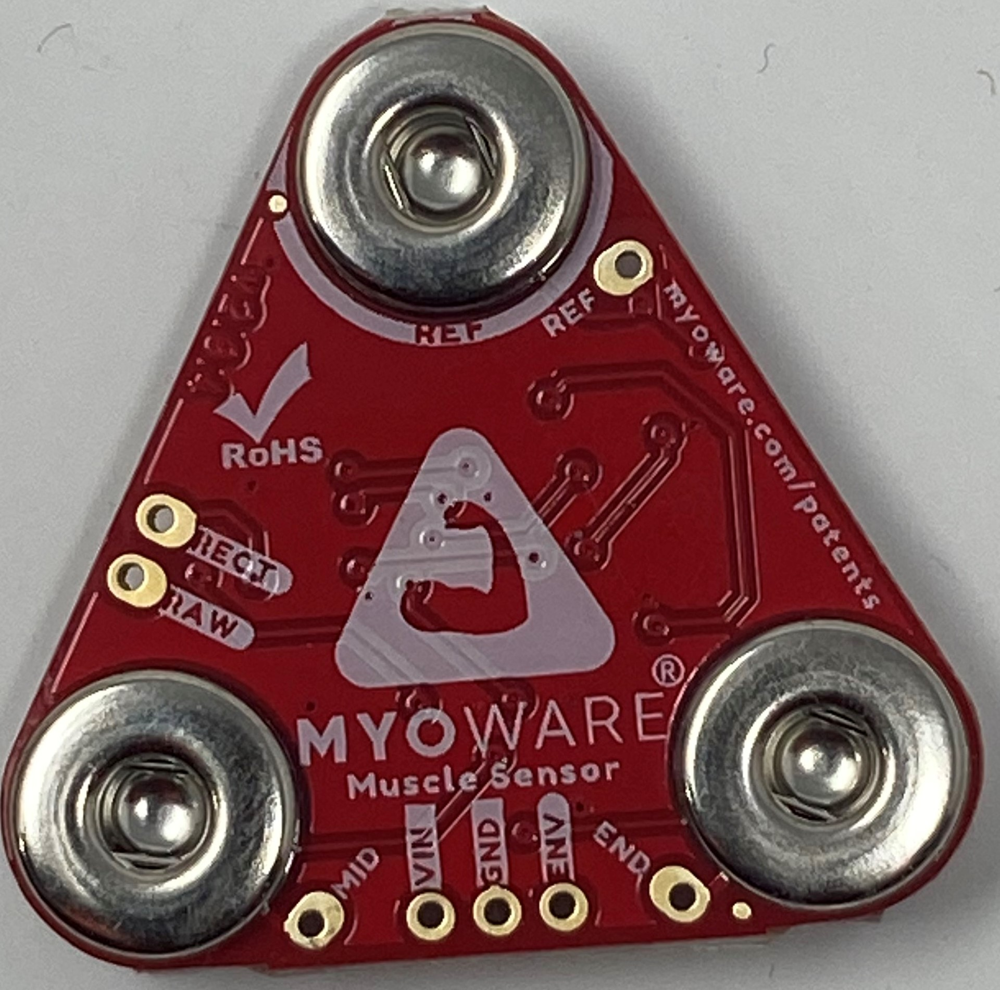
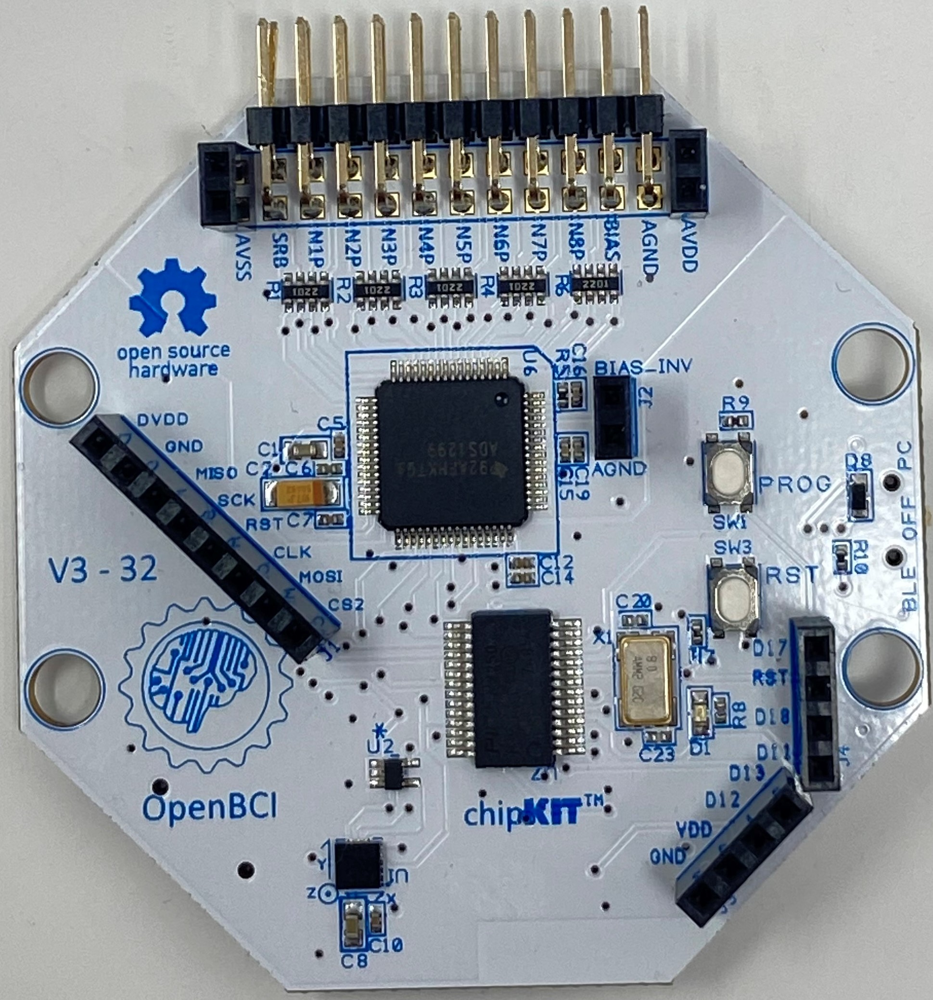
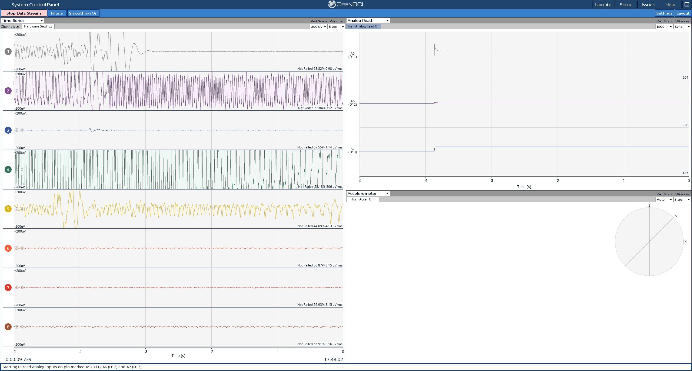
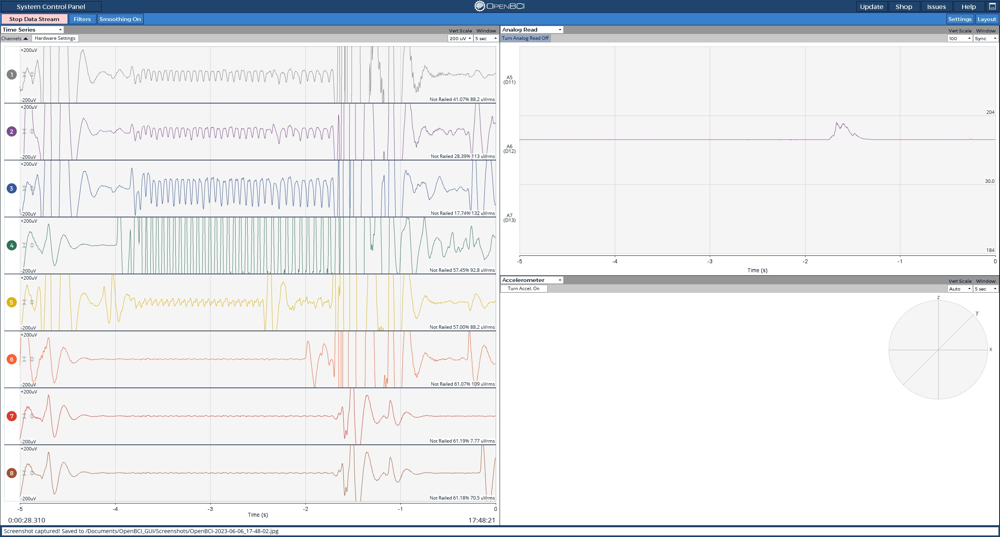

:::caution

The MyoWare 2.0 board cannot be used with the Ganglion board. If you have purchased a MyoWare 2.0 board with the intention of using it with the Ganglion board, please contact customer support at contact@openbci.com.

:::

### Overview

This tutorial will show you how to read EMG data (electrical signals from muscles) using a MyoWare board, an OpenBCI Cyton board, and the OpenBCI GUI.

 | 

### Materials Needed

1.  MyoWare board
2.  OpenBCI Cyton board, with power source
3.  OpenBCI dongle
4.  Disposable 24mm sticky electrodes (for using the MyoWare board)
5.  Soldering iron and materials
6.  Five male header pins (like [these](https://www.adafruit.com/product/2671))
7.  Five male-female jumper wires (like [these](https://www.adafruit.com/product/826))

Note: Jumper wires and header pins aren't sold on the OpenBCI website, but we used some from Adafruit (linked above) for this tutorial.

### 1. Soldering the MyoWare Headers

Break the male headers into a set of 2-pin headers and 3-pin headers as shown below

Solder the 3-pin header to the VIN, GND, and ENV pads, and solder the 2-pin header to the RECT and RAW pads of the MyoWare board.

The male-female jumper wires can then be used to interface with the Cyton from the MyoWare board. The female part of the jumper wire is plugged into the MyoWare, whereas the male part is plugged into the Cyton.

### 2. Preparing OpenBCI Cyton Board

Your Cyton board should look like this:

If your Cyton board is missing the black, female pin connectors (called "headers") sticking out of the board, you will need to solder them on before continuing.

### 3. Wiring the MyoWare Board to the OpenBCI Cyton Board

Connect the 5 wires from the MyoWare board in step 1 to the OpenBCI board, as shown below:

The wires attached to the "VIN" and "GND" pins will be used to supply power to the board. They'll be attached to the DVDD and GND headers on the OpenBCI Cyton board, respectively.

The ENV, RECT, and RAW headers are the output pins of the MyoWare Sensor. The ENV pin provides Envelope output, RECT provides Rectified output, and RAW provides Raw EMG data from the MyoWare Sensor.

The ENV, RECT and RAW pins should be connected to the Analog input pins of the Cyton, namely D12 and D13. For this tutorial, we have used D12 to demonstrate EMG Output. **D11 cannot be used as an Analog pin. It can only receive Digital Input**.

The wires should be connected like this:

| MyoWare Board | OpenBCI Board |
| ------------- | ------------- |
| VIN           | DVDD          |
| GND           | GND           |
| RAW/RECT/ENV  | D12           |

When you have everything wired up, turn on the Cyton board, connect the USB dongle to your computer, and start the OpenBCI GUI software. If you're new to using an OpenBCI board with your computer, take a look at the [Cyton Getting Started Guide](GettingStarted/Boards/01-Cyton_Getting_Started_Guide.md).

### 4. Streaming EMG Data with the OpenBCI GUI

Attach three sticky electrodes to the three electrodes on the MyoWare board, and then stick the board on a muscle you'd like to monitor. The [Sparkfun Hookup Guide for MyoWare](https://learn.sparkfun.com/tutorials/getting-started-with-the-MyoWare-20-muscle-sensor-ecosystem/all) has good guidelines for MyoWare board placement.

You'll be able to see signals from the MyoWare board in the OpenBCI GUI using the Analog Read widget. The Analog Read widget is used to read signals from the Analog pins of the Cyton.

Here's what the GUI, and pin D12, will look like with the muscle at rest:

Here's what D12 will look like after flexing the muscle:

