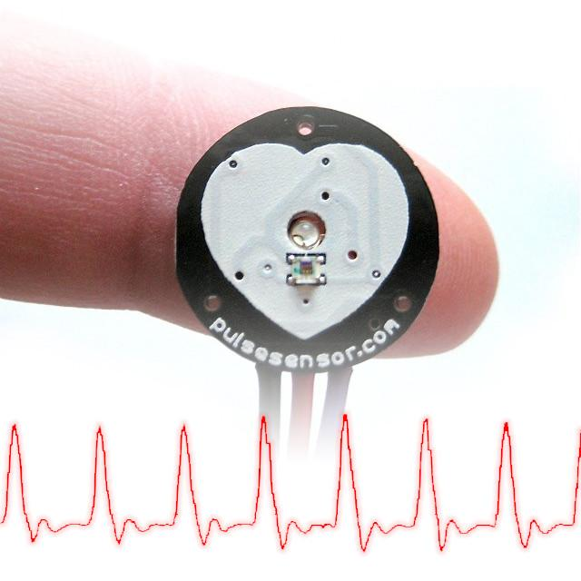

The directory to the left contains documents that explain the integration between OpenBCI and compatible third-party hardware. This landing page summarizes the variety of available sampling modalities!

## cEEGrid Kit

cEEGrids are a flexible and convenient around-the-ear electrode array that captures EEG and other physiological phenomena, allowing for the discrete recording of electrophysiological changes (e.g., EEG, ECG, EMG) from inconspicuous electrodes positioned around the ears.

The [cEEGrid Around-The-Ear EEG Bundle](https://shop.openbci.com/products/around-the-ear-eeg-bundle) uses the OpenBCI Cyton + Daisy and is fully compatible with the OpenBCI GUI and BrainFlow. Check out the [cEEGrid Kit guide](ThirdParty/cEEGrid_Kit/cEEGrid_Kit.md) to learn more.

## EmotiBit

Designed by our good friend Sean Montgomery and his team, [EmotiBit](https://emotibit.com) can stream 16+ signals from the body (EDA, 3-wavelength PPG, high-res body temperature, humidity, and a 9-axis IMU). We think it's the perfect complement for adding emotional, physiological, and movement data to your EEG recordings!

EmotiBit is a wearable sensor module for capturing high-quality emotional, physiological, and movement data. Easy-to-use and scientifically validated sensing lets you enjoy wireless data streaming to any platform or direct data recording to the built-in SD card. Customize the Arduino-compatible hardware and fully open-source software to meet any project needs!

If you’re new to EmotiBit and want to get everything you need to hit the ground running, purchase the [All-in-One EmotiBit Bundle](https://shop.openbci.com/collections/frontpage/products/all-in-one-emotibit-bundle).

## Pulse Sensor

The Pulse Sensor is one of the third-party add-ons offered in our store.

It can be connected to the [Ganglion](https://shop.openbci.com/collections/frontpage/products/pre-order-ganglion-board), [Cyton](https://shop.openbci.com/collections/frontpage/products/cyton-biosensing-board-8-channel), or any Arduino board to easily obtain your heart rate using a [photoplethysmogram (PPG)](https://en.wikipedia.org/wiki/Photoplethysmogram).

Purchase the [Pulse Sensor](https://shop.openbci.com/products/pulse-sensor).
