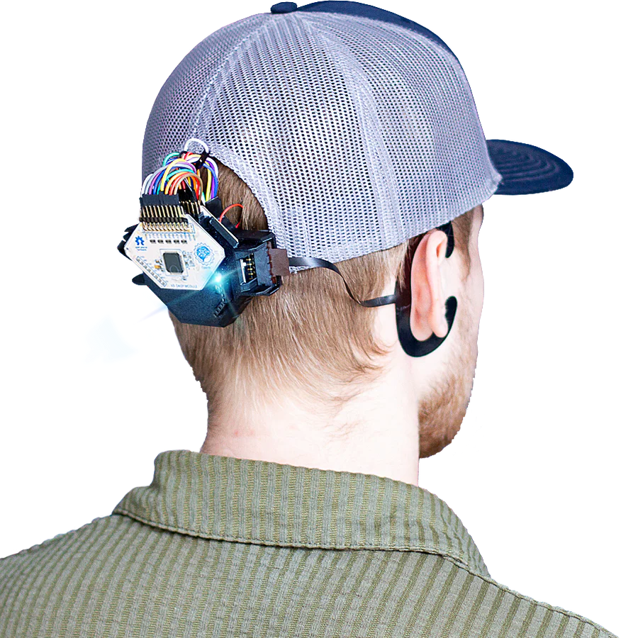
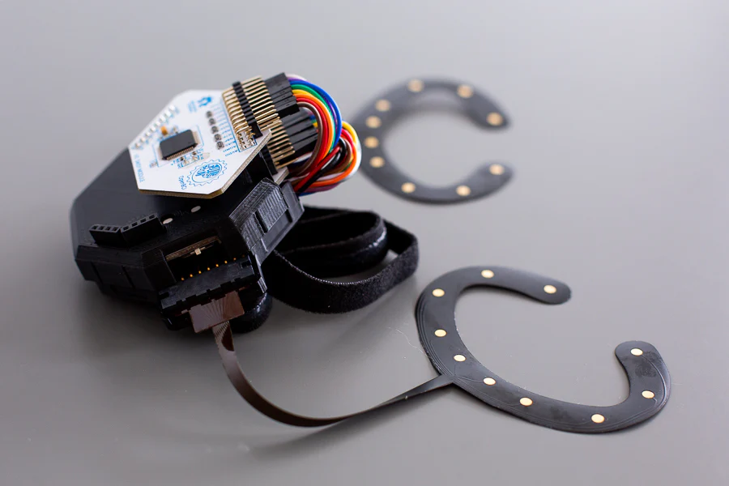

## [BUY IT!](https://shop.openbci.com/products/around-the-ear-eeg-bundle)

## Overview

cEEGrids are a flexible, reusable, and convenient around-the-ear electrode array that captures EEG and other physiological phenomena. This biosignal acquisition system allows for the discrete recording of electrophysiological changes (e.g., EEG, ECG, EMG) from inconspicuous electrodes positioned around the ears. The [cEEGrid Around-The-Ear EEG Bundle](https://shop.openbci.com/products/around-the-ear-eeg-bundle) contains everything you need to collect 16 channels of data. Since this uses the [OpenBCI Cyton + Daisy](../../Cyton/CytonLanding/), it's fully compatible with the [OpenBCI GUI](../../Software/OpenBCISoftware/01-OpenBCI_GUI.md) and [BrainFlow](../../ForDevelopers/SoftwareDevelopment/)!

## GitHub Repo and Documentation

Full documentation and all associated files for the cEEGrids project are located on GitHub.

https://github.com/MKnierim/openbci-ceegrids
