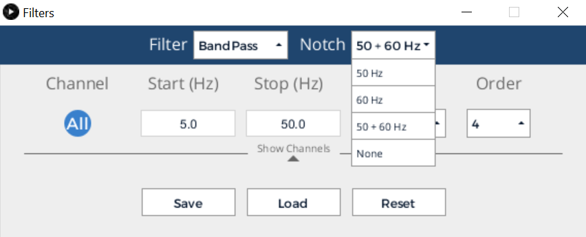

Are you getting "noisy" data from your device? There are several possible reasons for this. Let's go through some simple troubleshooting steps that resolve most issues.

#### Get rid of AC noise

Get rid of 60 Hz (or 50 Hz if you're in Europe or any country that operates on a 50 Hz power grid) using the OpenBCI GUI built-in notch filter. This does a good job at eliminating 60 Hz noise. You can adjust the notch filter by clicking the **Filters** button next to **Start/Stop Data Stream** then choose an option from the dropdown list. Additionally, if your board is on a table with any power cords or devices that are plugged into a wall outlet, move it to a location away from any electronic devices plugged into the wall. This will drastically reduce the alternating current (AC) influence on your signal.

#### Stabilize your electrodes

Make sure your electrode cables are steady. If you shake the electrodes that are dangling from your head/body, you'll notice that it severely affects the signals. This movement noise is something that could be greatly improved with active electrodes. When using the passive electrodes that come with the OpenBCI electrode starter kit, you have to be very careful to remain steady while using the system to produce the best signal. As a quick fix, binding all of the electrode cables together with a piece of electric tape secures them and minimizes cable movement. It is not as important to include any EMG/ECG channels in the bundle, since movement noise doesn't affect their signal as significantly.

#### Ensure that your electrodes are securely connected

Ensure that your electrodes are connected securely (especially your reference)!

#### Make sure your OpenBCI hardware is streaming data properly

Every so often, an error will occur with the wireless communication between your OpenBCI Dongle and board. If you've followed all of the steps above, and the data that you are seeing in the GUI interface is still illegible, try the following:

1. Power down your board and unplug your USB Dongle.
2. Plug back in your USB Dongle and power up your board in that order. 
3. Restart the GUI and start a new session.

#### Check Cyton - GUI connection
1. Open the GUI application and select **Cyton**
2. Select the **Manual** option
3. Unplug your dongle and select **Refresh** on the port selection
4. Re-plug the dongle and select **Refresh** once again
5. Select the serial port number (so that it's highlighted green)
6. Selecting channel 20 within the "OVERRIDE DONGLE" dropdown
7. Press "SYSTEM STATUS" and you should see "SUCCESS - HOST AND DEVICE ON CHANNEL 20"
8. Hit "START SESSION"
 
#### General tips for reducing noise (Cyton and Ganglion boards):
* Plug the dongle into a USB hub or USB extension cord. This limits radio interference caused by computers.
* Toggle on the filters in the OpenBCI GUI
* Use the feet that came with the board
* Use a fully charged battery
* Turn off bluetooth devices in the room
* Sit slightly away from the computer
* Use the FTDI fix for [Windows](https://docs.openbci.com/Troubleshooting/FTDI_Fix_Windows/) or [Mac](https://docs.openbci.com/Troubleshooting/FTDI_Fix_Mac/)

:::caution Additional Sources of Noise
* AC power or extension cables on the floor
* Conduits inside walls, floors or ceilings
* Nearby wifi or cellular equipment
* Laptop and desktop computers that have certain 'ground loop' or AC noise characteristics
* Metal desks or other large metal objects nearby
* LED, CFL or fluorescent lighting
:::

#### Further troubleshooting

If you are still having issues, refer to the [Forum](https://openbci.com/forum/) for further troubleshooting techniques.
