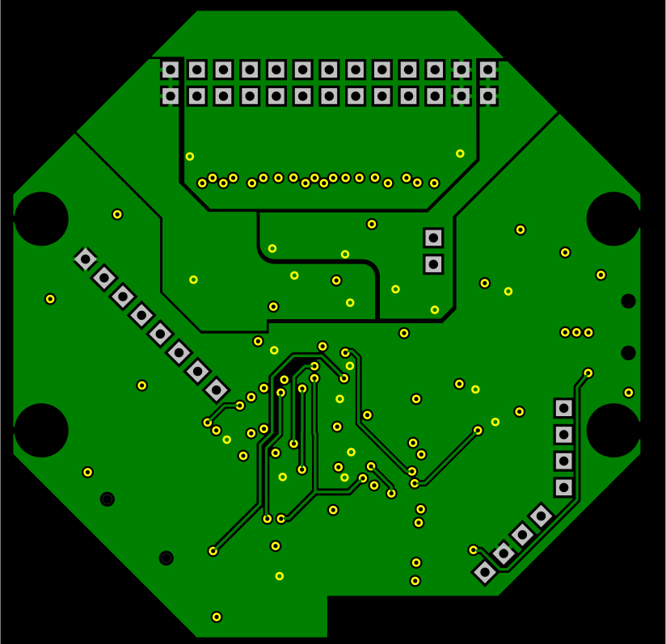
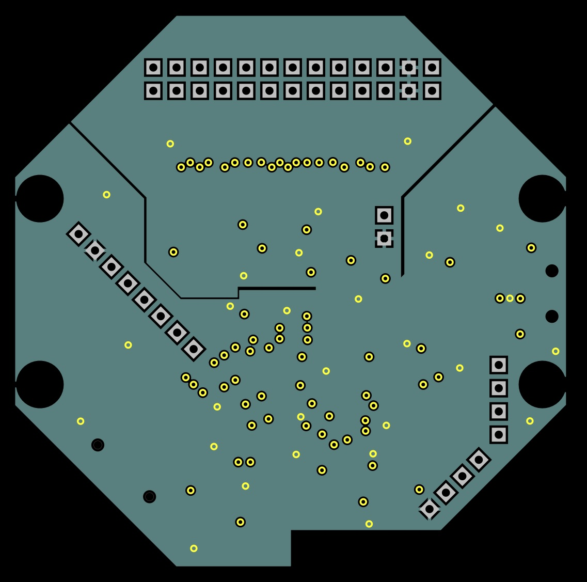
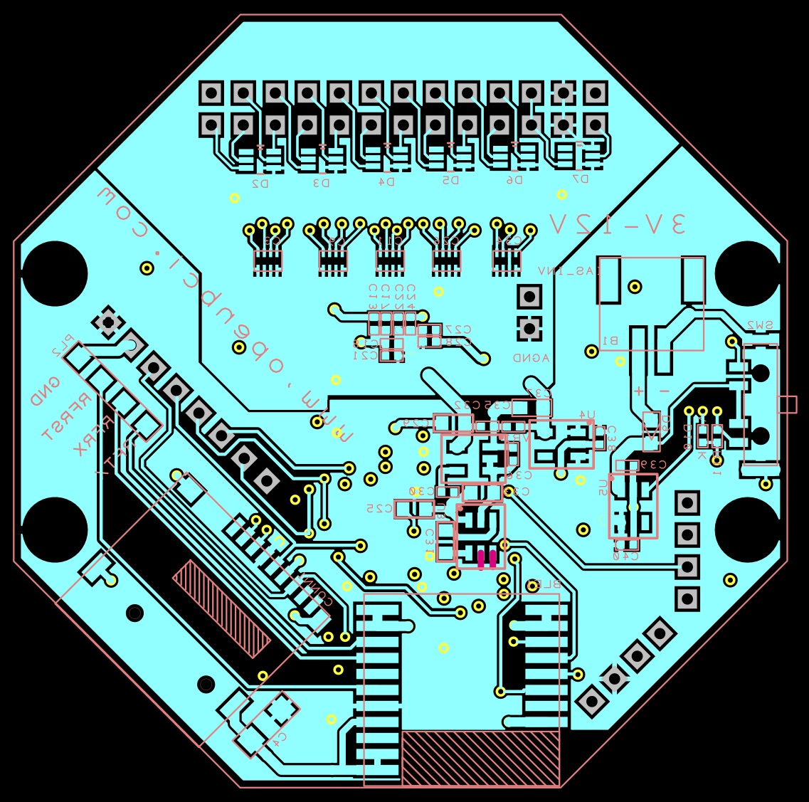
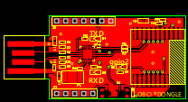

## [BUY IT!](https://shop.openbci.com/collections/frontpage/products/cyton-biosensing-board-8-channel)

The OpenBCI Cyton PCBs were designed with Design Spark, a free PCB capture program. You can find a link to download Design Spark in our [V3 design files repository](https://github.com/OpenBCI/V3_Hardware_Design_Files) where you will find all of the .sch and .pcb files. There are parts in the BOMs below that are not explicitly specified. For example, the passives (Rs and Cs) are all standard easy to find components. Thin film for the Rs, and MLCC X7R for the Cs. The battery connector is a standard JST type two position (with polarity key at the **TOP**), and the SD card holder that we are using is [ST-TF-003A](https://octopart.com/st-tf-003a-suntech-29424852).

## OpenBCI Cyton Board

### Cyton Board Specs:

-   Power with 3-6V DC Battery ONLY
-   PIC32MX250F128B Microcontroller with chipKIT UDB32-MX2-DIP bootloader
-   ADS1299 Analog Front End
-   LIS3DH 3 axis Accelerometer
-   RFduino BLE radio
-   Micro SD card slot
-   Voltage Regulation (3.3V, +2.5V, -2.5V)
-   Board Dimensions 2.41" x 2.41" (octogon has 1" edges)
-   Mount holes are 1/16" ID, 0.8" x 2.166" on center

### Breakout pins:

-   Program pins for bootloading PIC
    -   PGC, PGD, VDD, MCLR, GND
-   Serial pins for programming RFduino
    -   RFTX, RFRX, RFRST, GND
-   SPI bus pins on the 3V side for Daisy Module expansion
    -   DVDD, GND, MISO, MOSI, SCK, CS, CLK, RST
-   Unused PIC32 pins
    -   D11 (A5), D12 (A6), D13 (A7), D17, D18

The SPI bus pins on 3V side include CLK, which is tied to the ADS1299 CLK pin for timing the Daisy Module, and a RST pin which is tied to the ADS1299 MCLR pin for hardware reset of the ADS chips. We use a PICkit 3 to bootload the PIC chips. Pins D11, D12, and D13 can be digital or analog (called by their A number above for analog purposes). D11 is also PGD, and has the blue LED in series with a 1K resistor connected to AGND. D12 is PGC, for bootloading purposes. D17 and D18 are digital I|O only. D17 is connected to the PROG pushbutton. The PROG button can be used as an input by setting it's MODE direction and doing digitalRead on it (there is a 470K pulldown on D17, pressing PROG pulls pin D17 up to DVDD).

### Push Buttons

The RST pushbutton is connected to MCLR on the PIC. Pressing it will reset the PIC. To put the PIC into bootloader mode so that it can be re-programmed, press the RST button and hold it down. Then press the PROG button. Then release the RST button, and the blue LED will blink pleasantly, announcing that the PIC is ready to accept new code.

### Slide Switch

Slide switch is power for the board. The slide switch has three positions:

-   BLE activates a pull-up on RFduino pin 4
-   OFF disconnects the battery input
-   PC does NOT activate pull-up on RFduino pin 4

      **NOTE: BLE|PC selection is NOT implemented!**

Swtiching either BLE or PC will produce the same result. The option is available for future development...

### OpenBCI Cyton Board Circuit Schematic

### Cyton Board PCB Layer Images

### Cyton Board PCB Files

[OpenBCI 32bit gerber & BOM](https://github.com/OpenBCI/V3_Hardware_Design_Files/tree/master/OpenBCI%20Cyton%20Designs/OBCI_Cyton_Plots)

## OpenBCI USB DONGLE

The OpenBCI USB Dongle is used to connect your computer to the Cyton Board.

### Dongle Specs

-   Power via USB connector ONLY
-   RFduino BLE radio module
-   FTDI USB&lt;&gt;Serial IC (FT231XQ-R)
-   Resettable fuse

### Breakout Pins

RFduio pins are broken out in the same order and layout as the RFduino radio and shields. That makes the OpenBCI USB Dongle compatible with the RFduino shields, if you like. The TXD (red) and RXD (greed) LEDs are connected to outputs from the FTDI chip. The blue LED is connected to RFduino GPIO2.

### Slide Switch

The slide switch on the Dongle has two positions (noted on the bottom  silkscreen). When the switch is on the GPIO6 side, the FTDI DTR pin is routed to RFduino pin 6 and it is ready to pass data to-from the Cyton board. This configuration is 'normal' mode, and also allows for programming the Cyton board over air. When the switch is on the RESET side, the FTDI DTR pin is routed to the RFduino RESET pin. This mode allows for re-programming the RFduino on the Dongle.

### OpenBCI Dongle Circuit Schematic

### Dongle PCB Layer Images

### Dongle PCB Files

[OpenBCI Dongle gerber & BOM (518K zip)](http://ultracortex.com/downloads/hardware/OpenBCI_Dongle.zip)

## OpenBCI Daisy Module

The OpenBCI Daisy Module is a daughter card to the Cyton Board, and expands the number of sensor channels from **8** to **16**.

### Daisy Module Specs:

-   Power via pass-thru from Cyton Board pins ONLY
-   ADS1299 Analog Front End

### Breakout pins:

-   SPI bus pins for communication with OpenBCI Board
    -   DVDD, GND, MISO, MOSI, SCK, CS, CLK, RST
-   Analog Power and BIAS pins
    -   AVDD, AVSS, AGND, BIAS

The OpenBCI Daisy Module should be used as an expansion card for the OpenBCI Board ONLY. Daisy Modyle requires an external clock signal (2.048MHz) to be applied to the CLK pin.

**NOTE** This design contains an error [documented here](http://openbci.com/community/daisy-module-re-work/). If you intend to use these designs, be aware that you will have to make the change to the PCB file.

### OpenBCI Daisy Module Circuit Schematic

### Daisy Module PCB Layer Images

### Daisy Module PCB Files

[OpenBCI Daisy Module gerber & BOM (532K zip)](http://ultracortex.com/downloads/hardware/OpenBCI_DaisyModule.zip)
