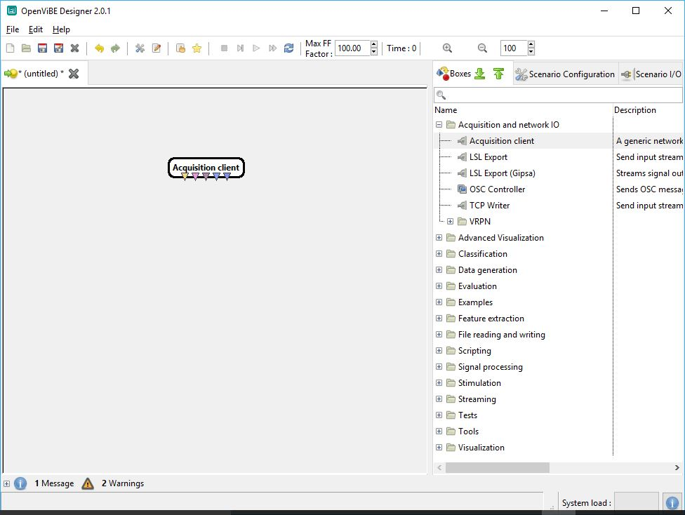
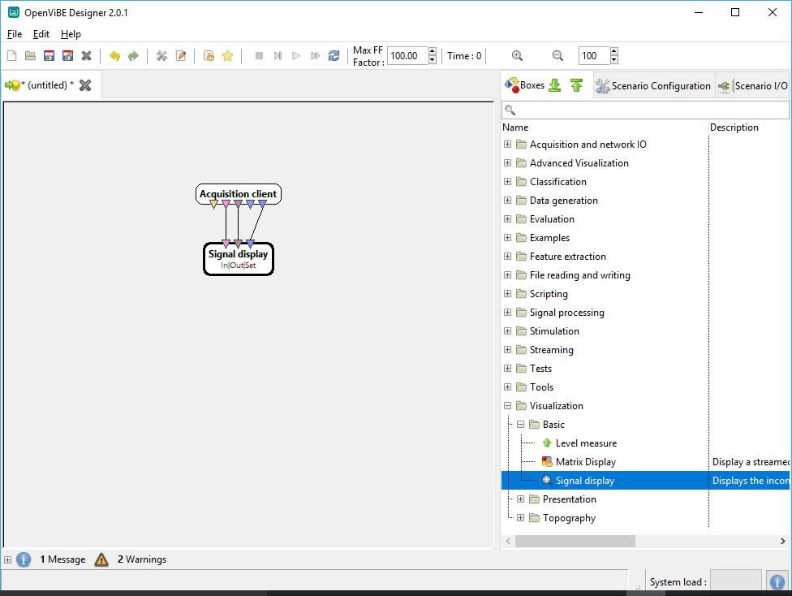
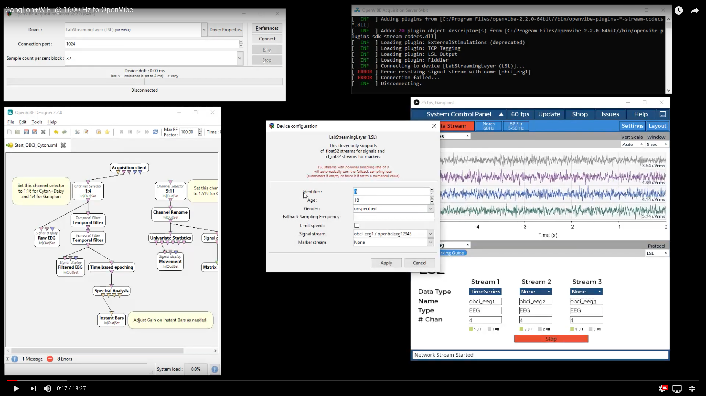

## Overview

**There are two primary methods of connecting from OpenBCI tech to OpenViBE:**

1.  You can connect the Cyton and Cyton+Daisy using an OpenViBE driver. This method is described below.

2.  Connect any OpenBCI Board to the OpenBCI GUI, then use the Networking Widget to stream data using LSL protocol to OpenViBE Acquisition Server. Start streaming from the GUI first. Select LSL in OpenViBE Acquisition Server. You should see an option in Driver Properties to select the data stream from the GUI, its typically auto-detected.

## Setting Up Your Environment

**Windows**: Follow [OpenBCI on Windows](Troubleshooting/04-FTDI_Fix_Windows.md) tutorial to properly connect your OBCI board on Windows. Then, continue this tutorial.

**OS X**: Visit the [Windows Virtual Box installation tutorial](Software/CompatibleThirdPartySoftware/07-VirtualBox.md) first, then follow these instructions. Note: you may have difficulty streaming live from your OpenBCI board to OpenViBE within a VM.

**Linux**: [Linux builds](http://openvibe.inria.fr/downloads/) of OpenViBE also work. Some linux users might find this guide useful but keep in mind it is meant primarily for mac + win7.

## Installation

Make sure you have a running Windows 7, 8.1, or 10 Machine (be it either a VM or native).
Download the latest OpenViBE software from their [website](http://openvibe.inria.fr/downloads/).

## Method 1: Connect Directly to Cyton or Cyton+Daisy using Dongle

### Getting Started

Connect your OpenBCI board and make sure it is recognized as a COM port and its latency is set to 1 ms. To troubleshoot, read our [OpenBCI on Windows tutorial.](Troubleshooting/04-FTDI_Fix_Windows.md)

Start the OpenViBE Signal Acquisition Server (SAS). **C: &gt; Program Files &gt; openvibe &gt; openvibe-acquisition-server** (normally shows up when searching “openvibe” in start menu).

1.  In the SAS select the OpenBCI (unstable means not throughly tested) option from the drop down list.
2.  Then open **Driver Properties**. In the Device option, select the COM port number your OBCI board was connected to.
3.  In the SAS Preference menu, change the drift tolerance from 2ms (default) to 10ms.
4.  Press Connect. If error, troubleshoot:
    -   Look at the terminal window that the SAS opens up. It has a verbose report on the SAS's condition.
    -   Often, pressing the restart button on the OBCI board, or Disconnecting/Connecting the Dongle will fix any connection issues.
    -   If the error reports that it cannot open the selected port, make sure the COM port selected in the driver options is the same as your board.

### Configure OpenViBE Designer

**[Click here to download the OpenBCI-OpenViBE example XML File.](https://github.com/openbci-archive/Docs/blob/master/assets/files/Start_OBCI_Cyton.xml)** This file is a pre-made graph that will display both the EEG channels and the AUX channels. For the V3 board, the AUX channels correspond to accelerometer values in the three cardinal directions.

Open the OpenViBE Designer GUI. If you are not using the example xml file, a blank page should open like below:

In the toolbar on the right, expand the "Acquisition and IO" folder and select "Acquisition client." This object represents the input stream from the OpenBCI board. Click and drag the Acquisition client into the design space.

From the same toolbar, expand the "Visualization" folder, then the "Basic" folder, and select "Signal display." Click and drag the Signal display box into the design space. Connect the similarly-colored triangles of the two boxes.

You're ready to stream data from your board! Return to the OpenViBE Acquisition Server GUI and select "Play."

Return to the OpenViBE designer GUI. Click the play button from the top toolbar. A signal display window should pop up, displaying data as it streams from your OpenBCI board.

You're now streaming data from your OpenBCI board to OpenViBE! Feel free to explore the other tools OpenViBE has to offer.

## Method 2: Stream from the OpenBCI GUI to OpenViBE

Please, refer to the following screenshot, YouTube video and/or steps below. For example, you can stream Ganglion+WiFi at 1600Hz from the OpenBCI GUI to OpenVibe, as seen in the screenshot. **Here is a [YouTube Video to document this method in detail.](https://www.youtube.com/watch?v=97rNewfbTKA)**

**[Click here to download the OpenBCI-OpenViBE example XML File.](https://github.com/openbci-archive/Docs/blob/master/assets/files/Start_OBCI_Cyton.xml)** This file is a pre-made graph that will display both the EEG channels and the AUX channels. For the V3 board, the AUX channels correspond to accelerometer values in the three cardinal directions. 

_We do not need the objects on the right to handle AUX channels. Sever the connection to the Aux data processing, since we will be sending just four channels TimeSeries data over LSL._

As you can see in the YouTube Video, we need to make a few modifications to the OpenBCI-OpenViBE XML for this to work with Ganglion sent over LSL. Refer to the comments in the example.

1.  Open the OpenBCI GUI.
2.  Start a session with any data mode.
3.  Open the Networking Widget and set Protocol to LSL from the dropdown in the top right of the widget.
4.  Select desired data type to stream.
5.  **IMPORTANT: In the OpenViBE Acquisition Server, select the Driver as LabStreamingLayer(LSL).**
6.  Click **Start** in the OpenBCI GUI Networking Widget.
7.  Click Connect and Play in the OpenViBE Acquisition Server.
8.  Click the Play button in the OpenViBE Designer GUI.

Here is what the Acquisition Server Console Log should read when successfully connected:

**Enjoy OpenBCI in OpenViBE!**

## Documentation and Resources

For more advanced tutorials using OpenBCI and OpenViBE, check out [Jeremy Frey's blog](http://blog.jfrey.info/). He has done both a [P300 Speller](http://blog.jfrey.info/2015/02/04/openbci-p300-coadapt/) and a [Motor Imagery Classifier](http://blog.jfrey.info/2015/03/03/openbci-motor-imagery/).

For an example of a more advanced OpenViBE setup with OpenBCI, open the attached [xml file](https://github.com/openbci-archive/Docs/blob/master/assets/files/Start_OBCI_Cyton.xml) in the OpenViBE designer GUI. This file is a pre-made graph that will display both the EEG channels and the AUX channels. For the V3 board, the AUX channels correspond to accelerometer values in the three cardinal directions.

To learn more about OpenViBE, take a look at their documentation [here.](http://openvibe.inria.fr/documentation-index/)

Build something new with OpenBCI and OpenViBE? Post about it on our [community page!](http://openbci.com/community/)
