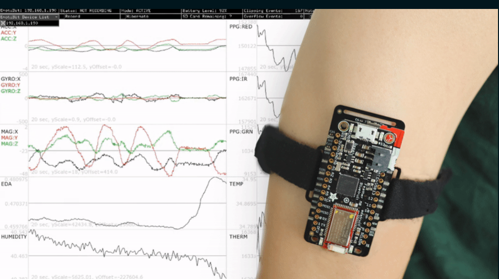
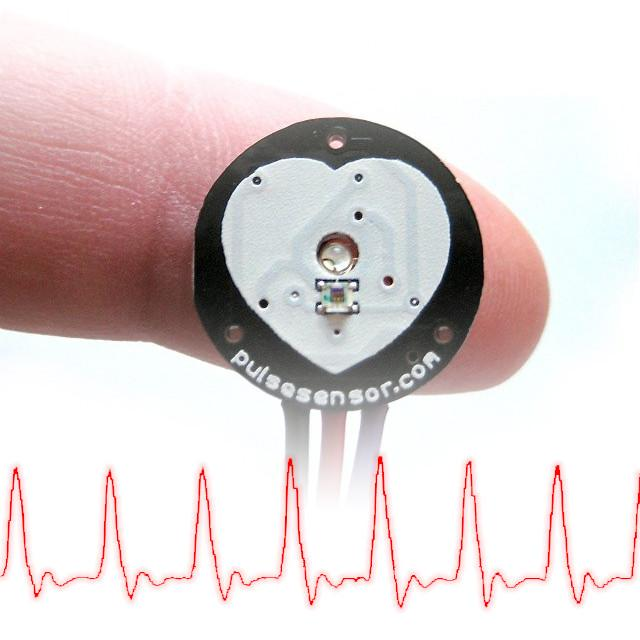

The directory to the left contains documents to explain the integration between OpenBCI and compatible third-party hardware. This landing page summarizes the variety of sampling modalities!

## EmotiBit

Designed by our good friend Sean Montgomery and his team, [EmotiBit](https://emotibit.com) can stream 16+ signals from the body (EDA, 3-wavelength PPG, high-res body temperature, humidity and a 9-axis IMU). We think it's the perfect complement to add emotional, physiological and movement data to your EEG recordings!

EmotiBit is a wearable sensor module for capturing high-quality emotional, physiological, and movement data. Easy-to-use and scientifically-validated sensing lets you enjoy wireless data streaming to any platform or direct data recording to the built-in SD card. Customize the Arduino-compatible hardware and fully open-source software to meet any project needs!

**Tutorial Coming Soon!**

## HEGduino

The "HEG" in HEGduino stands for HemoEncephaloGraphy, a non-invasive biofeedback method. HEG detects regional changes in the brain’s energy consumption via changes in blood-oxygen. HEGduino enables you to see in real time how your brain blood-oxygen levels respond to your thoughts and actions, resulting in a simple and elegant biofeedback system. You can easily affect and eventually control regional blood flow in your head by focusing, breathing, and relaxing, and watching the response on your screen. With the biofeedback provided by HEGduino, you can exercise your brain and make it healthier with mindful practice.

We're partnering with HEGduino to bring you low-cost at-home HEG technology. Brain blood-flow biofeedback meets open-source IoT technology!  These kits are hand-assembled and tested by their team to run out-of-the box. No firmware tinkering or wire soldering needed!

The open-source, extensively documented HEGduino Kit is now available at the [OpenBCI Shop](https://shop.openbci.com/products/hegduino-kit).

## IDUN Dryode

Introducing research-validated dry electrodes for sampling frontal cortex EEG and facial/body EMG, compatible with OpenBCI boards and standard snap cables!

## MyoWare

The MyoWare muscle sensor can be integrated with both the OpenBCI Cyton and Ganglion. To find out how, check out these tutorials:

-   [Cyton + MyoWare](ThirdParty/Myoware/14-MyoWare_Integration.md)
-   [Ganglion + MyoWare](ThirdParty/Myoware/15-MyoWare_Integration_Ganglion.md)

## Pulse Sensor

The Pulse Sensor is one of the third-party add-ons offered in our store.

It can be connected to the [Ganglion](https://shop.openbci.com/collections/frontpage/products/pre-order-ganglion-board), [Cyton](https://shop.openbci.com/collections/frontpage/products/cyton-biosensing-board-8-channel), or any Arduino board to easily obtain your heart rate using [photoplethysmogram (PPG)](https://en.wikipedia.org/wiki/Photoplethysmogram).

## ThinkPulse Active Electrodes

We are very excited to partner with Conscious Labs to offer this affordable, high-quality biosensing kit to our community. The ThinkPulse™ kit offers research-grade dry, active electrode EEG sensors at an unprecedented price point and comfort level.

## Wifi Shield

The Wifi Shield is an add-on module that allows you to connect an OpenBCI Board to the GUI and send data over Wifi rather than Radio/BLE.
To learn more about it, see these documents:

-   [Wifi Shield](ThirdParty/WiFiShield/01-Wifi.md)
-   [OpenBCI Wifi Server](ThirdParty/WiFiShield/03-OpenBCI_Wifi_Server.md)
-   [OpenBCI Wifi SDK](ThirdParty/WiFiShield/08-OpenBCI_Wifi_SDK.md)
-   [Wifi Programming Tutorial](ThirdParty/WiFiShield/12-Wifi_Programming_Tutorial.md)
